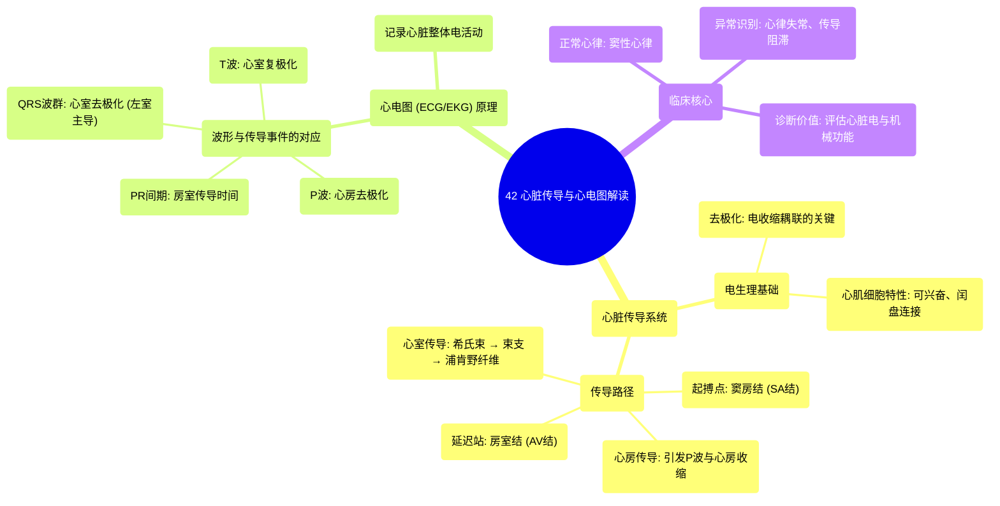

# 42 Heart Conduction & ECG (EKG) Interpretation

  <video controls preload="metadata" playsinline>
    <source src="https://helly.s3.bitiful.net/心血管学科/%E4%B8%93%E8%BE%91%2020%EF%BC%9A%E5%BF%83%E5%86%85%E7%A7%91%E7%BB%88%E6%9E%81%E8%BE%9E%E5%85%B8%E7%96%BE%E7%97%85%E6%9C%BA%E5%88%B6%E7%AF%87%20%28PathologyMechanisms%29/42%20Heart%20Conduction%20%26%20ECG%20%28EKG%29%20Interpretation.mp4" type="video/mp4">
    
您的浏览器不支持播放，请升级。

  </video>

::: tip ⚡️ 核心考点 (30s速读)
*   **核心考点**：心脏传导系统是控制心脏节律性收缩的“电路”。其核心是**窦房结（SA结）**，它作为天然起搏器，自发产生电信号（去极化），并沿特定路径（房室结、希氏束、浦肯野纤维）传导，最终引发心肌收缩。
*   **临床意义**：心电图（ECG/EKG）是记录此电活动的工具。波形的形态（如P波、QRS波群、T波）直接反映了传导路径是否正常。理解传导系统是诊断心律失常、心肌缺血等心脏疾病的基础。
:::

## 🧠 深度精讲

*   **心肌细胞的电特性**：心肌细胞是特化的可兴奋细胞。在静息状态下，细胞膜内外存在电位差，膜内为**负电荷**。当受到刺激时，细胞膜对离子的通透性发生改变，导致膜内电位迅速由负变正，这个过程称为**去极化**。去极化是心肌细胞收缩的“电开关”。
*   **细胞间的电传导**：心肌细胞通过**闰盘**上的缝隙连接紧密耦联。这使得一个细胞的去极化可以像波浪一样，通过离子流动迅速传播到相邻细胞，确保整个心房或心室能够同步、协调地收缩。
*   **心脏传导系统的路径**：
    1.  **起点：窦房结（SA结）**：位于右心房上部，是心脏的**正常起搏点**。它能以每分钟60-100次的频率**自发地、规律地**去极化，产生电冲动，并首先引起心房肌的去极化与收缩。
    2.  **传导延迟站：房室结（AV结）**：位于心房与心室交界处。电冲动在此处会**延迟约0.1-0.2秒**。这个延迟至关重要，它确保心房有足够时间完成收缩并将血液泵入心室，然后再让心室收缩。
    3.  **高速通路：希氏束与束支**：电冲动通过房室结后，进入**希氏束**，并迅速分为**左、右束支**，沿着室间隔下行。
    4.  **终末网络：浦肯野纤维**：束支进一步分支为细密的**浦肯野纤维网**，遍布于左右心室的心内膜下。它们以极快的速度将电冲动传导至所有心室肌细胞，引发心室同步、有力的收缩。
*   **心电图（ECG/EKG）与电活动的关系**：
    *   **P波**：代表**心房去极化**（收缩）。由窦房结冲动引起心房肌细胞去极化产生。
    *   **PR间期**：代表电冲动从窦房结发出，经心房、房室结、希氏束，直至心室肌开始激动前的总时间。其中的平坦段主要对应**房室结的传导延迟**。
    *   **QRS波群**：代表**心室去极化**（收缩）。由于左心室肌肉远比右心室厚，其产生的电活动占主导，因此在标准导联（如II导联）上通常表现为一个高大的**向上波峰（R波）**。
    *   **T波**：代表**心室复极化**（恢复静息电位，为下一次收缩做准备）。此时电活动方向与去极化时相反，因此在心电图上表现为一个方向与QRS主波方向通常一致的波。
*   **电与机械活动的耦联**：心电图上看到的电活动**稍早于**机械收缩。P波之后是心房收缩，QRS波群之后是心室收缩。心电图记录的是“电指令”，而心脏的泵血功能是执行这些“指令”的结果。

## 📚 双语术语表 (Terminology)
| 英文术语 | 中文翻译 | 定义/解释 |
| :--- | :--- | :--- |
| Depolarization | 去极化 | 心肌细胞膜电位由静息状态下的内负外正变为内正外负的过程，是触发收缩的电信号。 |
| Sinoatrial (SA) Node | 窦房结 | 位于右心房上部的特化心肌组织，是心脏的正常起搏点，自发产生节律性电冲动。 |
| Atrioventricular (AV) Node | 房室结 | 位于房室交界处的特化组织，负责将心房来的电冲动延迟传导至心室，确保心房心室顺序收缩。 |
| Bundle of His | 希氏束 | 连接房室结与心室束支的纤维束，是电冲动从心房传向心室的唯一通路。 |
| Bundle Branches | 束支 | 希氏束在室间隔分为的左束支和右束支，负责将电冲动快速传导至左右心室。 |
| Purkinje Fibers | 浦肯野纤维 | 束支的终末分支，形成网状分布于心室内膜下，将电冲动迅速传递至所有心室肌细胞。 |
| Electrocardiogram (ECG/EKG) | 心电图 | 记录心脏电活动随时间变化的图形，是评估心脏节律和传导功能的核心工具。 |
| P Wave | P波 | 心电图上第一个小波，代表心房肌的去极化（收缩）。 |
| QRS Complex | QRS波群 | 心电图上紧随P波之后的高大波群，代表心室肌的去极化（收缩）。 |
| T Wave | T波 | QRS波群之后的一个圆钝波，代表心室肌的复极化（恢复）。 |
| Myocardium | 心肌层 | 构成心脏壁中间层的肌肉组织，负责心脏的泵血功能。 |
| Pacemaker | 起搏器 | 指能自发产生节律性电冲动的组织（如窦房结）或人工植入的电子设备。 |

## 🗺️ 知识图谱

