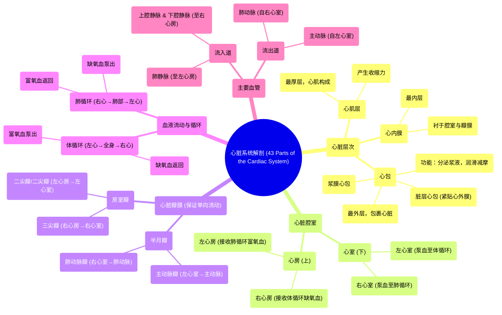

# 43 Parts of the Cardiac System (Heart Anatomy)

  <video controls preload="metadata" playsinline>
    <source src="https://helly.s3.bitiful.net/心血管学科/%E4%B8%93%E8%BE%91%2020%EF%BC%9A%E5%BF%83%E5%86%85%E7%A7%91%E7%BB%88%E6%9E%81%E8%BE%9E%E5%85%B8%E7%96%BE%E7%97%85%E6%9C%BA%E5%88%B6%E7%AF%87%20%28PathologyMechanisms%29/43%20Parts%20of%20the%20Cardiac%20System%20%28Heart%20Anatomy%29.mp4" type="video/mp4">
    
您的浏览器不支持播放，请升级。

  </video>

::: tip ⚡️ 核心考点 (30s速读)
*   **核心考点**：心脏由三层结构（心内膜、心肌层、心包）构成，分为四个腔室（左/右心房、左/右心室）。血液遵循“心房进、心室出”的单向流动原则，通过瓣膜（三尖瓣、二尖瓣/二尖瓣、半月瓣）防止反流。右侧心脏处理缺氧血，左侧处理富氧血。
*   **临床意义**：理解心脏层次是诊断心包炎、心肌梗死等疾病的基础。瓣膜功能异常（如狭窄或关闭不全）会导致血液反流或流动受阻，是心脏杂音和心力衰竭的常见原因。明确左右心功能与血液氧合状态的关系，是理解体循环与肺循环的基石。
:::

## 🧠 深度精讲

*   **心脏的三层结构**：心脏从内到外分为三层。最内层是**心内膜**，它衬在心脏腔室内壁，并延续至所有瓣膜。中间层是**心肌层**，由心肌构成，是心脏收缩产生泵血动力的主要部分。最外层是**心包**，它是一个包裹心脏的双层囊状结构，内层为**脏层心包**，外层为**浆膜心包**，其功能是分泌浆液以润滑心脏，减少搏动时的摩擦。
*   **心脏的四个腔室**：心脏分为上方两个**心房**和下方两个**心室**。面向患者时，左侧为**左心房**和**左心室**，右侧为**右心房**和**右心室**。这是所有心脏解剖描述的基准。
*   **血液流动路径与瓣膜**：血液流动遵循固定路径：**心房进，心室出**。血液从身体（经上、下腔静脉）返回**右心房**，通过**三尖瓣**进入**右心室**。右心室收缩，血液通过**肺动脉半月瓣**射入**肺动脉**，流向肺部进行气体交换。富氧血从肺部（经肺静脉）返回**左心房**，通过**二尖瓣**进入**左心室**。左心室收缩，血液通过**主动脉半月瓣**射入**主动脉**，分布至全身。所有瓣膜均确保血液单向流动，防止反流。
*   **血液氧合状态与左右心分工**：这是理解循环系统的关键。**右侧心脏（右心房、右心室）** 处理**缺氧血**（暗红色），负责将血液泵向肺部（肺循环）。**左侧心脏（左心房、左心室）** 处理**富氧血**（鲜红色），负责将血液泵向全身组织（体循环）。左右心通过肺循环串联起来，共同完成气体交换和氧气输送。

## 📚 双语术语表 (Terminology)
| 英文术语 | 中文翻译 | 定义/解释 |
| :--- | :--- | :--- |
| Endocardium | 心内膜 | 心脏的最内层，衬于心脏腔室内壁并延续至瓣膜。 |
| Myocardium | 心肌层 | 心脏的中层，由心肌构成，负责心脏的收缩运动。 |
| Pericardium | 心包 | 包裹心脏的双层囊状结构，分泌浆液以润滑和保护心脏。 |
| Visceral Pericardium | 脏层心包 | 心包的内层，紧贴于心脏表面（心肌层）。 |
| Serous Pericardium | 浆膜心包 | 心包的外层。 |
| Atrium (pl. Atria) | 心房 | 心脏上方的两个腔室，接收回心血液。 |
| Ventricle | 心室 | 心脏下方的两个腔室，将血液泵出心脏。 |
| Tricuspid Valve | 三尖瓣 | 位于右心房与右心室之间的瓣膜，有三个瓣叶，防止血液从心室反流回心房。 |
| Bicuspid / Mitral Valve | 二尖瓣 / 二尖瓣 | 位于左心房与左心室之间的瓣膜，有两个瓣叶，功能同三尖瓣。 |
| Semilunar Valve | 半月瓣 | 形状似半月，包括肺动脉瓣和主动脉瓣，位于心室与大动脉之间，防止血液从动脉反流回心室。 |
| Pulmonary Semilunar Valve | 肺动脉半月瓣 | 位于右心室与肺动脉之间的半月瓣。 |
| Vena Cava | 腔静脉 | 将身体缺氧血输送回右心房的大静脉，分为上腔静脉和下腔静脉。 |
| Pulmonary Artery | 肺动脉 | 将右心室的缺氧血输送至肺部的血管。 |
| Pulmonary Vein | 肺静脉 | 将肺部氧合后的富氧血输送回左心房的血管。 |
| Aorta | 主动脉 | 将左心室的富氧血输送至全身的大动脉。 |
| Deoxygenated Blood | 缺氧血 | 含氧量低的血液，呈暗红色，由体循环返回右心。 |
| Oxygenated Blood | 富氧血 | 含氧量高的血液，呈鲜红色，由肺循环返回左心。 |

## 🗺️ 知识图谱

