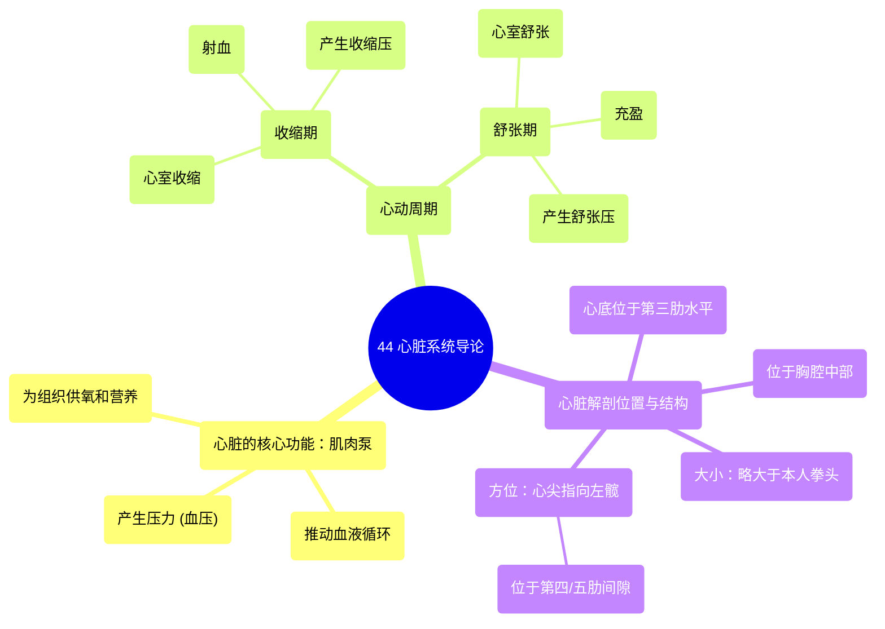

# 44 Introduction to the Cardiac System

  <video controls preload="metadata" playsinline>
    <source src="https://helly.s3.bitiful.net/心血管学科/%E4%B8%93%E8%BE%91%2020%EF%BC%9A%E5%BF%83%E5%86%85%E7%A7%91%E7%BB%88%E6%9E%81%E8%BE%9E%E5%85%B8%E7%96%BE%E7%97%85%E6%9C%BA%E5%88%B6%E7%AF%87%20%28PathologyMechanisms%29/44%20Introduction%20to%20the%20Cardiac%20System.mp4" type="video/mp4">
    
您的浏览器不支持播放，请升级。

  </video>

::: tip ⚡️ 核心考点 (30s速读)
*   **核心考点**：心脏是一个特化的肌肉泵，通过周期性收缩（收缩期）和舒张（舒张期）产生压力，将含氧血泵至全身组织。
*   **临床意义**：理解收缩压与舒张压是评估心血管健康的基础；心脏在胸腔内的解剖位置（心尖指向左髋）是进行心脏听诊、心电图电极放置等临床操作的关键。
:::

## 🧠 深度精讲
*   **心脏的功能本质**：心脏的核心功能是作为一个“泵”。它由特殊的心肌构成，通过有节律的收缩与舒张，产生流体压力（血压），从而推动血液在循环系统中流动。其根本目的是为全身组织持续输送氧气和营养物质，并带走代谢废物。
*   **心动周期：收缩期与舒张期**：心脏的每一次搏动都包含两个关键阶段：
    *   **收缩期**：指心室肌肉收缩的阶段。此时，心脏内压力升高，将血液从心室射入主动脉（左心）和肺动脉（右心）。这是我们测量“收缩压”（高压）的时期。
    *   **舒张期**：指心室肌肉舒张、放松的阶段。此时，心脏内压力降低，心房血液充盈心室，为下一次射血做准备。这是我们测量“舒张压”（低压）的时期。
*   **心脏的解剖位置与方位**：
    *   **位置**：心脏位于胸腔中部，胸骨（胸骨）后方，两肺之间。其大小略大于本人的拳头。
    *   **方位**：心脏并非垂直居中，而是有一定角度的倾斜。其较圆钝的上部称为“心底”，大致平对第三肋水平。其较尖的下部称为“心尖”，指向左前下方，大约在左侧第五肋间隙、锁骨中线内侧1-2厘米处（即指向左髋方向）。这一特定方位是临床体格检查中定位“心尖搏动点”的解剖基础。

## 📚 双语术语表 (Terminology)
| 英文术语 | 中文翻译 | 定义/解释 |
| :--- | :--- | :--- |
| Cardiac System | 心脏系统 / 心血管系统 | 以心脏为中心，负责泵血和血液运输的器官系统。 |
| Systole | 收缩期 | 心脏（尤指心室）收缩，将血液射出的阶段。 |
| Diastole | 舒张期 | 心脏（尤指心室）舒张，血液回心充盈的阶段。 |
| Pressure | 压力 | 此处特指血压，即血液对血管壁产生的侧压力。 |
| Millimeters of Mercury (mmHg) | 毫米汞柱 | 血压的常用计量单位。 |
| Apex | 心尖 | 心脏左下端的锥形尖端，搏动最明显处。 |
| Base | 心底 | 心脏右上端较宽大的部分，与大血管相连。 |
| Sternum | 胸骨 | 位于胸部正中的扁骨，构成胸廓前壁。 |
| Intercostal Space | 肋间隙 | 相邻两根肋骨之间的空隙。 |

## 🗺️ 知识图谱

