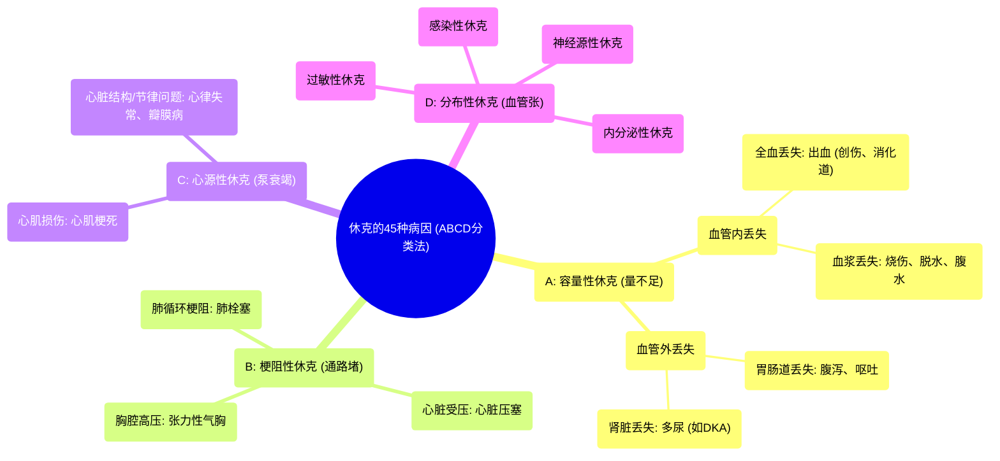

# 45 Causes of Shock

  <video controls preload="metadata" playsinline>
    <source src="https://helly.s3.bitiful.net/心血管学科/%E4%B8%93%E8%BE%91%2020%EF%BC%9A%E5%BF%83%E5%86%85%E7%A7%91%E7%BB%88%E6%9E%81%E8%BE%9E%E5%85%B8%E7%96%BE%E7%97%85%E6%9C%BA%E5%88%B6%E7%AF%87%20%28PathologyMechanisms%29/45%20Causes%20of%20Shock.mp4" type="video/mp4">
    
您的浏览器不支持播放，请升级。

  </video>

::: tip ⚡️ 核心考点 (30s速读)
*   **核心考点**：休克的本质是组织灌注不足导致的氧合与代谢功能障碍。其病因可归纳为“ABCD”四大类：**A**mount（容量/低血容量性）、**B**lockage（梗阻性）、**C**ardiac（心源性）、**D**istribution（分布性）。
*   **临床意义**：掌握“ABCD”分类法，能快速定位休克病因，指导紧急治疗。例如，低血容量性休克需快速补液，而梗阻性休克（如肺栓塞）则需解除梗阻。
:::

## 🧠 深度精讲
*   **休克的定义**：休克是一种临床综合征，其核心是**组织灌注不足**，导致氧气和营养物质无法有效输送到细胞，进而引起细胞代谢功能障碍和器官损伤。
*   **“ABCD”分类法详解**：
    1.  **A - 容量性休克 (Hypovolemic Shock)**：核心是**循环血容量绝对或相对不足**。关键在于“量”的减少。
        *   **血管内丢失**：丢失的是血液或血浆成分。例如：外伤出血、消化道出血（呕血、便血）、隐匿性出血（腹主动脉瘤破裂、异位妊娠）、严重烧伤、大量出汗、腹水形成。
        *   **血管外丢失**：体液从血管内转移到血管外或直接丢失到体外。例如：严重腹泻、大量呕吐、糖尿病酮症酸中毒（DKA）导致的多尿。
    2.  **B - 梗阻性休克 (Obstructive Shock)**：核心是**血液回心或泵出通路受阻**。关键在于“堵”。
        *   **心脏外梗阻**：如**肺栓塞**，血栓阻塞肺动脉，导致右心血液无法进入肺循环。
        *   **心脏受压**：如**心脏压塞**，心包腔内积血或积液，压迫心脏，限制其舒张和充盈。
        *   **胸腔内压增高**：如**张力性气胸**，胸腔内高压压迫大静脉和心脏，阻碍静脉回流。
    3.  **C - 心源性休克 (Cardiogenic Shock)**：核心是**心脏泵功能衰竭**。关键在于“泵”坏了。
        *   **心肌损伤**：如急性心肌梗死，心肌收缩力严重下降。
        *   **心脏结构/节律问题**：如严重的心律失常、心脏瓣膜急性反流或狭窄、心肌病等。
    4.  **D - 分布性休克 (Distributive Shock)**：核心是**外周血管异常扩张**，导致血液分布异常，有效循环血容量相对不足。关键在于“血管张力”丧失。
        *   **感染性休克**：最常见，由严重感染引起全身炎症反应，导致血管扩张和渗漏。
        *   **过敏性休克**：由严重过敏反应导致全身血管扩张和毛细血管通透性增加。
        *   **神经源性休克**：通常由高位脊髓损伤导致交感神经张力丧失，血管扩张。
        *   **内分泌性休克**：如肾上腺皮质功能危象。

## 📚 双语术语表 (Terminology)
| 英文术语 | 中文翻译 | 定义/解释 |
| :--- | :--- | :--- |
| Shock | 休克 | 组织灌注不足导致细胞缺氧和功能障碍的临床综合征。 |
| Hypovolemic Shock | 低血容量性休克 | 因循环血容量减少引起的休克。 |
| Obstructive Shock | 梗阻性休克 | 因心脏或大血管血流机械性梗阻引起的休克。 |
| Cardiogenic Shock | 心源性休克 | 因心脏泵功能衰竭引起的休克。 |
| Distributive Shock | 分布性休克 | 因全身血管阻力异常降低，血液分布不均引起的休克。 |
| Perfusion | 灌注 | 血液流经组织毛细血管床的过程。 |
| Pulmonary Embolism (PE) | 肺栓塞 | 血栓阻塞肺动脉或其分支。 |
| Cardiac Tamponade | 心脏压塞 | 心包腔内液体急剧积聚，压迫心脏，限制其充盈。 |
| Tension Pneumothorax | 张力性气胸 | 胸腔内气体只进不出，压力持续升高，严重压迫心肺。 |
| Septic Shock | 感染性休克 | 由感染引发的分布性休克，常伴有低血压。 |
| Anaphylactic Shock | 过敏性休克 | 由I型超敏反应引发的严重、速发的分布性休克。 |

## 🗺️ 知识图谱

