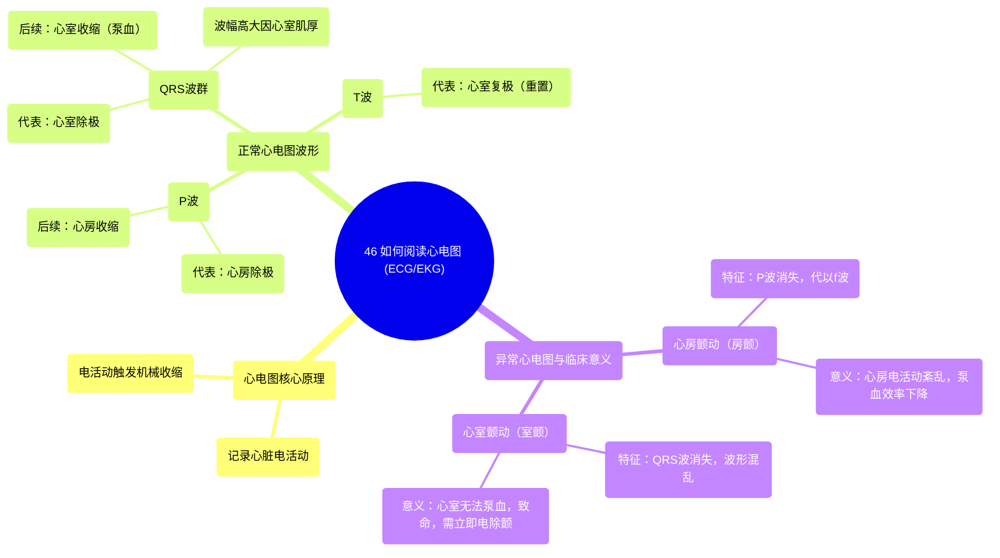

# 46 How to read an ECG EKG

  <video controls preload="metadata" playsinline>
    <source src="https://helly.s3.bitiful.net/心血管学科/%E4%B8%93%E8%BE%91%2020%EF%BC%9A%E5%BF%83%E5%86%85%E7%A7%91%E7%BB%88%E6%9E%81%E8%BE%9E%E5%85%B8%E7%96%BE%E7%97%85%E6%9C%BA%E5%88%B6%E7%AF%87%20%28PathologyMechanisms%29/46%20How%20to%20read%20an%20ECG%20EKG.mp4" type="video/mp4">
    
您的浏览器不支持播放，请升级。

  </video>

::: tip ⚡️ 核心考点 (30s速读)
*   **核心考点**：心电图（ECG/EKG）通过记录心脏的电活动来反映其功能。正常心电图波形（P波、QRS波群、T波）分别对应心房除极、心室除极和心室复极。波形异常直接提示特定心脏结构（心房或心室）的电活动紊乱。
*   **临床意义**：识别异常心电图是诊断心律失常（如房颤、室颤）的关键。房颤影响心房泵血效率，而室颤是致命性心律失常，需立即电除颤。
:::

## 🧠 深度精讲
*   **概念1：心电图的基本原理与波形解读**
    心电图是记录心脏电活动的工具。心脏收缩前，心肌细胞必须先发生电激动（除极），这个电信号传导并触发机械收缩。正常心电图的一个心动周期包含：
    1.  **P波**：第一个向上的小波，代表**心房肌的除极**（电活动），随后心房收缩，将血液推入心室。
    2.  **QRS波群**：紧随P波之后的高大尖峰，代表**心室肌的除极**。由于心室肌肉更厚，产生的电信号更强，因此波幅更大。之后心室收缩，将血液泵出心脏。
    3.  **T波**：最后的宽缓波，代表**心室的复极**（电活动重置），为下一次心跳做准备。

*   **概念2：异常心电图的临床实例**
    当心脏电传导系统发生故障时，会出现特征性的异常波形：
    1.  **心房颤动（房颤）**：心电图表现为P波消失，代之以一系列快速、不规则、形态各异的小颤动波（f波）。这意味着心房电活动紊乱，失去协调有效的收缩，心房像“一袋蠕虫”一样蠕动。虽然重力仍能使部分血液流入心室，但泵血效率显著下降。
    2.  **心室颤动（室颤）**：心电图表现为QRS波群完全消失，出现形态、振幅均不规则的波动。这意味着心室电活动完全混乱，心室无法有效收缩泵血，血液循环即刻停止，是导致猝死的危急情况，必须立即进行**电除颤**以重置心脏电活动。

## 📚 双语术语表 (Terminology)
| 英文术语 | 中文翻译 | 定义/解释 |
| :--- | :--- | :--- |
| ECG / EKG | 心电图 | 记录心脏电活动的图形。 |
| Atria | 心房 | 心脏上部的两个腔室，接收回心血液。 |
| Ventricles | 心室 | 心脏下部的两个腔室，负责将血液泵出心脏。 |
| Apex | 心尖 | 心脏的尖端，通常指向左下方。 |
| Contraction | 收缩 | 心肌收紧，推动血液流动。 |
| Electrical Activity | 电活动 | 心肌细胞产生的电信号，触发收缩。 |
| P wave | P波 | 心电图上第一个波，代表心房除极。 |
| QRS complex | QRS波群 | 心电图上高大的波群，代表心室除极。 |
| T wave | T波 | 心电图上代表心室复极的波。 |
| Atrial Fibrillation (AF) | 心房颤动（房颤） | 一种常见心律失常，心房快速、不协调地颤动。 |
| Ventricular Fibrillation (VF) | 心室颤动（室颤） | 一种致命性心律失常，心室无法有效泵血。 |
| Defibrillator | 除颤器 | 一种医疗设备，通过电击终止致命性心律失常。 |

## 🗺️ 知识图谱

