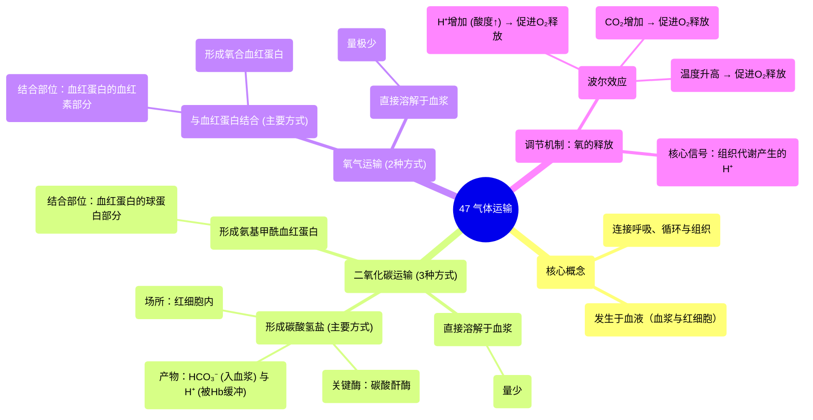

# 47 Gas Transport

  <video controls preload="metadata" playsinline>
    <source src="https://helly.s3.bitiful.net/心血管学科/%E4%B8%93%E8%BE%91%2020%EF%BC%9A%E5%BF%83%E5%86%85%E7%A7%91%E7%BB%88%E6%9E%81%E8%BE%9E%E5%85%B8%E7%96%BE%E7%97%85%E6%9C%BA%E5%88%B6%E7%AF%87%20%28PathologyMechanisms%29/47%20Gas%20Transport.mp4" type="video/mp4">
    
您的浏览器不支持播放，请升级。

  </video>

::: tip ⚡️ 核心考点 (30s速读)
*   **核心考点**：气体运输的核心是氧气和二氧化碳在血液中的运输方式。氧气主要通过与血红蛋白结合运输，而二氧化碳主要以碳酸氢盐形式运输。两者在组织和肺部的交换受氢离子浓度、温度等因素调节。
*   **临床意义**：理解气体运输机制是解释呼吸衰竭、酸中毒、一氧化碳中毒等病理状态的基础。例如，酸中毒（氢离子增多）会促进氧气释放，但也可能影响血红蛋白的携氧能力。
:::

## 🧠 深度精讲

*   **气体运输概述**：气体运输是连接呼吸系统（肺）、循环系统（血液）和组织细胞的关键生理过程。其核心任务是在肺部摄取氧气并排出二氧化碳，在组织处释放氧气并收集二氧化碳。
*   **运输载体**：气体主要在**血液**中运输，具体发生在**血浆**和**红细胞**内。红细胞是气体运输，尤其是氧气运输的核心场所。
*   **二氧化碳的运输方式 (3种)**：
    1.  **直接溶解**：少量二氧化碳直接物理溶解于血浆中。
    2.  **形成碳酸氢盐 (主要方式)**：
        *   **过程**：二氧化碳进入红细胞，在**碳酸酐酶**的催化下，与水快速反应生成碳酸，后者迅速解离为**氢离子**和**碳酸氢根离子**。
        *   **去向**：碳酸氢根离子扩散进入血浆运输；氢离子则与血红蛋白结合，被缓冲，防止血液过酸。
        *   **特点**：此途径是运输二氧化碳最主要、最高效的方式。
    3.  **形成氨基甲酰血红蛋白**：
        *   **过程**：二氧化碳直接与血红蛋白的**球蛋白部分**结合，形成**氨基甲酰血红蛋白**。
        *   **特点**：此方式运输量较少，但快速、可逆。
*   **氧气的运输方式 (2种)**：
    1.  **与血红蛋白结合 (主要方式)**：绝大部分氧气与红细胞内的血红蛋白的**血红素部分**可逆性结合，形成**氧合血红蛋白**。
    2.  **直接溶解**：极少量的氧气直接物理溶解于血浆中。
*   **氧解离曲线的调节 (氧气释放的关键)**：氧气从血红蛋白上释放（解离）受多种因素影响，以确保在组织处高效供氧。
    *   **波尔效应**：组织代谢产生大量二氧化碳，进而增加氢离子浓度（酸度增加）和温度，这些变化会**促使**血红蛋白与氧气的亲和力**下降**，从而在需要氧气的组织处**促进氧气释放**。
    *   **核心机制**：视频中提到的**氢离子**是关键的调节信号。组织代谢活跃时，氢离子增多，能直接促使血红蛋白构象改变，释放氧气。

## 📚 双语术语表 (Terminology)
| 英文术语 | 中文翻译 | 定义/解释 |
| :--- | :--- | :--- |
| Gas Transport | 气体运输 | 氧气和二氧化碳在血液中从肺到组织及反向运输的过程。 |
| Red Blood Cell (RBC) | 红细胞 | 血液中负责运输氧气和部分二氧化碳的细胞，内含血红蛋白。 |
| Hemoglobin (Hb) | 血红蛋白 | 红细胞内的蛋白质，由血红素和球蛋白组成，主要负责携带氧气和部分二氧化碳。 |
| Carbonic Anhydrase | 碳酸酐酶 | 存在于红细胞内的酶，能极大加速二氧化碳与水反应生成碳酸的速度。 |
| Bicarbonate (HCO₃⁻) | 碳酸氢根离子 | 二氧化碳在血液中运输的主要形式。 |
| Carbaminohemoglobin | 氨基甲酰血红蛋白 | 二氧化碳与血红蛋白的球蛋白部分结合形成的化合物，是二氧化碳的一种运输形式。 |
| Dissolved in Plasma | 溶解于血浆 | 气体以物理溶解状态直接在血浆中运输，运输量很小。 |
| Bohr Effect | 波尔效应 | 氢离子浓度增加（pH降低）和二氧化碳增加会降低血红蛋白对氧的亲和力，促进氧在组织释放的现象。 |
| Oxygen-Hemoglobin Dissociation Curve | 氧解离曲线 | 描述血氧饱和度与氧分压之间关系的曲线，其位置受pH、温度等影响。 |

## 🗺️ 知识图谱

