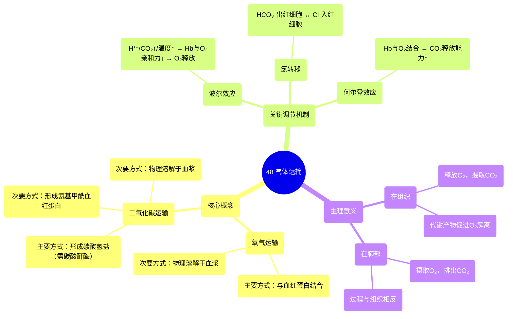

# 48 Gas Transport

  <video controls preload="metadata" playsinline>
    <source src="https://helly.s3.bitiful.net/心血管学科/%E4%B8%93%E8%BE%91%2020%EF%BC%9A%E5%BF%83%E5%86%85%E7%A7%91%E7%BB%88%E6%9E%81%E8%BE%9E%E5%85%B8%E7%96%BE%E7%97%85%E6%9C%BA%E5%88%B6%E7%AF%87%20%28PathologyMechanisms%29/48%20Gas%20Transport.mp4" type="video/mp4">
    
您的浏览器不支持播放，请升级。

  </video>

::: tip ⚡️ 核心考点 (30s速读)
*   **核心考点**：气体运输的核心是氧气和二氧化碳在血液中的运输方式。氧气主要通过与血红蛋白结合运输，而二氧化碳主要以碳酸氢盐形式运输。两者在组织与肺部的交换受氢离子浓度、温度等因素调节。
*   **临床意义**：理解气体运输机制是解释呼吸性酸/碱中毒、一氧化碳中毒、贫血等病理生理的基础。例如，碳酸酐酶抑制剂（如乙酰唑胺）通过影响二氧化碳运输来治疗某些疾病。
:::

## 🧠 深度精讲

*   **气体运输概述**：气体运输是连接呼吸系统（肺）、循环系统（血液）和组织代谢的关键桥梁。其核心任务是在肺部摄取氧气并排出二氧化碳，在组织释放氧气并收集二氧化碳。
*   **氧气运输的两种方式**：
    1.  **与血红蛋白结合**：这是最主要的方式（约占98.5%）。氧气与红细胞内的血红蛋白（Hb）的血红素部分可逆性结合，形成氧合血红蛋白（HbO₂）。
    2.  **物理溶解于血浆**：这是次要方式（约占1.5%）。氧气直接溶解在血浆中，虽然量少，但却是氧气进入红细胞与血红蛋白结合或从血液扩散到组织的必经步骤。
*   **二氧化碳运输的三种方式**：
    1.  **溶解于血浆**：约占7-10%。二氧化碳直接物理溶解在血浆中。
    2.  **形成碳酸氢盐**：这是最主要的方式（约占70%）。该过程主要在红细胞内进行：二氧化碳与水在**碳酸酐酶**的催化下快速生成碳酸（H₂CO₃），后者随即解离为氢离子（H⁺）和碳酸氢根离子（HCO₃⁻）。HCO₃⁻扩散进入血浆运输，H⁺则由血红蛋白等缓冲。
    3.  **形成氨基甲酰血红蛋白**：约占20-23%。二氧化碳直接与血红蛋白的球蛋白部分的氨基结合，形成氨基甲酰血红蛋白（HbCO₂）。
*   **组织与肺部气体交换的调节（氯转移与波尔效应）**：
    *   **在组织**：代谢产生大量CO₂和H⁺，导致局部pH下降、温度升高。这些变化（尤其是H⁺增加）通过**波尔效应**促使血红蛋白与氧气的亲和力下降，从而促进氧气释放给组织。同时，CO₂进入红细胞生成HCO₃⁻，后者出细胞时伴随氯离子（Cl⁻）内流（**氯转移**），以维持电中性。
    *   **在肺部**：过程相反。肺泡氧分压高，氧气与血红蛋白结合，促使H⁺从血红蛋白释放。H⁺与HCO₃⁻结合生成H₂CO₃，并在碳酸酐酶催化下分解为CO₂和水，CO₂扩散至肺泡被呼出。

## 📚 双语术语表 (Terminology)
| 英文术语 | 中文翻译 | 定义/解释 |
| :--- | :--- | :--- |
| Gas Transport | 气体运输 | 氧气和二氧化碳在血液中从肺部到组织及反向的运输过程。 |
| Hemoglobin (Hb) | 血红蛋白 | 红细胞内含有铁的蛋白质，主要负责与氧气和二氧化碳结合并进行运输。 |
| Oxyhemoglobin (HbO₂) | 氧合血红蛋白 | 与氧气结合后的血红蛋白。 |
| Carbaminohemoglobin (HbCO₂) | 氨基甲酰血红蛋白 | 二氧化碳与血红蛋白的球蛋白部分结合形成的化合物。 |
| Bicarbonate (HCO₃⁻) | 碳酸氢盐/碳酸氢根离子 | 二氧化碳运输的主要形式，由二氧化碳和水反应后生成。 |
| Carbonic Anhydrase | 碳酸酐酶 | 存在于红细胞内的酶，能极大加速二氧化碳与水反应生成碳酸的过程。 |
| Chloride Shift | 氯转移/氯离子转移 | 当碳酸氢根离子从红细胞扩散到血浆时，氯离子向红细胞内移动以维持细胞内外电中性的过程。 |
| Bohr Effect | 波尔效应 | pH值降低（H⁺浓度增加）或二氧化碳分压升高时，血红蛋白对氧气的亲和力下降的现象，利于在组织释放氧气。 |
| Haldane Effect | 何尔登效应 | 氧合血红蛋白促进二氧化碳释放的现象，即在肺部，血红蛋白与氧结合后，其携带二氧化碳的能力下降，利于二氧化碳排出。 |
| Plasma | 血浆 | 血液的液体成分，可物理溶解少量氧气和二氧化碳。 |

## 🗺️ 知识图谱

