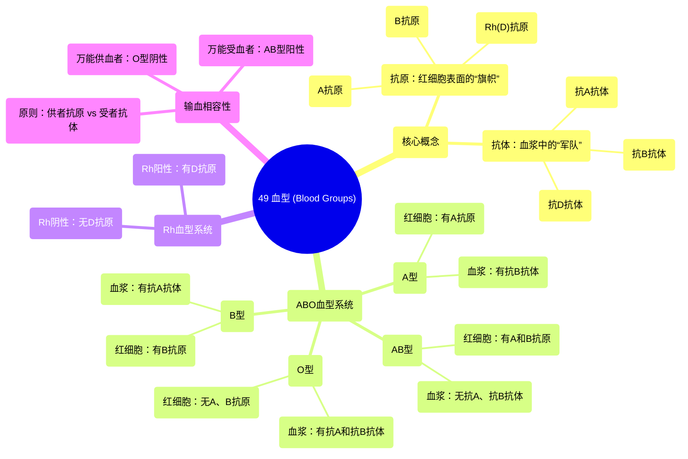

# 49 Blood Types (Blood Groups)

  <video controls preload="metadata" playsinline>
    <source src="https://helly.s3.bitiful.net/心血管学科/%E4%B8%93%E8%BE%91%2020%EF%BC%9A%E5%BF%83%E5%86%85%E7%A7%91%E7%BB%88%E6%9E%81%E8%BE%9E%E5%85%B8%E7%96%BE%E7%97%85%E6%9C%BA%E5%88%B6%E7%AF%87%20%28PathologyMechanisms%29/49%20Blood%20Types%20%28Blood%20Groups%29.mp4" type="video/mp4">
    
您的浏览器不支持播放，请升级。

  </video>

::: tip ⚡️ 核心考点 (30s速读)
*   **核心考点**：血型系统基于红细胞表面的**抗原**（A、B、Rh/D）和血浆中的**抗体**（抗A、抗B、抗D）进行区分。输血时，供血者的红细胞抗原不能与受血者的血浆抗体发生凝集反应。
*   **临床意义**：**O型阴性**是“万能供血者”，可紧急输给任何血型；**AB型阳性**是“万能受血者”，可接受任何血型的血液。Rh阴性者（尤其是女性）首次接受Rh阳性血后会产生抗D抗体，再次输入会导致严重溶血反应。
:::

## 🧠 深度精讲

*   **概念1：抗原与抗体**
    *   **抗原**：位于红细胞表面的蛋白质“旗帜”，用于标识“自我”。主要血型抗原包括A抗原、B抗原和Rh(D)抗原。
    *   **抗体**：由免疫系统产生的蛋白质“军队”，用于识别并攻击“非我”抗原。人体天然存在针对自身所缺乏的A/B抗原的抗体（如A型血者有抗B抗体）。

*   **概念2：ABO血型系统**
    *   根据红细胞表面是否存在A抗原和/或B抗原，分为四型：
        *   **A型**：红细胞有A抗原，血浆有**抗B抗体**。
        *   **B型**：红细胞有B抗原，血浆有**抗A抗体**。
        *   **AB型**：红细胞同时有A和B抗原，血浆中**无抗A、抗B抗体**。
        *   **O型**：红细胞无A、B抗原，血浆中**同时有抗A和抗B抗体**。

*   **概念3：Rh血型系统**
    *   根据红细胞表面是否存在**D抗原**（Rh因子）划分。
    *   **Rh阳性**：有D抗原（如A+、B+、O+、AB+）。
    *   **Rh阴性**：无D抗原（如A-、B-、O-、AB-）。Rh阴性者首次接触D抗原（如输血、妊娠）后可能产生**抗D抗体**。

*   **概念4：输血相容性原则**
    *   核心是避免供血者红细胞的抗原与受血者血浆中的抗体相遇。
    *   **万能供血者**：**O型阴性**。因其红细胞无A、B、D抗原，理论上可输给任何人（紧急情况下）。
    *   **万能受血者**：**AB型阳性**。因其血浆中无抗A、抗B、抗D抗体，理论上可接受任何血型的红细胞。
    *   **同型输血**始终是最安全的选择。

## 📚 双语术语表 (Terminology)
| 英文术语 | 中文翻译 | 定义/解释 |
| :--- | :--- | :--- |
| Antigen | 抗原 | 存在于细胞表面（如红细胞）的蛋白质标记，能被免疫系统识别。 |
| Antibody | 抗体 | 由免疫系统产生的蛋白质，能特异性识别并结合外来抗原，引发免疫反应。 |
| Erythrocyte / Red Blood Cell (RBC) | 红细胞 | 血液中负责运输氧气和二氧化碳的细胞，其表面的抗原决定了血型。 |
| Blood Group / Blood Type | 血型 | 根据红细胞表面抗原差异进行的血液分类，如ABO系统和Rh系统。 |
| ABO System | ABO血型系统 | 根据红细胞表面A抗原和B抗原的有无，将人类血液分为A、B、AB、O四型。 |
| Rhesus (Rh) Factor | Rh因子 | 红细胞表面的另一种重要抗原，主要指D抗原。有则为Rh阳性，无则为Rh阴性。 |
| Universal Donor | 万能供血者 | 通常指O型阴性血，因其红细胞缺乏A、B、D抗原，可紧急输给其他血型患者。 |
| Universal Acceptor/Recipient | 万能受血者 | 通常指AB型阳性血，因其血浆中不含抗A、抗B、抗D抗体，可接受所有血型的红细胞。 |
| Transfusion | 输血 | 将血液或血液成分从一个人（供血者）输注给另一个人（受血者）的医疗过程。 |
| Agglutination | 凝集反应 | 当红细胞表面的抗原与相应的抗体结合时，导致红细胞聚集在一起的反应，是输血禁忌的体现。 |

## 🗺️ 知识图谱

