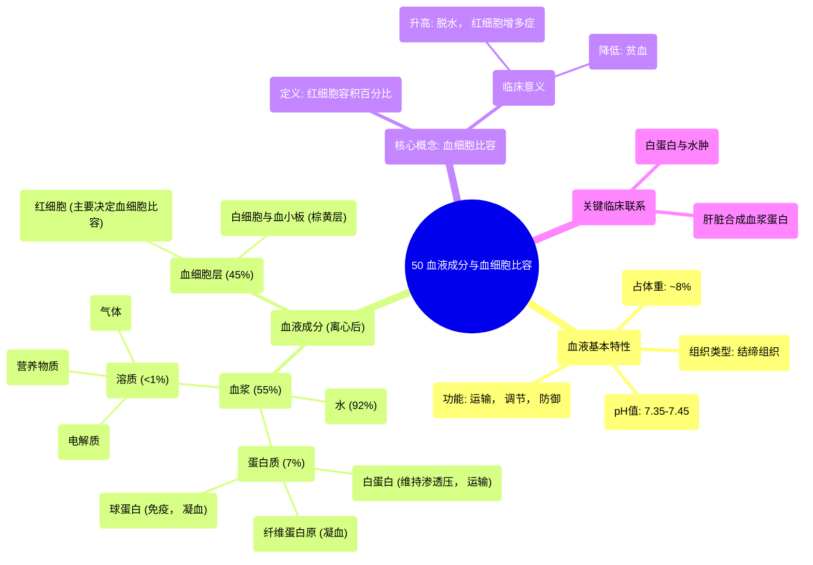

# 50 Blood Components (Hematocrit)

  <video controls preload="metadata" playsinline>
    <source src="https://helly.s3.bitiful.net/心血管学科/%E4%B8%93%E8%BE%91%2020%EF%BC%9A%E5%BF%83%E5%86%85%E7%A7%91%E7%BB%88%E6%9E%81%E8%BE%9E%E5%85%B8%E7%96%BE%E7%97%85%E6%9C%BA%E5%88%B6%E7%AF%87%20%28PathologyMechanisms%29/50%20Blood%20Components%20%28Hematocrit%29.mp4" type="video/mp4">
    
您的浏览器不支持播放，请升级。

  </video>

::: tip ⚡️ 核心考点 (30s速读)
*   **核心考点**：血液是结缔组织，由血浆（55%）和血细胞（45%）组成。血细胞比容（Hct）指血细胞在血液中所占的容积百分比，是评估贫血、脱水等的重要指标。
*   **临床意义**：血浆白蛋白是维持血浆胶体渗透压的关键，其缺乏会导致水肿。肝脏是合成血浆蛋白的主要器官，肝功能受损会影响蛋白合成。
:::

## 🧠 深度精讲

*   **血液的基本特性**：血液是一种液态结缔组织，pH值稳定在7.35-7.45之间。它约占成人体重的8%，男性平均血容量为5-6升，女性为4-5升。体温约为38°C，是体内热量传递的主要媒介。
*   **血液的组成分离**：通过离心，血液可分离为三层：最上层是**血浆**，中间薄层是**白细胞和血小板**（“棕黄层”），最下层是**红细胞**。血细胞比容即指红细胞层所占的总体积百分比。
*   **血浆 (Plasma)**：占全血容积的55%，其成分包括：
    *   **水**：占血浆的92%，是血液的主要成分。
    *   **蛋白质**：占血浆的7%，主要由肝脏合成，包括：
        1.  **白蛋白**：含量最丰富。主要功能是维持血浆胶体渗透压，防止液体从血管过度渗出（水肿）；同时作为载体，运输脂溶性物质（如激素、药物）。
        2.  **球蛋白**：参与免疫反应（如抗体）和凝血过程。
        3.  **纤维蛋白原**：在凝血过程中被激活为纤维蛋白，形成血凝块的基础。
    *   **溶质**：占血浆的<1%，包括电解质（如Na⁺、K⁺、Ca²⁺）、营养物质（葡萄糖、氨基酸、脂肪酸）和气体（O₂、CO₂）等。
*   **血细胞比容 (Hematocrit)**：指经离心后，红细胞在全血中所占的容积百分比。它是临床常规检查项目，用于评估贫血（Hct降低）或红细胞增多症、脱水（Hct升高）等情况。

## 📚 双语术语表 (Terminology)
| 英文术语 | 中文翻译 | 定义/解释 |
| :--- | :--- | :--- |
| Blood | 血液 | 一种在心血管系统中循环的液态结缔组织，负责运输物质、调节内环境和防御。 |
| Hematocrit (Hct) | 血细胞比容 | 红细胞在全血中所占的容积百分比，是评估红细胞数量的重要指标。 |
| Plasma | 血浆 | 血液的液体成分，约占全血容积的55%，含有水、蛋白质、电解质、激素和代谢废物等。 |
| Albumin | 白蛋白 | 血浆中含量最丰富的蛋白质，由肝脏合成，主要功能是维持血浆胶体渗透压和运输脂溶性物质。 |
| Globulin | 球蛋白 | 一类血浆蛋白质，主要参与机体的免疫反应（如免疫球蛋白）和凝血过程。 |
| Fibrinogen | 纤维蛋白原 | 一种由肝脏合成的血浆蛋白质，在凝血过程中被激活为纤维蛋白，是血凝块形成的关键。 |
| Osmotic Pressure | 渗透压 | 溶液由于溶质颗粒存在而产生的吸引水分子跨膜移动的能力。血浆胶体渗透压主要由白蛋白维持。 |
| Edema | 水肿 | 组织间隙或体腔内过量的液体积聚，血浆白蛋白减少导致渗透压下降是常见原因之一。 |
| Centrifuge | 离心机 | 一种利用离心力分离混合物中不同密度成分的仪器，用于分离血液成分以测定血细胞比容。 |

## 🗺️ 知识图谱

