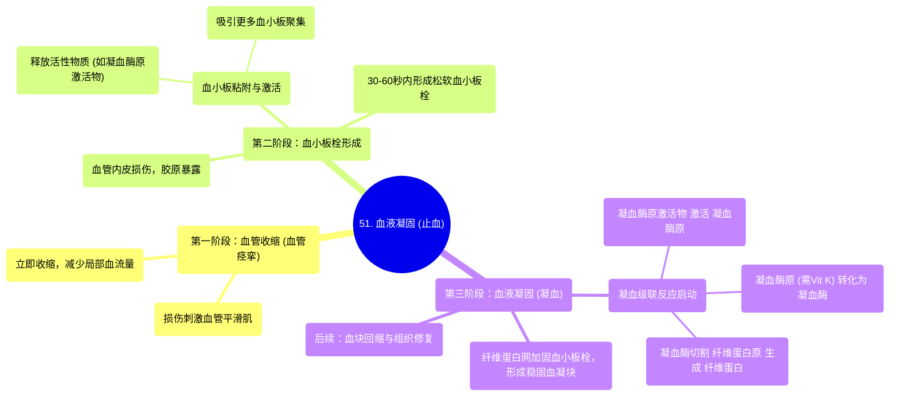

# 51 Blood Clotting (Hemostasis)

  <video controls preload="metadata" playsinline>
    <source src="https://helly.s3.bitiful.net/心血管学科/%E4%B8%93%E8%BE%91%2020%EF%BC%9A%E5%BF%83%E5%86%85%E7%A7%91%E7%BB%88%E6%9E%81%E8%BE%9E%E5%85%B8%E7%96%BE%E7%97%85%E6%9C%BA%E5%88%B6%E7%AF%87%20%28PathologyMechanisms%29/51%20Blood%20Clotting%20%28Hemostasis%29.mp4" type="video/mp4">
    
您的浏览器不支持播放，请升级。

  </video>

::: tip ⚡️ 核心考点 (30s速读)
*   **核心考点**：止血是血管损伤后快速止血的生理过程，包含三个连续且部分重叠的阶段：血管收缩、血小板栓形成和血液凝固。
*   **临床意义**：理解止血机制是诊断和治疗出血性疾病（如血友病）与血栓性疾病（如深静脉血栓）的基础。维生素K依赖的凝血因子合成、血小板功能等是关键环节。
:::

## 🧠 深度精讲

*   **概念1：止血的定义与目的**
    止血，又称血液凝固，是机体在血管壁受损后，为防止血液流失而启动的一系列快速、有序的生理反应。其最终目的是在损伤处形成稳固的血凝块，封堵破口，为后续组织修复赢得时间。

*   **概念2：止血的三个阶段**
    1.  **血管收缩（血管痉挛）**：这是损伤后立即发生的**第一步**。血管壁平滑肌受刺激后收缩，使血管管腔变窄，从而**立即减少流向损伤部位的血流量**，为后续步骤创造条件。
    2.  **血小板栓形成**：这是损伤后**30-60秒内**发生的**第二步**。血管内皮下的**胶原纤维**暴露，流经的血小板识别并粘附上去，被激活。激活的血小板释放内含物（如ADP、血栓烷A2），吸引更多血小板聚集，形成松软的**血小板栓子**，初步封堵伤口。同时，激活的血小板会释放**凝血酶原激活物**，启动下一步。
    3.  **血液凝固（凝血阶段）**：这是**第三步**，也是形成稳固血凝块的关键。此阶段通过一系列凝血因子的级联反应，将可溶性的**纤维蛋白原**转化为不溶性的**纤维蛋白**。纤维蛋白交织成网，网罗血细胞，加固血小板栓，形成牢固的**红色血栓**（血凝块）。随后进入**血块回缩**和**组织修复（血管重塑）**阶段。

*   **概念3：凝血级联反应的关键路径（基于视频内容）**
    视频中重点描述了一条关键的凝血激活路径（属于“内源性”和“共同途径”的一部分）：
    1.  **启动**：血小板释放**凝血酶原激活物**。
    2.  **转化**：凝血酶原激活物将血浆中的**凝血酶原**（肝脏合成，依赖维生素K）激活为**凝血酶**。
    3.  **成形**：凝血酶作为“分子剪刀”，将**纤维蛋白原**切割成**纤维蛋白单体**，后者聚合交联成稳定的**纤维蛋白多聚体（网）**。
    简单记忆：**凝血酶原 → (激活) → 凝血酶 → (作用) → 纤维蛋白原 → 纤维蛋白**。

## 📚 双语术语表 (Terminology)
| 英文术语 | 中文翻译 | 定义/解释 |
| :--- | :--- | :--- |
| Hemostasis | 止血 | 血管损伤后停止出血的生理过程。 |
| Blood Clotting | 血液凝固 | 血液由液体状态转变为凝胶状血块的过程，是止血的一部分。 |
| Vascular Spasm | 血管痉挛 | 止血第一步，损伤血管平滑肌收缩以减少血流量。 |
| Platelet Plug | 血小板栓 | 止血第二步，由激活和聚集的血小板形成的临时性堵塞物。 |
| Coagulation Phase | 凝血阶段 | 止血第三步，通过凝血因子级联反应生成纤维蛋白，形成稳固血凝块。 |
| Collagen | 胶原蛋白 | 血管内皮下结缔组织的主要成分，损伤暴露后是血小板粘附的关键信号。 |
| Platelets | 血小板 | 骨髓巨核细胞脱落的细胞碎片，在止血中负责粘附、聚集和释放活性物质。 |
| Prothrombin Activator | 凝血酶原激活物 | 由激活的血小板等释放，能激活凝血酶原的复合物。 |
| Prothrombin | 凝血酶原 | 肝脏合成的凝血因子II，在维生素K参与下生成，可被激活为凝血酶。 |
| Thrombin | 凝血酶 | 关键凝血因子IIa，能切割纤维蛋白原转化为纤维蛋白。 |
| Fibrinogen | 纤维蛋白原 | 血浆中的可溶性蛋白质，凝血酶的底物。 |
| Fibrin | 纤维蛋白 | 由纤维蛋白原经凝血酶作用后形成的不溶性蛋白纤维，交织成网构成血凝块骨架。 |
| Vitamin K | 维生素K | 脂溶性维生素，肝脏合成凝血酶原等凝血因子所必需。 |

## 🗺️ 知识图谱

