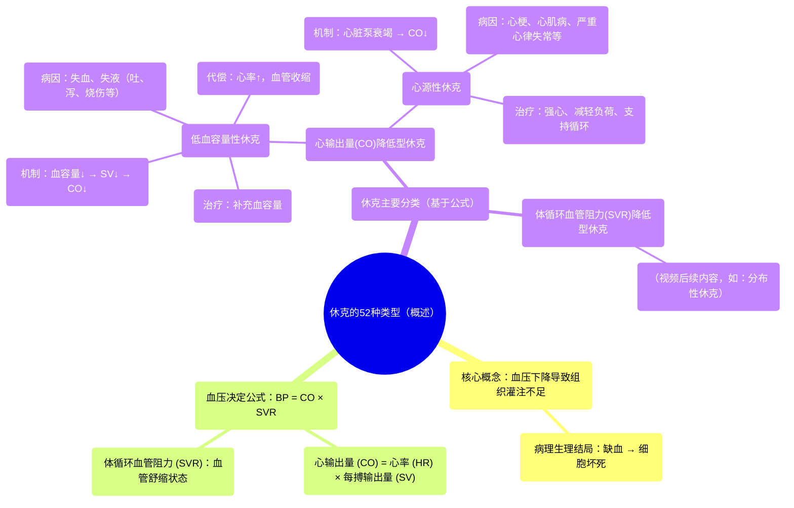

# 52 Types of Shock

  <video controls preload="metadata" playsinline>
    <source src="https://helly.s3.bitiful.net/心血管学科/%E4%B8%93%E8%BE%91%2020%EF%BC%9A%E5%BF%83%E5%86%85%E7%A7%91%E7%BB%88%E6%9E%81%E8%BE%9E%E5%85%B8%E7%96%BE%E7%97%85%E6%9C%BA%E5%88%B6%E7%AF%87%20%28PathologyMechanisms%29/52%20Types%20of%20Shock.mp4" type="video/mp4">
    
您的浏览器不支持播放，请升级。

  </video>

::: tip ⚡️ 核心考点 (30s速读)
*   **核心考点**：休克的核心是**血压下降**导致的**组织灌注不足**，进而引发缺血和坏死。其病理生理基础可用**血压公式 (BP = CO × SVR)** 来理解。
*   **临床意义**：根据血压公式，休克可分为三大类：**心输出量(CO)相关**（如低血容量性、心源性休克）和**体循环血管阻力(SVR)相关**（如分布性休克）。理解病因是精准治疗的关键。
:::

## 🧠 深度精讲

*   **休克的定义与病理生理**：休克并非单一疾病，而是一种危及生命的**循环衰竭综合征**。其本质是**有效循环血容量锐减**，导致**全身组织和器官的微循环灌注严重不足**，从而引起细胞代谢紊乱和功能受损。视频中强调的“灌注减少”是核心环节，它直接导致细胞缺氧、无法产生ATP（能量），最终走向细胞坏死和器官功能衰竭。
*   **血压的决定公式**：理解休克分类的钥匙是血压公式：**血压 (BP) = 心输出量 (CO) × 体循环血管阻力 (SVR)**。
    *   **心输出量 (CO)** = 心率 (HR) × 每搏输出量 (SV)。它代表心脏每分钟泵出的总血量。
    *   **体循环血管阻力 (SVR)**：指血液在体循环动脉系统中流动所遇到的总阻力，主要受小动脉舒缩状态（血管直径）影响。
    *   任何导致**CO下降**或**SVR下降**的因素，都可能引起血压下降，从而引发休克。
*   **低血容量性休克 (Hypovolemic Shock)**：
    *   **核心机制**：循环血容量绝对减少，导致**每搏输出量(SV)下降**，进而使心输出量(CO)下降。
    *   **常见病因**：
        *   **失血**：如创伤、消化道出血、产后出血、动脉瘤破裂等。
        *   **失液**：如严重呕吐、腹泻、糖尿病高渗状态导致的多尿、大面积烧伤引起的血浆渗出。
    *   **身体代偿**：为维持血压，身体会启动代偿机制：① **心率增快**（心动过速），试图增加CO；② **血管收缩**，以提升SVR。但这些代偿是有限的，若病因不解除，终将失代偿。
    *   **治疗原则**：**补充血容量**。针对病因给予输血、输液（晶体液、胶体液）等，迅速恢复有效循环血量。
*   **心源性休克 (Cardiogenic Shock)**：
    *   **核心机制**：**心脏泵功能本身衰竭**，导致心输出量(CO)下降。问题出在“泵”上。
    *   **受损环节**：可能是**心率**（如严重心动过缓）、**每搏输出量**（如心肌收缩力减弱）或两者兼有。
    *   **常见病因**：急性心肌梗死、严重心肌炎、终末期心肌病、严重心律失常、心脏瓣膜急性衰竭等。
    *   **与低血容量性休克区别**：虽然两者都导致CO下降，但心源性休克的“血容量”可能正常甚至增多（如心衰时体液潴留），关键是泵血能力不足。治疗重点在于**增强心肌收缩力、减轻心脏负荷、恢复心脏功能**（如使用正性肌力药、血管活性药、机械循环支持等），而非单纯大量补液。

## 📚 双语术语表 (Terminology)
| 英文术语 | 中文翻译 | 定义/解释 |
| :--- | :--- | :--- |
| Shock | 休克 | 因有效循环血容量减少，组织灌注不足导致的细胞缺氧和功能损害的临床综合征。 |
| Perfusion | 灌注 | 血液流经组织毛细血管网，为细胞输送氧气和营养物质并带走代谢废物的过程。 |
| Ischemia | 缺血 | 组织或器官的血液供应减少或中断。 |
| Necrosis | 坏死 | 活体内局部组织、细胞的病理性死亡。 |
| Blood Pressure (BP) | 血压 | 血液在血管内流动时作用于单位面积血管壁的侧压力。 |
| Cardiac Output (CO) | 心输出量 | 一侧心室每分钟射出的血液总量，等于心率乘以每搏输出量。 |
| Stroke Volume (SV) | 每搏输出量 | 一次心搏中，一侧心室射出的血液量。 |
| Systemic Vascular Resistance (SVR) | 体循环血管阻力 | 血液在体循环动脉系统内流动所受到的总阻力。 |
| Hypovolemic Shock | 低血容量性休克 | 因循环血容量绝对减少（失血或失液）引起的休克。 |
| Cardiogenic Shock | 心源性休克 | 因心脏泵功能衰竭，心输出量显著减少引起的休克。 |
| Tachycardia | 心动过速 | 成人静息心率超过100次/分钟。 |
| Compensation | 代偿 | 机体在疾病过程中通过调整功能、代谢和结构来适应异常变化，试图维持内环境稳定的过程。 |

## 🗺️ 知识图谱

