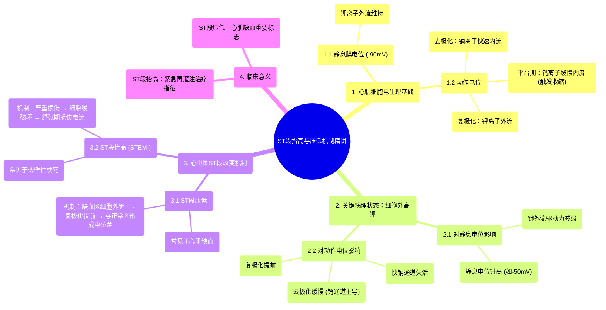

# 53 ST Elevation and ST Depression EXPLAINED

  <video controls preload="metadata" playsinline>
    <source src="https://helly.s3.bitiful.net/心血管学科/%E4%B8%93%E8%BE%91%2020%EF%BC%9A%E5%BF%83%E5%86%85%E7%A7%91%E7%BB%88%E6%9E%81%E8%BE%9E%E5%85%B8%E7%96%BE%E7%97%85%E6%9C%BA%E5%88%B6%E7%AF%87%20%28PathologyMechanisms%29/53%20ST%20Elevation%20and%20ST%20Depression%20EXPLAINED.mp4" type="video/mp4">
    
您的浏览器不支持播放，请升级。

  </video>

::: tip ⚡️ 核心考点 (30s速读)
*   **核心考点**：ST段抬高（STEMI）和ST段压低是心肌梗死（心梗）在心电图上的两种关键表现，其根本原因在于心肌细胞膜电位异常导致的电流变化。
*   **临床意义**：ST段抬高通常提示冠状动脉完全闭塞，需紧急再灌注治疗（如溶栓或介入）；ST段压低则常提示心肌缺血或心内膜下梗死，是评估冠心病风险的重要指标。
:::

## 🧠 深度精讲

*   **正常心肌细胞电生理**：心肌细胞在静息时，膜电位约为-90mV（内负外正），主要由钾离子外流维持。当受到刺激，钠离子快速内流，引发去极化（膜内变正），形成动作电位的上升支。随后钙离子缓慢内流（维持平台期，引发收缩），最后钾离子外流导致复极化（膜内恢复负电位）。
*   **高钾环境的影响**：当细胞外钾离子浓度异常升高时，钾离子外流的驱动力减弱，导致静息膜电位值升高（例如从-90mV变为-50mV）。这意味着细胞已部分去极化。在这种状态下，快钠通道失活，去极化过程只能依赖缓慢的钙通道，导致动作电位上升缓慢、幅度降低，并且提前复极化。
*   **ST段改变的机制**：
    *   **ST段压低**：视频中重点解释了这一机制。当心肌缺血（如心内膜下）时，局部细胞可能因代谢产物堆积（如钾离子）而导致细胞外钾浓度相对升高。这会使该区域心肌细胞的动作电位时程缩短、复极化提前。在体表心电图上，健康区域与缺血区域之间在复极化期间（对应ST段）存在电位差，电流从复极化早的区域流向晚的区域，表现为面向缺血区的导联出现**ST段压低**。
    *   **ST段抬高**：虽然视频未深入展开，但其经典机制是冠状动脉完全闭塞导致**透壁性心肌缺血/梗死**。缺血中心区心肌细胞严重损伤，细胞膜完整性破坏，钾离子大量外流，同时细胞无法正常去极化，在舒张期（对应ST段）表现为“损伤电流”，导致面向梗死区的导联出现**ST段抬高**。

## 📚 双语术语表 (Terminology)
| 英文术语 | 中文翻译 | 定义/解释 |
| :--- | :--- | :--- |
| ST Elevation (STE) | ST段抬高 | 心电图上J点后ST段异常上抬，超过正常范围，是急性心肌梗死（STEMI）的特征性表现。 |
| ST Depression (STD) | ST段压低 | 心电图上ST段异常下移，常见于心肌缺血、心内膜下梗死等。 |
| Myocardial Infarction (MI) | 心肌梗死 | 因冠状动脉血流急剧减少或中断，导致相应区域心肌因缺血而坏死。 |
| Resting Membrane Potential | 静息膜电位 | 细胞未受刺激时，细胞膜内外两侧的电位差，心肌细胞约为-90mV。 |
| Depolarization | 去极化 | 细胞受刺激后，膜电位由内负外正向内正外负方向变化的过程，对应动作电位上升支。 |
| Repolarization | 复极化 | 去极化后，膜电位恢复至静息状态的过程，对应动作电位下降支。 |
| Action Potential | 动作电位 | 可兴奋细胞受到刺激时产生的短暂、可传导的膜电位波动。 |
| Cardiomyocyte | 心肌细胞 | 构成心肌组织的基本功能单位，具有自律性、传导性和收缩性。 |
| STEMI | ST段抬高型心肌梗死 | 心电图表现为ST段抬高的急性心肌梗死，通常提示冠状动脉完全闭塞。 |
| Isoelectric Point | 等电位点 | 心电图上两个波形之间（如T-P段）无电位变化的基线水平。 |

## 🗺️ 知识图谱

