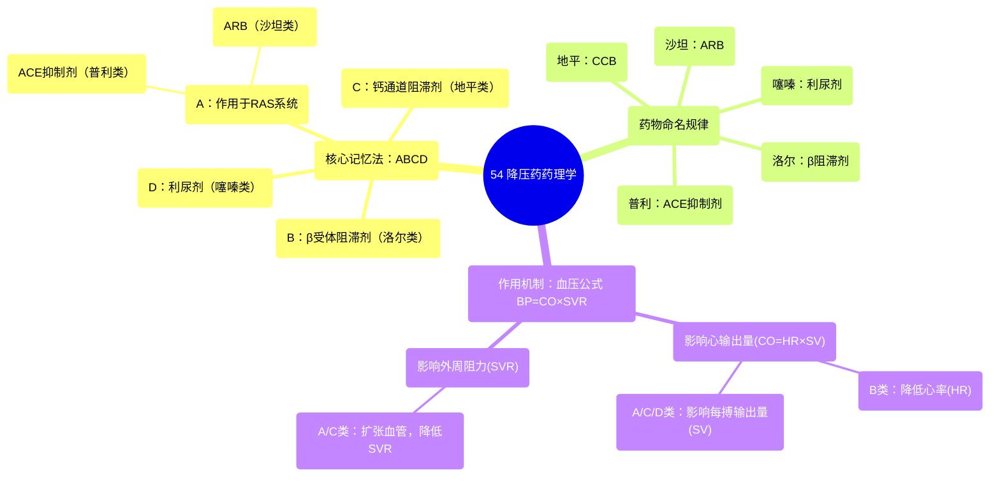

# 54 Blood Pressure Drugs Pharmacology

  <video controls preload="metadata" playsinline>
    <source src="https://helly.s3.bitiful.net/心血管学科/%E4%B8%93%E8%BE%91%2020%EF%BC%9A%E5%BF%83%E5%86%85%E7%A7%91%E7%BB%88%E6%9E%81%E8%BE%9E%E5%85%B8%E7%96%BE%E7%97%85%E6%9C%BA%E5%88%B6%E7%AF%87%20%28PathologyMechanisms%29/54%20Blood%20Pressure%20Drugs%20Pharmacology.mp4" type="video/mp4">
    
您的浏览器不支持播放，请升级。

  </video>

::: tip ⚡️ 核心考点 (30s速读)
*   **核心考点**：降压药可按“A、B、C、D”四类快速记忆，每类药物有特征性后缀。
*   **临床意义**：所有降压药均通过影响血压公式（血压=心输出量×外周阻力）的某个环节来降低血压。
:::

## 🧠 深度精讲
*   **概念1**：降压药的“ABCD”分类法。这是一种高效的记忆框架，将主流降压药分为四类：
    *   **A**：代表作用于肾素-血管紧张素系统的两类药物。第一类是“血管紧张素转换酶抑制剂”，即“普利”类药物。第二类是“血管紧张素II受体拮抗剂”，即“沙坦”类药物。
    *   **B**：代表“β受体阻滞剂”，即“洛尔”类药物。
    *   **C**：代表“钙通道阻滞剂”，即“地平”类药物。
    *   **D**：代表“利尿剂”，在降压治疗中特指“噻嗪类”或“噻嗪样”利尿剂。
*   **概念2**：药物名称的后缀规律。掌握各类药物的通用后缀有助于快速识别：
    *   “普利”类：如卡托普利、依那普利。
    *   “沙坦”类：如氯沙坦、缬沙坦。
    *   “洛尔”类：如美托洛尔、普萘洛尔。
    *   “地平”类：如硝苯地平、氨氯地平。
    *   利尿剂：常含“噻嗪”，如氢氯噻嗪，但也有例外。
*   **概念3**：降压药物的作用机制与血压公式。血压（BP）= 心输出量（CO）× 外周血管阻力（SVR）。心输出量（CO）= 心率（HR）× 每搏输出量（SV）。
    *   **A类药物**：通过抑制血管紧张素II的生成或作用，阻止血管收缩（降低SVR）和减少血容量（影响SV），从而降压。
    *   **B类药物**：主要减慢心率（降低HR），减少心输出量。
    *   **C类药物**：主要扩张血管（降低SVR），部分也抑制心肌收缩力（影响SV）。
    *   **D类药物**：通过利尿减少循环血容量，降低每搏输出量（SV）。

## 📚 双语术语表 (Terminology)
| 英文术语 | 中文翻译 | 定义/解释 |
| :--- | :--- | :--- |
| Antihypertensive medications | 抗高血压药物 / 降压药 | 用于治疗高血压的药物。 |
| ACE inhibitors | 血管紧张素转换酶抑制剂 | 抑制血管紧张素转换酶，减少血管紧张素II生成，常用药名以“普利”结尾。 |
| Angiotensin-2 receptor blockers (ARBs) | 血管紧张素II受体拮抗剂 | 阻断血管紧张素II与其受体结合，常用药名以“沙坦”结尾。 |
| Beta blockers | β受体阻滞剂 | 阻断β肾上腺素能受体，主要减慢心率和减弱心肌收缩力，常用药名以“洛尔”结尾。 |
| Calcium channel blockers (CCBs) | 钙通道阻滞剂 | 阻断钙离子通道，主要扩张血管，部分抑制心肌，常用药名以“地平”结尾。 |
| Diuretics | 利尿剂 | 促进肾脏排钠排水，减少血容量。用于降压的主要是噻嗪类。 |
| Thiazide diuretics | 噻嗪类利尿剂 | 一类中效利尿剂，常用于高血压治疗。 |
| Cardiac output (CO) | 心输出量 | 每分钟心脏泵出的血液总量，等于心率×每搏输出量。 |
| Systemic vascular resistance (SVR) | 体循环血管阻力 / 外周血管阻力 | 血液在体循环中流动所遇到的总阻力，主要受小动脉口径影响。 |
| Stroke volume (SV) | 每搏输出量 | 心脏每次收缩泵出的血液量。 |

## 🗺️ 知识图谱

