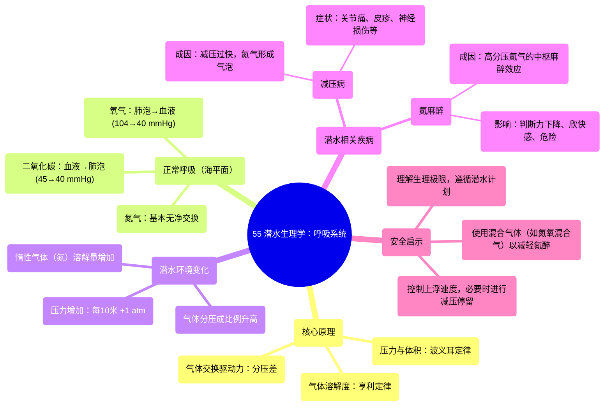

# 55 Diving Physiology Respiratory System

  <video controls preload="metadata" playsinline>
    <source src="https://helly.s3.bitiful.net/心血管学科/%E4%B8%93%E8%BE%91%2020%EF%BC%9A%E5%BF%83%E5%86%85%E7%A7%91%E7%BB%88%E6%9E%81%E8%BE%9E%E5%85%B8%E7%96%BE%E7%97%85%E6%9C%BA%E5%88%B6%E7%AF%87%20%28PathologyMechanisms%29/55%20Diving%20Physiology%20Respiratory%20System.mp4" type="video/mp4">
    
您的浏览器不支持播放，请升级。

  </video>

::: tip ⚡️ 核心考点 (30s速读)
*   **核心考点**：潜水时，环境压力随深度增加，导致吸入气体分压升高，影响气体在血液和组织中的溶解与交换，这是减压病和氮麻醉等潜水相关疾病的生理基础。
*   **临床意义**：理解气体分压差是气体交换的驱动力，以及高压下惰性气体（如氮气）溶解度的变化，对于预防和治疗减压病、制定安全潜水方案至关重要。
:::

## 🧠 深度精讲

*   **概念1：正常呼吸时的气体交换**
    在正常海平面（1个大气压）呼吸时，肺部气体与血液之间存在分压差，驱动气体交换。氧气从分压较高的肺泡（约104 mmHg）扩散进入分压较低的静脉血（约40 mmHg）。二氧化碳则从分压较高的静脉血（约45 mmHg）扩散进入肺泡（约40 mmHg）。氮气作为惰性气体，在肺泡和血液中的分压基本相等（约570 mmHg），因此没有净交换。

*   **概念2：压力与体积的关系（波义耳定律）**
    潜水时，环境压力随深度增加。每下潜10米（约33英尺），增加1个大气压。根据波义耳定律，在温度恒定时，气体的体积与压力成反比。例如，在海平面吸入1升气体，下潜到30米（4个大气压）时，如果不补充气体，这1升气体在肺内会被压缩到约0.25升。这解释了为什么潜水员在下潜时必须持续呼吸以平衡肺内压力，防止肺部挤压伤；而上浮时必须保持呼吸，避免肺部过度膨胀。

*   **概念3：高压下的气体分压与溶解度**
    随着总压力增加，吸入气体中各成分的分压也成比例增加。例如，在30米深处（4个大气压），吸入空气中氮气的分压将变为海平面时的4倍。根据亨利定律，气体在液体中的溶解量与其分压成正比。因此，在高压下，更多的氮气会溶解到血液和组织中。氮气在脂肪组织中的溶解度较高，导致其更容易在脂肪组织中蓄积。

*   **概念4：减压病（“The Bends”）的成因**
    如果潜水员上浮（减压）过快，环境压力迅速降低，溶解在血液和组织中的氮气会因过饱和而形成气泡。这些气泡可能阻塞血管（气栓）、压迫神经或组织，引起关节疼痛、皮疹、瘫痪甚至死亡等症状。这就是减压病，俗称“潜水夫病”或“沉箱病”。

*   **概念5：氮麻醉（“氮醉”）**
    在高分压氮气（通常始于30米以深）作用下，氮气对中枢神经系统产生类似麻醉剂的效应。潜水员可能出现判断力下降、反应迟钝、欣快感或恐慌，类似于醉酒状态，极其危险。这主要是氮气在高分压下对神经细胞膜脂质溶解产生的物理化学效应。

## 📚 双语术语表 (Terminology)
| 英文术语 | 中文翻译 | 定义/解释 |
| :--- | :--- | :--- |
| Diving Physiology | 潜水生理学 | 研究人体在潜水高压环境下生理功能变化的学科。 |
| The Bends / Decompression Sickness | 减压病 | 因减压过快，溶解在体内的惰性气体（如氮气）形成气泡所引起的一系列病症。 |
| Nitrogen Narcosis | 氮麻醉 / 氮醉 | 深潜时，高分压氮气对中枢神经系统产生的麻醉效应。 |
| Atmosphere (atm) | 大气压 | 压力单位，海平面的标准大气压约为760 mmHg。 |
| Partial Pressure | 分压 | 混合气体中某一特定气体组分所产生的压力。 |
| Boyle‘s Law | 波义耳定律 | 温度恒定时，一定质量气体的体积与其压力成反比。 |
| Henry‘s Law | 亨利定律 | 温度恒定时，气体在液体中的溶解量与其分压成正比。 |
| Alveoli | 肺泡 | 肺部进行气体交换的微小气囊。 |
| Hemoglobin | 血红蛋白 | 红细胞内负责携带氧气的蛋白质。 |
| Respiratory Membrane | 呼吸膜 | 肺泡内气体与毛细血管血液之间进行气体交换所通过的结构。 |

## 🗺️ 知识图谱

