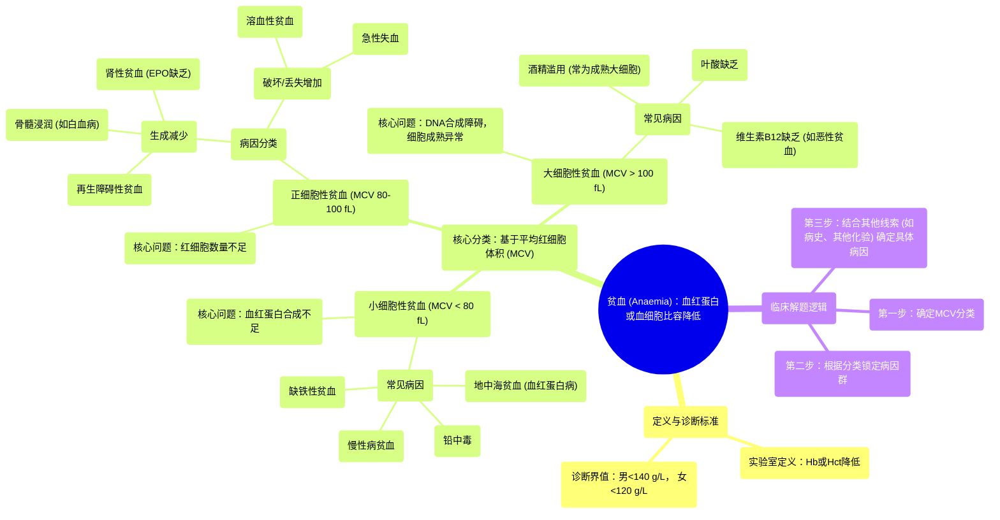

# 56 Exam Question Anaemia

  <video controls preload="metadata" playsinline>
    <source src="https://helly.s3.bitiful.net/心血管学科/%E4%B8%93%E8%BE%91%2020%EF%BC%9A%E5%BF%83%E5%86%85%E7%A7%91%E7%BB%88%E6%9E%81%E8%BE%9E%E5%85%B8%E7%96%BE%E7%97%85%E6%9C%BA%E5%88%B6%E7%AF%87%20%28PathologyMechanisms%29/56%20Exam%20Question%20Anaemia.mp4" type="video/mp4">
    
您的浏览器不支持播放，请升级。

  </video>

::: tip ⚡️ 核心考点 (30s速读)
*   **核心考点**：贫血的形态学分类（MCV）是诊断的关键第一步。根据平均红细胞体积（MCV），贫血可分为小细胞性、正细胞性、大细胞性三类，每类指向不同的病因群。
*   **临床意义**：通过MCV快速缩小鉴别诊断范围。例如，正细胞性贫血（MCV正常）提示病因可能为骨髓生成障碍（如再生障碍性贫血）或红细胞破坏/丢失（如溶血、急性失血），而非营养缺乏（铁、B12/叶酸）。
:::

## 🧠 深度精讲

*   **概念1：贫血的定义与诊断标准**
    贫血的本质是血液携氧能力下降，实验室定义为**血红蛋白浓度**或**血细胞比容**低于正常值。成年男性通常以血红蛋白 < 140 g/L，女性 < 120 g/L为诊断界值。血细胞比容指红细胞在全血中所占的容积百分比。

*   **概念2：贫血的形态学分类（基于MCV）**
    这是贫血鉴别诊断的核心框架。通过计算**平均红细胞体积**（MCV = 血细胞比容 / 红细胞总数，单位：飞升），将贫血分为三类：
    1.  **小细胞性贫血**（MCV < 80 fL）：问题核心在于**血红蛋白合成不足**，导致细胞“填充不满”而体积变小。常见病因包括：**缺铁性贫血**、**地中海贫血**（一种血红蛋白病）、慢性病贫血、铅中毒等。
    2.  **正细胞性贫血**（MCV 80-100 fL）：红细胞大小正常，但数量不足。病因可分为两大类：
        *   **生成减少**：骨髓造血功能衰竭，如**再生障碍性贫血**、白血病浸润、肾性贫血（EPO缺乏）。
        *   **破坏或丢失增加**：如**溶血性贫血**、急性失血。
    3.  **大细胞性贫血**（MCV > 100 fL）：问题核心在于**红细胞DNA合成障碍**，导致细胞核成熟延迟，细胞体积增大。主要病因是**维生素B12缺乏**（如恶性贫血）和**叶酸缺乏**。长期**酒精滥用**也可导致大细胞性贫血，但细胞通常是成熟的。

*   **概念3：解题逻辑应用**
    视频中的考题设置了“素食女性”的干扰项（易联想缺铁或B12缺乏），但关键线索是“**正细胞性贫血**”。据此排除小细胞性（缺铁、地中海贫血）和大细胞性（B12缺乏）选项，正确答案指向正细胞性贫血中的**溶血性贫血**（属于破坏增加类）。

## 📚 双语术语表 (Terminology)
| 英文术语 | 中文翻译 | 定义/解释 |
| :--- | :--- | :--- |
| Anemia | 贫血 | 指单位容积血液中血红蛋白浓度、红细胞计数或血细胞比容低于正常标准。 |
| Hemoglobin | 血红蛋白 | 红细胞内负责携带氧气的蛋白质。 |
| Hematocrit | 血细胞比容 | 红细胞在全血中所占的容积百分比。 |
| Mean Corpuscular Volume (MCV) | 平均红细胞体积 | 每个红细胞的平均体积，以飞升(fL)为单位，是贫血形态学分类的主要依据。 |
| Microcytic Anemia | 小细胞性贫血 | MCV < 80 fL 的贫血，常因血红蛋白合成障碍所致。 |
| Normocytic Anemia | 正细胞性贫血 | MCV 在 80-100 fL 之间的贫血，红细胞大小正常但数量不足。 |
| Macrocytic Anemia | 大细胞性贫血 | MCV > 100 fL 的贫血，常因DNA合成障碍导致红细胞成熟异常。 |
| Iron Deficiency Anemia | 缺铁性贫血 | 由于铁缺乏导致血红蛋白合成减少，属于典型的小细胞性贫血。 |
| Thalassemia | 地中海贫血 | 一种遗传性血红蛋白肽链合成障碍的疾病，属于小细胞性贫血。 |
| Hemolytic Anemia | 溶血性贫血 | 红细胞破坏速率加快（寿命缩短）超过骨髓代偿能力而发生的贫血，常为正细胞性。 |
| Aplastic Anemia | 再生障碍性贫血 | 骨髓造血功能衰竭，导致全血细胞减少，贫血常为正细胞性。 |
| Vitamin B12 / Folate Deficiency | 维生素B12/叶酸缺乏 | 导致DNA合成障碍，引起巨幼红细胞性贫血，属于大细胞性贫血。 |
| Pernicious Anemia | 恶性贫血 | 由于内因子缺乏导致维生素B12吸收障碍所引起的巨幼细胞性贫血，属于大细胞性贫血。 |

## 🗺️ 知识图谱

