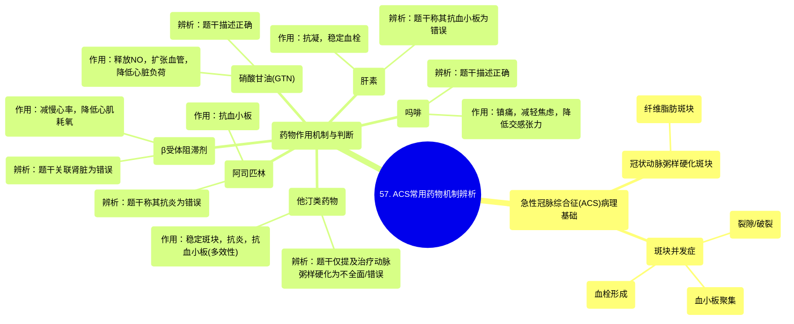

# 57 Exam Question Acute Coronary Syndrome Medications

  <video controls preload="metadata" playsinline>
    <source src="https://helly.s3.bitiful.net/心血管学科/%E4%B8%93%E8%BE%91%2020%EF%BC%9A%E5%BF%83%E5%86%85%E7%A7%91%E7%BB%88%E6%9E%81%E8%BE%9E%E5%85%B8%E7%96%BE%E7%97%85%E6%9C%BA%E5%88%B6%E7%AF%87%20%28PathologyMechanisms%29/57%20Exam%20Question%20Acute%20Coronary%20Syndrome%20Medications.mp4" type="video/mp4">
    
您的浏览器不支持播放，请升级。

  </video>

::: tip ⚡️ 核心考点 (30s速读)
*   **核心考点**：针对疑似STEMI患者，判断各类常用药物的作用机制是否与题干描述相符。关键在于区分药物的主要作用（如抗血小板、扩血管、镇痛、抗凝、稳定斑块），而非其所有潜在效应。
*   **临床意义**：在急性冠脉综合征（ACS）的紧急处理中，快速、准确地选择并应用正确的药物至关重要，这直接关系到心肌再灌注、减少梗死面积和改善患者预后。
:::

## 🧠 深度精讲
*   **概念1：急性冠脉综合征（ACS）的病理生理基础**
    ACS的核心是冠状动脉粥样硬化斑块破裂或侵蚀，继发血小板活化和血栓形成，导致心肌缺血。视频中插图展示了“纤维脂肪斑块”出现“裂隙”，暴露出斑块内容物，从而触发“血小板聚集”和“血栓”形成。理解这一过程是选择正确药物的基础。

*   **概念2：各类药物在ACS中的作用机制与辨析**
    1.  **阿司匹林**：通过不可逆抑制血小板环氧化酶，发挥**抗血小板**作用，防止血栓进一步扩大。题干错误地将其主要作用描述为“抗炎”。
    2.  **硝酸甘油（GTN）**：通过释放一氧化氮，扩张冠状动脉（尤其是侧支循环）和全身静脉，**降低心脏前负荷**，增加心肌供血并减少耗氧。题干描述其“扩大血管直径”是正确的。
    3.  **β受体阻滞剂**：通过拮抗心脏β1受体，**减慢心率、降低心肌收缩力和血压**，从而减少心肌耗氧量，在ACS中具有心脏保护作用。题干错误地将其作用与肾脏相关联。
    4.  **吗啡**：主要作用是**镇痛、减轻焦虑**，并能通过降低交感神经张力产生轻微的心脏保护效应。题干描述正确。
    5.  **肝素**：是一种抗凝剂，通过激活抗凝血酶III来抑制凝血酶（Ⅱa因子）和Xa因子，从而**阻止纤维蛋白原转化为纤维蛋白，稳定已形成的血栓**。它不直接作用于血小板，因此题干称其有“抗血小板作用”是错误的。
    6.  **他汀类药物**：在ACS急性期使用的益处不仅在于降脂，更在于其**稳定斑块、抗炎和抗血小板**等多效性作用。题干错误地将其作用仅描述为治疗“进一步的动脉粥样硬化”。

## 📚 双语术语表 (Terminology)
| 英文术语 | 中文翻译 | 定义/解释 |
| :--- | :--- | :--- |
| Acute Coronary Syndrome (ACS) | 急性冠脉综合征 | 由冠状动脉粥样硬化斑块破裂或侵蚀引发血栓形成，导致心肌急性缺血的一组临床综合征，包括不稳定型心绞痛和心肌梗死。 |
| ST-Elevated Myocardial Infarction (STEMI) | ST段抬高型心肌梗死 | ACS的一种，心电图表现为ST段弓背向上抬高，通常意味着冠状动脉完全闭塞，需紧急再灌注治疗。 |
| Fibro-fatty plaque | 纤维脂肪斑块 | 动脉粥样硬化斑块的一种类型，由脂质核心和覆盖的纤维帽构成，不稳定斑块容易破裂。 |
| Platelet aggregation | 血小板聚集 | 血小板被激活后相互黏附、聚集成团的过程，是动脉血栓形成的起始关键步骤。 |
| Thrombus | 血栓 | 在活体心血管腔内，血液成分形成的固体质块。 |
| Anti-platelet | 抗血小板 | 指药物通过抑制血小板活化、聚集来预防或治疗血栓形成的作用。 |
| Anti-coagulant | 抗凝剂 | 指药物通过干扰凝血因子，抑制血液凝固过程，防止血栓形成或扩大。 |
| Plaque stabilization | 斑块稳定 | 通过治疗（如他汀）使易损斑块的纤维帽增厚、脂核减小、炎症减轻，降低其破裂风险。 |

## 🗺️ 知识图谱

