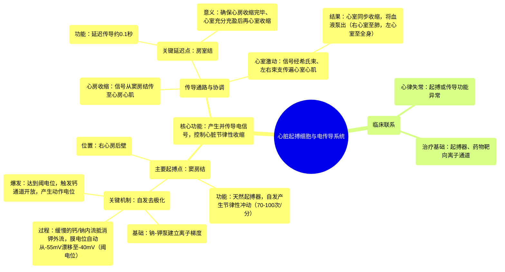

# 59 Pacemaker Cells of the Heart Cardiology

  <video controls preload="metadata" playsinline>
    <source src="https://helly.s3.bitiful.net/心血管学科/%E4%B8%93%E8%BE%91%2020%EF%BC%9A%E5%BF%83%E5%86%85%E7%A7%91%E7%BB%88%E6%9E%81%E8%BE%9E%E5%85%B8%E7%96%BE%E7%97%85%E6%9C%BA%E5%88%B6%E7%AF%87%20%28PathologyMechanisms%29/59%20Pacemaker%20Cells%20of%20the%20Heart%20Cardiology.mp4" type="video/mp4">
    
您的浏览器不支持播放，请升级。

  </video>

::: tip ⚡️ 核心考点 (30s速读)
*   **核心考点**：心脏起搏细胞（窦房结、房室结）通过独特的“自发去极化”机制产生并传导电信号，控制心脏节律性收缩。
*   **临床意义**：理解此机制是诊断和治疗心律失常（如病态窦房结综合征、房室传导阻滞）的基础。
:::

## 🧠 深度精讲

*   **心脏的电传导系统**：心脏的节律性收缩由一套特化的心肌细胞（起搏和传导系统）控制。**窦房结**是位于右心房后壁的“天然起搏器”，它自发产生的电信号（动作电位）首先引起心房收缩。电信号随后汇聚至**房室结**，在此处延迟约0.1秒，确保心房收缩完毕、心室充分充盈血液后，再经**希氏束**、**左右束支**传遍心室，引起心室收缩。
*   **起搏细胞的自发去极化机制**：窦房结细胞能“自动”产生动作电位，其核心在于跨膜离子流的动态平衡。
    1.  **静息电位基础**：**钠-钾泵**活动（泵出3个Na⁺，泵入2个K⁺）使细胞外呈净正电荷，细胞内呈净负电荷，形成约-55mV的静息电位（比普通心肌细胞高）。
    2.  **“起搏”电流（4期自动去极化）**：这是起搏细胞的关键特性。静息状态下，细胞膜对K⁺的通透性较高，K⁺外流使细胞内更负；但同时存在持续的**Na⁺和Ca²⁺内流（漏电流）**。内流的正电荷（Na⁺， Ca²⁺）逐渐抵消K⁺外流造成的负电位，使膜电位缓慢、自动地从-55mV向正电位方向“漂移”。
    3.  **达到阈值与动作电位爆发**：当膜电位漂移至约**-40mV（阈电位）** 时，会激活另一类电压门控**钙通道**，引发大量Ca²⁺快速内流，产生一个迅速上升的动作电位（去极化），从而触发一次心跳。之后，离子泵和通道恢复，膜电位复极，并再次开始缓慢的自动去极化，周而复始。

## 📚 双语术语表 (Terminology)
| 英文术语 | 中文翻译 | 定义/解释 |
| :--- | :--- | :--- |
| SA node (Sinoatrial node) | 窦房结 | 位于右心房后壁的特化心肌细胞团，是心脏的天然起搏器，自发产生节律性电冲动。 |
| AV node (Atrioventricular node) | 房室结 | 位于心房与心室交界处的特化心肌组织，能延迟电信号传导（约0.1秒），确保心房收缩先于心室。 |
| Action Potential | 动作电位 | 细胞膜电位快速、短暂的逆转和恢复过程，是电信号在神经和肌肉（包括心肌）中传导的基本形式。 |
| Depolarization | 去极化 | 细胞膜内电位向正方向变化的过程（如从负变正），是动作电位的上升支。 |
| Spontaneous Depolarization | 自发去极化 | 起搏细胞（如窦房结细胞）在无外界刺激下，膜电位自动、缓慢上升至阈电位的特性。 |
| Sodium-Potassium ATPase Pump | 钠-钾ATP酶泵 | 一种跨膜蛋白，利用ATP能量主动将3个钠离子泵出细胞，同时将2个钾离子泵入细胞，建立并维持细胞的离子浓度梯度和静息电位。 |
| Threshold Potential | 阈电位 | 触发动作电位所需达到的临界膜电位值。对于窦房结细胞，约为-40mV。 |
| Bundle of His | 希氏束 | 房室结的延续，将电信号从房室结传导至心室。 |
| Bundle Branches | 束支 | 希氏束在室间隔分为左、右束支，将电信号快速传导至左、右心室。 |
| Myocardium | 心肌 | 构成心脏壁的肌肉组织，负责心脏的收缩功能。 |

## 🗺️ 知识图谱

