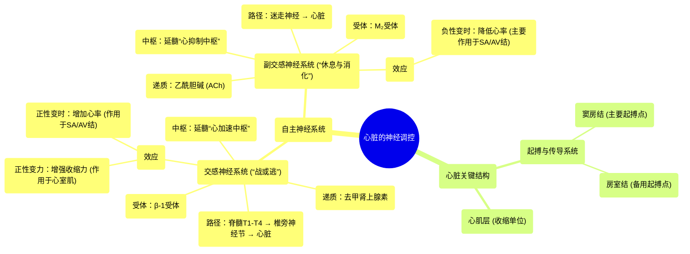

# 60 Neural Control of the Heart Cardiology

  <video controls preload="metadata" playsinline>
    <source src="https://helly.s3.bitiful.net/心血管学科/%E4%B8%93%E8%BE%91%2020%EF%BC%9A%E5%BF%83%E5%86%85%E7%A7%91%E7%BB%88%E6%9E%81%E8%BE%9E%E5%85%B8%E7%96%BE%E7%97%85%E6%9C%BA%E5%88%B6%E7%AF%87%20%28PathologyMechanisms%29/60%20Neural%20Control%20of%20the%20Heart%20Cardiology.mp4" type="video/mp4">
    
您的浏览器不支持播放，请升级。

  </video>

::: tip ⚡️ 核心考点 (30s速读)
*   **核心考点**：自主神经系统通过交感神经（“战或逃”）和副交感神经（“休息与消化”）双向调节心脏功能。交感神经兴奋通过释放去甲肾上腺素作用于β-1受体，增加心率（正性变时）和心肌收缩力（正性变力）。副交感神经兴奋通过释放乙酰胆碱作用于M2受体，降低心率（负性变时）。
*   **临床意义**：理解此调控机制是解释应激性心动过速、使用β受体阻滞剂（如美托洛尔）降低心率/心肌耗氧、以及使用抗胆碱能药物（如阿托品）提升心率等临床现象和药物治疗的基础。
:::

## 🧠 深度精讲

*   **自主神经系统对心脏的双重支配**：心脏活动受自主神经系统（ANS）的精细调控，这是一个不受意识控制的系统。它包含功能上相互拮抗的两个分支：
    *   **交感神经系统**：对应“战或逃”反应，在应激、恐惧或运动时被激活。其总体效应是**增强**心脏泵血功能，以适应身体对氧气和能量需求的增加。
    *   **副交感神经系统**：对应“休息与消化”，在放松、消化时占优势。其总体效应是**抑制**心脏活动，降低心率，以保存能量。

*   **交感神经通路与机制**：
    1.  **中枢启动**：信号起源于延髓的 **“心加速中枢”**。
    2.  **神经路径**：信号经脊髓胸段（T1-T4）传出，在**椎旁神经节**换元后，其节后纤维支配心脏。
    3.  **作用靶点**：主要支配**窦房结（SA node）**、**房室结（AV node）** 和**心室心肌**。
    4.  **神经递质与受体**：节后纤维末梢释放**去甲肾上腺素（Norepinephrine）**，作用于心肌细胞上的 **β-1肾上腺素能受体**。
    5.  **细胞电生理效应**：
        *   **在窦房结/房室结**：β-1受体激活后，增加细胞膜对钠离子（Na⁺）和钙离子（Ca²⁺）的通透性，使起搏细胞4期自动去极化速度加快，从而**提高心率（正性变时作用）**。
        *   **在心室肌**：β-1受体激活主要增加钙离子内流，增强兴奋-收缩耦联，从而**增强心肌收缩力（正性变力作用）**。

*   **副交感神经通路与机制**：
    1.  **中枢启动**：信号起源于延髓背侧的 **“心抑制中枢”**。
    2.  **神经路径**：主要通过**迷走神经**（第X对脑神经）传出，其节后纤维支配心脏。
    3.  **作用靶点**：主要集中于**窦房结**和**房室结**，对心室肌的支配较少。
    4.  **神经递质与受体**：节后纤维末梢释放**乙酰胆碱（ACh）**，作用于心肌细胞上的 **M₂型毒蕈碱受体**。
    5.  **细胞电生理效应**：M₂受体激活后，增加细胞膜对钾离子（K⁺）的通透性（使细胞超极化），并减少环磷酸腺苷（cAMP）生成，从而抑制钙离子内流。这导致窦房结细胞4期自动去极化速度减慢，**降低心率（负性变时作用）**。对收缩力的直接影响较弱。

## 📚 双语术语表 (Terminology)
| 英文术语 | 中文翻译 | 定义/解释 |
| :--- | :--- | :--- |
| Autonomic Nervous System (ANS) | 自主神经系统 | 调节内脏功能（如心率、消化）的神经系统，不受意识直接控制。 |
| Sympathetic Nervous System | 交感神经系统 | ANS的分支，负责“战或逃”反应，激活时增加心率、收缩力等。 |
| Parasympathetic Nervous System | 副交感神经系统 | ANS的分支，负责“休息与消化”，激活时降低心率、促进消化等。 |
| Cardio-acceleratory Center | 心加速中枢 | 位于延髓，发出交感神经信号以增加心率的神经中枢。 |
| Cardio-inhibitory Center | 心抑制中枢 | 位于延髓背侧，发出副交感神经信号以降低心率的神经中枢。 |
| SA Node (Sinoatrial Node) | 窦房结 | 位于右心房，心脏的正常起搏点，自主产生节律性电冲动。 |
| AV Node (Atrioventricular Node) | 房室结 | 位于房间隔下部，将心房电冲动传导至心室的延迟站和备用起搏点。 |
| Myocardium | 心肌层 | 构成心脏壁的肌肉层，负责心脏的收缩。 |
| Norepinephrine (Noradrenaline) | 去甲肾上腺素 | 交感神经节后纤维释放的主要神经递质。 |
| Acetylcholine (ACh) | 乙酰胆碱 | 副交感神经节后纤维释放的主要神经递质。 |
| Beta-1 Adrenergic Receptor | β-1肾上腺素能受体 | 主要存在于心脏，与去甲肾上腺素结合后介导心率加快和收缩力增强。 |
| M₂ Muscarinic Receptor | M₂型毒蕈碱受体 | 主要存在于心脏，与乙酰胆碱结合后介导心率减慢。 |
| Contractility | 收缩力 | 心肌纤维收缩的强度和速度。 |
| Depolarization | 去极化 | 细胞膜电位向正值方向变化的过程，是动作电位的起始阶段。 |

## 🗺️ 知识图谱

