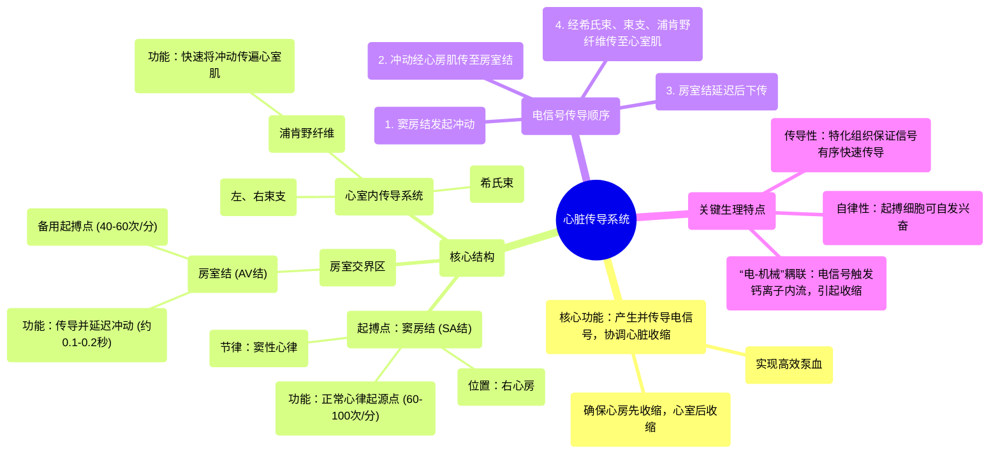

# 61 Cardiac Conduction System Cardiology

  <video controls preload="metadata" playsinline>
    <source src="https://helly.s3.bitiful.net/心血管学科/%E4%B8%93%E8%BE%91%2020%EF%BC%9A%E5%BF%83%E5%86%85%E7%A7%91%E7%BB%88%E6%9E%81%E8%BE%9E%E5%85%B8%E7%96%BE%E7%97%85%E6%9C%BA%E5%88%B6%E7%AF%87%20%28PathologyMechanisms%29/61%20Cardiac%20Conduction%20System%20Cardiology.mp4" type="video/mp4">
    
您的浏览器不支持播放，请升级。

  </video>

::: tip ⚡️ 核心考点 (30s速读)
*   **核心考点**：心脏传导系统是心脏自发产生并传导电信号的“电路”，确保心房和心室有序、协调地收缩。其核心顺序是：窦房结（SA结）→ 心房肌 → 房室结（AV结）→ 希氏束 → 左右束支 → 浦肯野纤维 → 心室肌。
*   **临床意义**：窦房结是正常心跳的“总司令”（起搏点），其节律为“窦性心律”。传导通路上任何环节的异常（如阻滞、异位起搏）都会导致心律失常，如心动过缓、心动过速或传导阻滞。
:::

## 🧠 深度精讲

*   **心脏的自律性**：心脏无需大脑指令即可自主跳动，这依赖于心肌中特化的“起搏细胞”。它们能自发产生电冲动，这是心脏传导系统的基础。
*   **传导系统的结构与功能**：
    1.  **窦房结 (SA结)**：位于右心房，是正常心律的“最高司令部”。它每分钟自发产生60-100次电冲动，形成“窦性心律”。冲动首先通过心房肌传导，引起心房收缩。
    2.  **房室结 (AV结)**：位于心房与心室交界处，是心房和心室之间的“唯一电信号通道”。其关键作用在于**延迟传导约0.1-0.2秒**（视频中提到的0.4秒是更宽泛的描述），这确保了心房完全收缩、将血液充分挤入心室后，心室才开始收缩。
    3.  **希氏束与束支**：电信号通过房室结后，进入希氏束，并迅速分为左、右束支，沿室间隔下行，将信号高效传向心室。
    4.  **浦肯野纤维**：是束支的终末分支，像一张网一样遍布于心室肌内层。它们以极快的速度将电信号传导至整个心室肌，确保心室肌几乎同步收缩，形成强大的泵血力量。
*   **“电-机械”耦联**：传导系统传递的是**电信号**。当电信号到达心肌细胞时，会触发钙离子内流，钙离子才是直接引起**心肌收缩**（机械活动）的关键物质。因此，顺序是：电兴奋 → 钙离子内流 → 肌肉收缩。

## 📚 双语术语表 (Terminology)
| 英文术语 | 中文翻译 | 定义/解释 |
| :--- | :--- | :--- |
| Cardiac Conduction System | 心脏传导系统 | 心脏内特化的心肌细胞组成的网络，负责产生和传导电冲动，控制心跳节律。 |
| Sinoatrial Node (SA Node) | 窦房结 | 位于右心房，是正常心脏的初级起搏点，自动产生节律性电冲动。 |
| Atrioventricular Node (AV Node) | 房室结 | 位于房室交界处，传导并延迟心房来的冲动，是心房到心室的唯一电传导通路。 |
| Bundle of His | 希氏束 | 房室结的延续，将电冲动从房室结传至心室。 |
| Bundle Branches | 束支 | 希氏束的分支，分为左束支和右束支，沿室间隔下行。 |
| Purkinje Fibers | 浦肯野纤维 | 束支的终末分支，广泛分布于心室心内膜下，快速将冲动传至整个心室肌。 |
| Myocardium | 心肌（心肌层） | 构成心脏壁的肌肉组织，负责收缩泵血。 |
| Sinus Rhythm | 窦性心律 | 由窦房结正常启动和控制的心律。 |
| Autonomic Nervous System | 自主神经系统 | 调节内脏功能的神经系统，其交感神经和副交感神经分支可影响心率快慢。 |
| Pacemaker Cell | 起搏细胞 | 具有自动产生节律性电冲动能力的心肌细胞。 |

## 🗺️ 知识图谱

