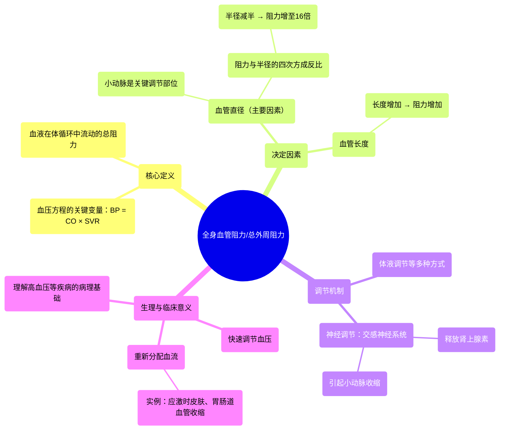

# 62 Systemic Vascular Resistance (Total Peripheral Resistance) Cardiology

  <video controls preload="metadata" playsinline>
    <source src="https://helly.s3.bitiful.net/心血管学科/%E4%B8%93%E8%BE%91%2020%EF%BC%9A%E5%BF%83%E5%86%85%E7%A7%91%E7%BB%88%E6%9E%81%E8%BE%9E%E5%85%B8%E7%96%BE%E7%97%85%E6%9C%BA%E5%88%B6%E7%AF%87%20%28PathologyMechanisms%29/62%20Systemic%20Vascular%20Resistance%20%28Total%20Peripheral%20Resistance%29%20Cardiology.mp4" type="video/mp4">
    
您的浏览器不支持播放，请升级。

  </video>

::: tip ⚡️ 核心考点 (30s速读)
*   **核心考点**：全身血管阻力是决定血压的关键因素之一，它等于血压除以心输出量。其大小主要由小动脉的直径和血管总长度决定。
*   **临床意义**：通过收缩或舒张小动脉，可以快速、显著地调节血压和全身血流分布。例如，交感神经兴奋时，皮肤和胃肠道血管收缩，阻力增加，血压升高，同时将血液重新分配到重要器官。
:::

## 🧠 深度精讲

*   **概念1：什么是全身血管阻力？**
    全身血管阻力，也称为总外周阻力，是血液在体循环动脉系统中流动时所遇到的总阻力。它是血压方程（血压 = 心输出量 × 全身血管阻力）中的一个核心变量。简单来说，它反映了心脏泵血时，血液“前进”的困难程度。

*   **概念2：全身血管阻力如何影响血压？**
    根据血压方程，在**心输出量**不变的情况下，**全身血管阻力**增加会直接导致**血压**升高。视频中用了一个生动的比喻：用手指堵住水管口，水流受阻，水管内的压力就会升高。同理，当全身小动脉收缩时，血流阻力增大，血压就会上升。

*   **概念3：全身血管阻力受什么因素调节？（核心机制）**
    这是视频讲解的重点，主要有两个因素：
    1.  **血管直径（尤其是小动脉）**：这是**最主要、最快速**的调节方式。小动脉壁富含平滑肌，其收缩或舒张会显著改变血管内径。关键在于，血流阻力与血管半径的**四次方**成反比。这意味着，血管半径**减半**，血流阻力将增加到原来的**16倍**，血流量则减少到原来的**1/16**。因此，微小的直径变化就能引起血压和血流的巨大改变。
    2.  **血管总长度**：血管越长，血液流动时与管壁的摩擦越多，阻力就越大。视频用10米水管和1公里水管出水压力的对比，直观地说明了这一点。

*   **概念4：临床实例——交感神经兴奋（“战斗或逃跑”反应）**
    当人受到惊吓时，交感神经系统激活，释放肾上腺素等物质。
    *   **作用部位**：主要作用于皮肤、胃肠道等非紧急器官的**小动脉**平滑肌。
    *   **生理效应**：引起这些血管**强烈收缩**，导致：
        *   **局部表现**：皮肤血管收缩 → 皮肤血流量锐减 → 脸色苍白；胃肠道血管收缩 → 消化活动减弱。
        *   **全身效应**：大量血液（视频中提到约30%的心输出量）被“挤回”中央循环系统，导致**全身血管阻力显著增加**，进而引起**血压升高**。同时，血液被重新分配至心脏、大脑、肌肉等关键器官，以应对紧急状况。

## 📚 双语术语表 (Terminology)
| 英文术语 | 中文翻译 | 定义/解释 |
| :--- | :--- | :--- |
| Systemic Vascular Resistance (SVR) | 全身血管阻力 | 血液流经体循环动脉系统时所遇到的总阻力。 |
| Total Peripheral Resistance (TPR) | 总外周阻力 | 与全身血管阻力同义。 |
| Blood Pressure | 血压 | 血液在血管内流动时作用于单位面积血管壁的侧压力。 |
| Cardiac Output | 心输出量 | 一侧心室每分钟射出的血液总量。 |
| Arteriole | 小动脉 | 介于动脉和毛细血管之间的微小血管，管壁富含平滑肌，是调节外周阻力和器官血流量的主要部位。 |
| Sympathetic Nervous System | 交感神经系统 | 自主神经系统的一部分，负责动员身体资源应对压力或紧急情况，即“战斗或逃跑”反应。 |
| Constrict | 收缩 | （血管）管径变窄。 |
| Diameter | 直径 | 这里特指血管的内径。 |
| Adrenaline (Epinephrine) | 肾上腺素 | 由肾上腺髓质分泌的激素，在应激状态下释放，能引起心率加快、血管收缩等反应。 |

## 🗺️ 知识图谱

