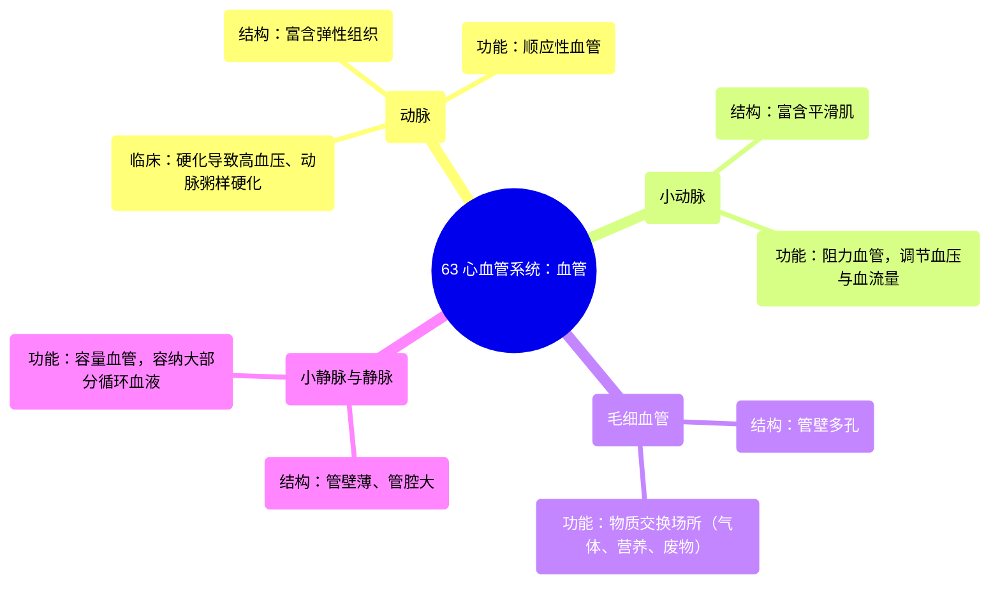

# 63 Blood Vessels Cardiology

  <video controls preload="metadata" playsinline>
    <source src="https://helly.s3.bitiful.net/心血管学科/%E4%B8%93%E8%BE%91%2020%EF%BC%9A%E5%BF%83%E5%86%85%E7%A7%91%E7%BB%88%E6%9E%81%E8%BE%9E%E5%85%B8%E7%96%BE%E7%97%85%E6%9C%BA%E5%88%B6%E7%AF%87%20%28PathologyMechanisms%29/63%20Blood%20Vessels%20Cardiology.mp4" type="video/mp4">
    
您的浏览器不支持播放，请升级。

  </video>

::: tip ⚡️ 核心考点 (30s速读)
*   **核心考点**：血管系统分为动脉、小动脉、毛细血管、小静脉和静脉，各自结构（弹性组织/平滑肌/多孔性/管壁厚度）决定其功能（顺应性/阻力/交换/容量）。
*   **临床意义**：动脉硬化（顺应性下降）易致高血压和动脉粥样硬化；小动脉收缩（阻力增加）是调节血压的关键；静脉是主要的储血库。
:::

## 🧠 深度精讲

*   **动脉 (Arteries)**：从心脏（主要是左心室）发出，将血液泵向全身。其管壁富含**弹性组织**，使其具有**顺应性**，能在心脏收缩（高压）时扩张，舒张时回弹，维持持续血流。随着年龄增长，动脉可能硬化，顺应性下降，导致血压升高并增加动脉粥样硬化（斑块形成）风险，斑块破裂可引发心肌梗死或中风。
*   **小动脉 (Arterioles)**：动脉的分支，是连接动脉与毛细血管的**阻力血管**。其管壁富含**平滑肌**，可通过收缩或舒张来调节管径，从而**控制局部血流量和全身血压**。这类似于用手指部分堵住水管出口，会增加系统内压力。
*   **毛细血管 (Capillaries)**：最细的血管，是**物质交换的主要场所**。其管壁**多孔**，允许气体（O₂、CO₂）、营养物质、代谢废物和液体在血液与组织液之间自由扩散。根据组织需求，孔洞大小不同（如骨髓中的血窦允许细胞通过）。
*   **小静脉 (Venules) 与静脉 (Veins)**：收集毛细血管床的血液并返回心脏。其管壁**较薄**，但**管腔直径较大**，这使得静脉系统能够**容纳循环系统中大部分的血液**，因此被称为**容量血管**。静脉血压较低，依靠骨骼肌收缩和静脉瓣膜防止血液倒流。

## 📚 双语术语表 (Terminology)
| 英文术语 | 中文翻译 | 定义/解释 |
| :--- | :--- | :--- |
| Artery | 动脉 | 从心脏发出、富含弹性组织的血管，具有顺应性，负责将血液输送至全身。 |
| Arteriole | 小动脉 | 动脉的细小分支，富含平滑肌，是主要的阻力血管，通过收缩舒张调节血压和血流量。 |
| Capillary | 毛细血管 | 连接小动脉与小静脉的微细血管，管壁多孔，是气体、营养物质和废物交换的场所。 |
| Venule | 小静脉 | 收集毛细血管血液的细小血管，汇入静脉。 |
| Vein | 静脉 | 将血液从全身输送回心脏的血管，管壁薄、管腔大，是容纳大部分血液的容量血管。 |
| Compliance | 顺应性 | 血管在压力下扩张的能力。动脉的弹性组织赋予其高顺应性。 |
| Resistance vessel | 阻力血管 | 主要指小动脉，通过改变血管阻力来调节血压和局部血流分布。 |
| Capacitance vessel | 容量血管 | 主要指静脉，因其管腔大、可扩张性强，能储存大量血液。 |
| Atherosclerosis | 动脉粥样硬化 | 动脉壁内脂质、胆固醇等沉积形成斑块的疾病，可导致血管狭窄、硬化。 |
| Thrombus | 血栓 | 血管内形成的血凝块，可能脱落并堵塞远端血管（如导致中风或心梗）。 |

## 🗺️ 知识图谱

