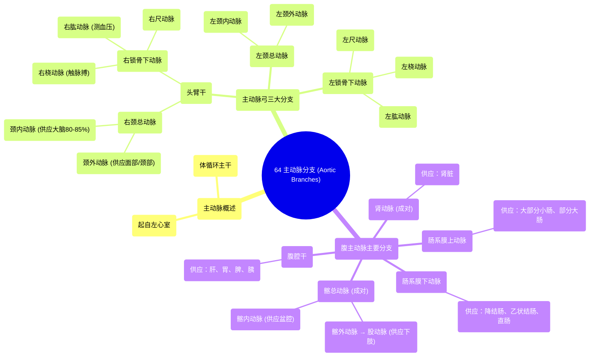

# 64 Aortic Branches Cardiology

  <video controls preload="metadata" playsinline>
    <source src="https://helly.s3.bitiful.net/心血管学科/%E4%B8%93%E8%BE%91%2020%EF%BC%9A%E5%BF%83%E5%86%85%E7%A7%91%E7%BB%88%E6%9E%81%E8%BE%9E%E5%85%B8%E7%96%BE%E7%97%85%E6%9C%BA%E5%88%B6%E7%AF%87%20%28PathologyMechanisms%29/64%20Aortic%20Branches%20Cardiology.mp4" type="video/mp4">
    
您的浏览器不支持播放，请升级。

  </video>

::: tip ⚡️ 核心考点 (30s速读)
*   **核心考点**：主动脉是体循环的“总干道”，其分支供应全身（除肺脏）。需重点掌握主动脉弓三大分支（头臂干、左颈总动脉、左锁骨下动脉）及其主要次级分支的走向与供血区域。
*   **临床意义**：颈内动脉供应大脑80-85%的血流；肱动脉是测量血压的常用部位；桡动脉是触诊脉搏的常用点；腹腔干、肠系膜上/下动脉是腹部脏器血供的关键。
:::

## 🧠 深度精讲

*   **主动脉概述**：主动脉是人体最大的动脉，起自左心室，是体循环的起始主干。它将富含氧气的血液从左心室泵出，通过其各级分支输送到全身各组织和器官（肺循环除外）。
*   **主动脉弓三大分支**：主动脉在离开心脏后向上形成主动脉弓，弓上发出三个主要分支，从右向左依次为：
    1.  **头臂干**：向右上方走行，随后分为**右颈总动脉**和**右锁骨下动脉**。
    2.  **左颈总动脉**：直接发自主动脉弓，供应左侧头颈部。
    3.  **左锁骨下动脉**：直接发自主动脉弓，供应左上肢。
*   **头颈部动脉详解**：
    *   **颈总动脉**：在颈部上行，于甲状软骨上缘水平分为**颈内动脉**和**颈外动脉**。
        *   **颈内动脉**：主要供应大脑（约占脑血供的80-85%）和眼眶。
        *   **颈外动脉**：主要供应面部、头皮、甲状腺和咽喉等头颈部浅表结构。
*   **上肢动脉详解**：
    *   **锁骨下动脉**：经锁骨后方进入腋窝，移行为**腋动脉**，继而延续为**肱动脉**。
        *   **肱动脉**：位于上臂内侧，是**测量血压的常用部位**。
        *   肱动脉在肘窝附近分为**桡动脉**和**尺动脉**。
            *   **桡动脉**：位于前臂外侧（桡侧），位置表浅，是**临床触诊脉搏最常用的部位**。
            *   **尺动脉**：位于前臂内侧（尺侧）。
*   **胸主动脉与腹主动脉主要分支**：
    *   主动脉穿过膈肌的主动脉裂孔进入腹腔，成为腹主动脉。
    *   **腹腔干**：紧邻膈肌下方发出，为一短干，随即分为**胃左动脉、肝总动脉和脾动脉**，主要供应肝、胃、脾、胰及十二指肠上部。
    *   **肠系膜上动脉**：在腹腔干稍下方发出，供应大部分小肠（空肠、回肠）和部分大肠（盲肠、升结肠、横结肠右半部）。
    *   **肾动脉**：成对发出，左右各一，供应肾脏。
    *   **肠系膜下动脉**：在肾动脉下方发出，供应降结肠、乙状结肠和直肠上部。
    *   **髂总动脉**：腹主动脉在约第4腰椎水平分叉为左、右**髂总动脉**，后者再分为**髂内动脉**（供应盆腔）和**髂外动脉**（移行为**股动脉**供应下肢）。

## 📚 双语术语表 (Terminology)
| 英文术语 | 中文翻译 | 定义/解释 |
| :--- | :--- | :--- |
| Aorta | 主动脉 | 体循环的起始主干动脉，起自左心室。 |
| Aortic arch | 主动脉弓 | 主动脉离开心脏后向上的弯曲部分，发出头臂干、左颈总动脉和左锁骨下动脉。 |
| Brachiocephalic trunk | 头臂干 | 主动脉弓的第一个分支，供应右侧头颈部和右上肢。 |
| Common carotid artery | 颈总动脉 | 供应头颈部的主要动脉，分为颈内和颈外动脉。 |
| Internal carotid artery | 颈内动脉 | 颈总动脉的分支，主要供应大脑和眼眶。 |
| External carotid artery | 颈外动脉 | 颈总动脉的分支，主要供应面部、头皮等头颈部浅表结构。 |
| Subclavian artery | 锁骨下动脉 | 供应上肢的动脉，经锁骨后方进入腋窝。 |
| Brachial artery | 肱动脉 | 腋动脉的延续，位于上臂，常用于测量血压。 |
| Radial artery | 桡动脉 | 肱动脉的分支，位于前臂桡侧，常用于触诊脉搏。 |
| Ulnar artery | 尺动脉 | 肱动脉的分支，位于前臂尺侧。 |
| Celiac trunk | 腹腔干 | 腹主动脉的第一个主要分支，供应上腹部脏器（肝、胃、脾、胰等）。 |
| Superior mesenteric artery | 肠系膜上动脉 | 腹主动脉的分支，供应大部分小肠和部分大肠。 |
| Renal artery | 肾动脉 | 成对发自腹主动脉，供应肾脏。 |
| Inferior mesenteric artery | 肠系膜下动脉 | 腹主动脉的分支，供应降结肠、乙状结肠和直肠上部。 |
| Common iliac artery | 髂总动脉 | 腹主动脉的终末分支，向下延续为髂内、外动脉。 |
| Femoral artery | 股动脉 | 髂外动脉的延续，位于大腿部，是下肢的主要供血动脉。 |

## 🗺️ 知识图谱

