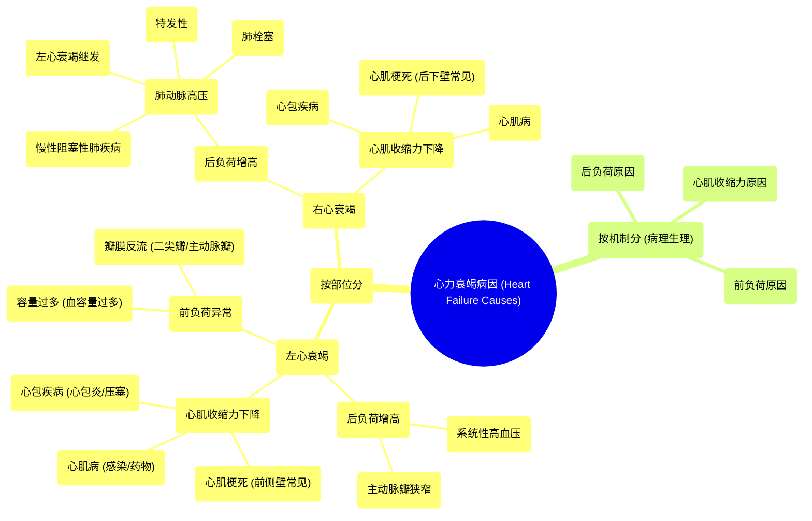

# 65 Heart Failure Causes

  <video controls preload="metadata" playsinline>
    <source src="https://helly.s3.bitiful.net/心血管学科/%E4%B8%93%E8%BE%91%2020%EF%BC%9A%E5%BF%83%E5%86%85%E7%A7%91%E7%BB%88%E6%9E%81%E8%BE%9E%E5%85%B8%E7%96%BE%E7%97%85%E6%9C%BA%E5%88%B6%E7%AF%87%20%28PathologyMechanisms%29/65%20Heart%20Failure%20Causes.mp4" type="video/mp4">
    
您的浏览器不支持播放，请升级。

  </video>

::: tip ⚡️ 核心考点 (30s速读)
*   **核心考点**：心力衰竭病因可按**左/右侧**及**病理生理机制（后负荷、心肌收缩力、前负荷）** 分类。左心衰竭常见于高血压、主动脉瓣狭窄、心肌梗死；右心衰竭常见于肺动脉高压、肺栓塞。
*   **临床意义**：理解病因分类是诊断和治疗的基础。例如，针对后负荷增高（如高血压）需降压，而针对心肌收缩力下降（如心梗）则需改善心肌供血和功能。
:::

## 🧠 深度精讲

*   **心力衰竭的定义与分类**：心力衰竭本质是心脏泵血功能无法满足机体代谢需求。可从多个维度分类：**左心衰竭**（影响体循环）与**右心衰竭**（影响肺循环）；**收缩性心衰**（泵血能力下降）与**舒张性心衰**（充盈受限）；急性与慢性；射血分数保留型与射血分数降低型。本讲座重点从**病理生理机制**角度剖析病因。
*   **基于病理生理机制的病因分类**：
    1.  **后负荷原因**：指心室收缩时面对的阻力过高。
        *   **左心**：常见于**系统性高血压**（全身血管阻力增加）、**主动脉瓣狭窄**（出口梗阻）。
        *   **右心**：常见于**肺动脉高压**，原因包括慢性阻塞性肺疾病（COPD）、左心衰竭导致的肺静脉淤血、肺栓塞、特发性肺动脉高压等。
    2.  **心肌收缩力原因**：指心肌本身收缩能力受损。
        *   **常见原因**：**心肌梗死（MI）**（左心常见于前侧壁，右心常见于后下壁）、**心肌病**（由感染、药物如可卡因/酒精/化疗药等引起）、**心包疾病**（如心包炎、心脏压塞，限制心脏舒张与收缩）。
    3.  **前负荷原因**：指回流到心室的血容量异常。
        *   **容量过多（前负荷增加）**：如**血容量过多**（输液过量）、**瓣膜反流**（二尖瓣反流、主动脉瓣反流导致血液回流）。
        *   **容量不足（前负荷降低）**：如严重脱水、失血等（讲座中未展开，但属重要概念）。

## 📚 双语术语表 (Terminology)
| 英文术语 | 中文翻译 | 定义/解释 |
| :--- | :--- | :--- |
| Heart Failure | 心力衰竭 | 心脏泵血功能无法满足身体需求的状态。 |
| Left-sided Heart Failure | 左心衰竭 | 左心室泵血功能障碍，影响体循环，常导致肺淤血、呼吸困难。 |
| Right-sided Heart Failure | 右心衰竭 | 右心室泵血功能障碍，影响肺循环，常导致体循环淤血（如肝大、下肢水肿）。 |
| Afterload | 后负荷 | 心室收缩射血时需要克服的动脉系统阻力。 |
| Contractility | 心肌收缩力 | 心肌纤维收缩的内在能力。 |
| Preload | 前负荷 | 心室舒张末期容积（即收缩前心肌的初始拉伸程度），反映回心血量。 |
| Systemic Hypertension | 系统性高血压 | 体循环动脉压持续升高，增加左心室后负荷。 |
| Aortic Stenosis | 主动脉瓣狭窄 | 主动脉瓣开口狭窄，阻碍左心室射血，增加后负荷。 |
| Pulmonary Hypertension | 肺动脉高压 | 肺动脉压力异常升高，增加右心室后负荷。 |
| Myocardial Infarction (MI) | 心肌梗死 | 冠状动脉阻塞导致心肌缺血性坏死，损害心肌收缩力。 |
| Cardiomyopathy | 心肌病 | 一组直接损害心肌结构和功能，导致心衰的疾病。 |
| Pericarditis | 心包炎 | 心包膜的炎症，可限制心脏充盈。 |
| Cardiac Tamponade | 心脏压塞 | 心包腔内积液或积血，压迫心脏，限制其充盈与泵血。 |
| Hypervolemia | 血容量过多 | 体内循环血量异常增多，增加心脏前负荷。 |
| Mitral Regurgitation | 二尖瓣反流 | 二尖瓣关闭不全，左心室收缩时血液反流入左心房，增加左心室前负荷。 |
| Aortic Regurgitation | 主动脉瓣反流 | 主动脉瓣关闭不全，舒张期血液从主动脉反流入左心室，增加左心室前负荷。 |

## 🗺️ 知识图谱

