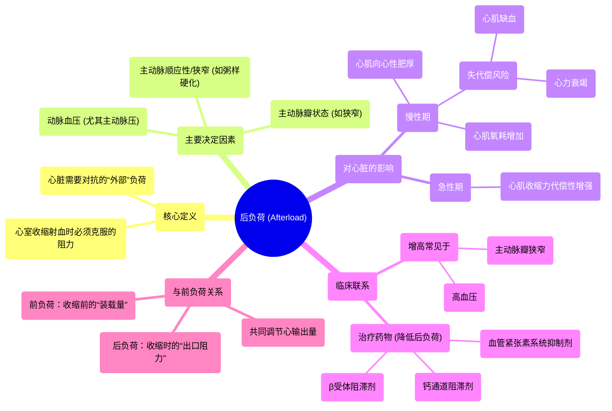

# 66 Afterload Cardiology

  <video controls preload="metadata" playsinline>
    <source src="https://helly.s3.bitiful.net/心血管学科/%E4%B8%93%E8%BE%91%2020%EF%BC%9A%E5%BF%83%E5%86%85%E7%A7%91%E7%BB%88%E6%9E%81%E8%BE%9E%E5%85%B8%E7%96%BE%E7%97%85%E6%9C%BA%E5%88%B6%E7%AF%87%20%28PathologyMechanisms%29/66%20Afterload%20Cardiology.mp4" type="video/mp4">
    
您的浏览器不支持播放，请升级。

  </video>

::: tip ⚡️ 核心考点 (30s速读)
*   **核心考点**：后负荷是心室收缩射血时必须克服的阻力。阻力越大（后负荷越高），心肌收缩就需要越用力，长期会导致心肌肥厚，最终可能引发心力衰竭。
*   **临床意义**：理解后负荷是管理高血压、主动脉瓣狭窄等疾病的关键。降低后负荷的药物（如β受体阻滞剂、钙通道阻滞剂）是心力衰竭治疗的重要部分。
:::

## 🧠 深度精讲

*   **概念1：后负荷的定义与本质**
    后负荷是指心室肌肉在收缩期，为了将血液泵入动脉系统（主要是主动脉和肺动脉）而必须克服的阻力或力量。它不是心脏本身的属性，而是心脏需要对抗的“外部”负荷。简单理解，就是血液流出心脏时遇到的“门槛”高度。

*   **概念2：后负荷的决定因素**
    最主要的决定因素是**动脉系统的阻力**，尤其是**主动脉的阻力**。任何增加主动脉阻力的因素都会增加后负荷，例如：
    1.  **动脉血压升高**：这是最常见的原因。血压越高，心脏推开主动脉瓣、将血液射入高压环境的难度就越大。
    2.  **主动脉瓣狭窄**：瓣膜开口变窄，血液流出通道受阻，阻力显著增加。
    3.  **主动脉缩窄或动脉粥样硬化**：血管本身变窄、硬化，增加了血流阻力。

*   **概念3：后负荷对心脏的影响（核心病理生理）**
    1.  **急性期代偿**：当后负荷突然增加（如血压急剧升高），为了维持心输出量不变，心室肌肉会通过增强收缩力来克服增大的阻力。
    2.  **慢性期适应与失代偿**：如果后负荷长期持续增高（如长期未控制的高血压），心脏会启动“适应性”改变——心肌细胞肥大，心室壁增厚（称为**向心性肥厚**），以产生更大的收缩力。这类似于举重运动员的肌肉为了举起更重的重量而变粗壮。
    3.  **失代偿与心力衰竭**：心肌肥厚是双刃剑。肥厚的心肌需要更多的氧气和营养供应，但心脏的血液供应（冠状动脉）可能无法同步增长。最终，心肌会因相对缺血而功能下降，收缩力减弱，无法有效泵血，导致**心力衰竭**。

*   **概念4：后负荷与临床药物**
    降低后负荷是治疗高血压和心力衰竭的核心策略之一。常用药物包括：
    *   **血管紧张素转换酶抑制剂/血管紧张素II受体拮抗剂**：扩张动脉，降低外周血管阻力。
    *   **钙通道阻滞剂**：部分药物通过扩张动脉血管来降低后负荷。
    *   **β受体阻滞剂**：通过减慢心率、减弱心肌收缩力，间接降低心脏的氧耗和工作负荷，对改善长期预后有益。

## 📚 双语术语表 (Terminology)
| 英文术语 | 中文翻译 | 定义/解释 |
| :--- | :--- | :--- |
| Afterload | 后负荷 | 心室收缩射血时必须克服的动脉系统阻力。 |
| Cardiac Output | 心输出量 | 心脏每分钟泵出的血液总量，等于心率乘以每搏输出量。 |
| Preload | 前负荷 | 心室在舒张末期（收缩前）的容积，决定了心肌纤维的初始长度。 |
| Ventricle | 心室 | 心脏下部的腔室，负责将血液泵出心脏（左心室泵向全身，右心室泵向肺部）。 |
| Aorta | 主动脉 | 人体最大的动脉，从左心室发出，将含氧血输送至全身。 |
| Stenosis | 狭窄 | 管道或开口异常变窄。在心脏常指瓣膜狭窄。 |
| Hypertrophy | 肥厚 | 组织或器官因细胞体积增大（而非数量增多）而导致的体积增大。 |
| Heart Failure | 心力衰竭 | 心脏泵血功能下降，无法满足身体代谢需要的综合征。 |
| Beta Blocker | β受体阻滞剂 | 一类通过阻断β肾上腺素能受体来减慢心率、降低心肌收缩力的药物。 |
| Calcium Channel Blocker | 钙通道阻滞剂 | 一类通过阻断细胞膜上的钙离子通道来产生作用的药物，可用于降低血压和心绞痛。 |

## 🗺️ 知识图谱

