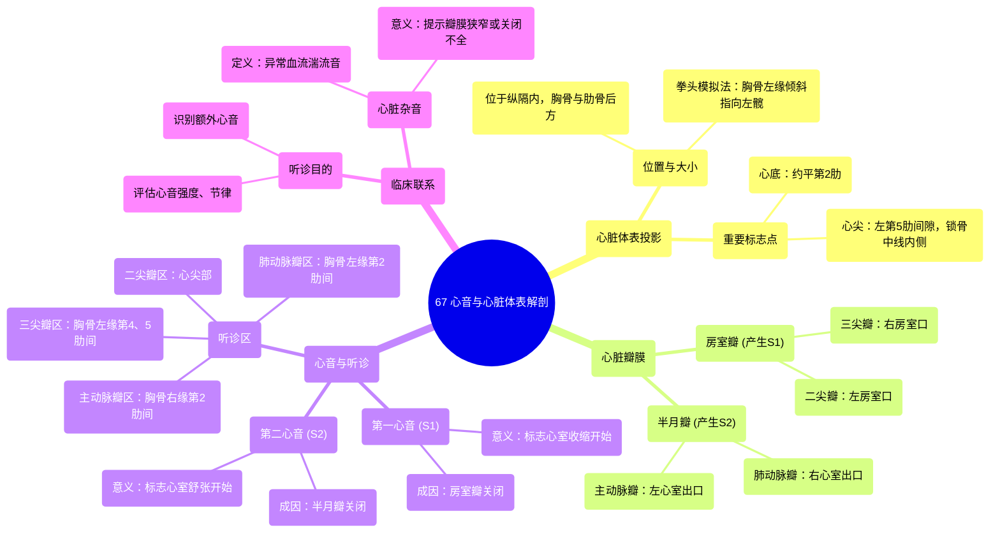

# 67 Heart Sounds & Surface Anatomy Cardiology

  <video controls preload="metadata" playsinline>
    <source src="https://helly.s3.bitiful.net/心血管学科/%E4%B8%93%E8%BE%91%2020%EF%BC%9A%E5%BF%83%E5%86%85%E7%A7%91%E7%BB%88%E6%9E%81%E8%BE%9E%E5%85%B8%E7%96%BE%E7%97%85%E6%9C%BA%E5%88%B6%E7%AF%87%20%28PathologyMechanisms%29/67%20Heart%20Sounds%20%26%20Surface%20Anatomy%20Cardiology.mp4" type="video/mp4">
    
您的浏览器不支持播放，请升级。

  </video>

::: tip ⚡️ 核心考点 (30s速读)
*   **核心考点**：心脏体表投影位置（心底、心尖）、四个心瓣膜的解剖位置及其对应的最佳听诊区。
*   **临床意义**：掌握心脏体表标志是进行心脏听诊的基础。通过在不同听诊区听取第一心音（S1，房室瓣关闭）和第二心音（S2，半月瓣关闭），可以判断瓣膜功能是否正常，识别心脏杂音。
:::

## 🧠 深度精讲

*   **心脏的体表投影**：心脏位于胸腔纵隔内，胸骨和肋骨后方。其大小和位置可近似用拳头模拟：将拳头置于胸骨，稍向左移并倾斜，使拳面指向左髋。**心底**（心脏顶部）约平对**第2肋**；**心尖**（心脏尖部）约在**左侧第5肋间隙，锁骨中线内侧**。此处可触及心尖搏动。
*   **心脏瓣膜与心音**：
    *   **房室瓣**：位于心房与心室之间。右侧为**三尖瓣**，左侧为**二尖瓣（僧帽瓣）**。它们的关闭产生**第一心音（S1，“咚”）**。
    *   **半月瓣**：位于心室与动脉之间。右心室与肺动脉之间为**肺动脉瓣**，左心室与主动脉之间为**主动脉瓣**。它们的关闭产生**第二心音（S2，“哒”）**。
*   **听诊区**：由于瓣膜位于胸骨后方，直接听诊声音模糊。因此临床在胸壁特定区域（声音传导最佳处）进行听诊：
    *   **二尖瓣听诊区**：心尖搏动处（第5肋间隙，左锁骨中线内侧）。
    *   **三尖瓣听诊区**：胸骨左缘第4、5肋间。
    *   **肺动脉瓣听诊区**：胸骨左缘第2肋间。
    *   **主动脉瓣听诊区**：胸骨右缘第2肋间。
    *   **主动脉瓣第二听诊区**：胸骨左缘第3肋间（用于听诊主动脉瓣关闭不全的杂音）。
*   **临床联系**：听诊时，注意S1和S2的强度、节律，以及有无额外心音或**杂音**（血流湍流产生的异常声音）。杂音的出现常提示瓣膜狭窄或关闭不全等病变。

## 📚 双语术语表 (Terminology)
| 英文术语 | 中文翻译 | 定义/解释 |
| :--- | :--- | :--- |
| Mediastinum | 纵隔 | 胸腔中部、两肺之间的区域，内含心脏、大血管、气管、食管等。 |
| Apex of the heart | 心尖 | 心脏左下端的锥形部分，朝向左前下方，体表投影位于第5肋间隙。 |
| Base of the heart | 心底 | 心脏右上部分，主要由左心房和部分右心房构成，与大血管相连。 |
| Intercostal space | 肋间隙 | 相邻两根肋骨之间的间隙。 |
| Atrioventricular (AV) valves | 房室瓣 | 位于心房和心室之间的瓣膜，包括二尖瓣和三尖瓣，防止心室收缩时血液反流回心房。 |
| Tricuspid valve | 三尖瓣 | 右心房与右心室之间的房室瓣，由三个瓣叶组成。 |
| Bicuspid / Mitral valve | 二尖瓣 / 僧帽瓣 | 左心房与左心室之间的房室瓣，由两个瓣叶组成。 |
| Semilunar valves | 半月瓣 | 形状似半月，位于心室与动脉出口处的瓣膜，包括主动脉瓣和肺动脉瓣。 |
| Aortic valve | 主动脉瓣 | 左心室与主动脉之间的半月瓣。 |
| Pulmonary valve | 肺动脉瓣 | 右心室与肺动脉干之间的半月瓣。 |
| First heart sound (S1) | 第一心音 | 心室收缩开始时，房室瓣（二尖瓣、三尖瓣）关闭产生的声音，标志收缩期开始。 |
| Second heart sound (S2) | 第二心音 | 心室舒张开始时，半月瓣（主动脉瓣、肺动脉瓣）关闭产生的声音，标志舒张期开始。 |
| Auscultation | 听诊 | 使用听诊器听取身体内部声音（如心音、呼吸音）的临床检查方法。 |
| Murmur | 杂音 | 心音以外、由湍流血流产生的一种异常声音，常提示心脏结构异常如瓣膜病变。 |

## 🗺️ 知识图谱

