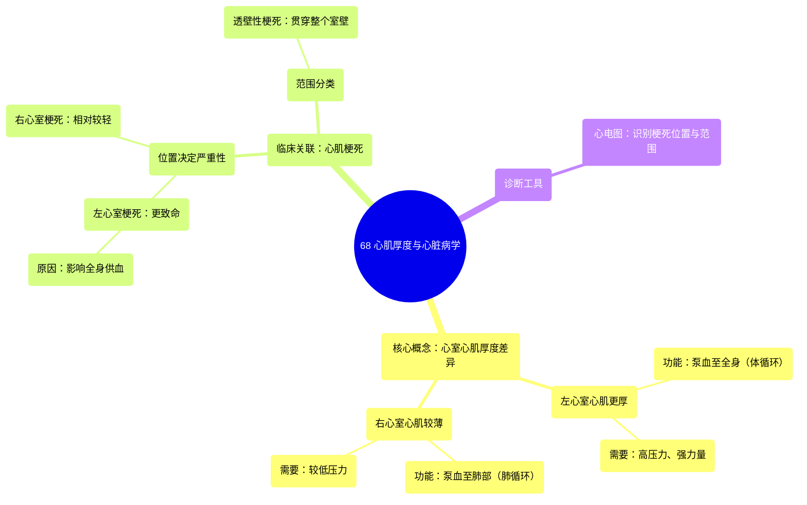

# 68 Myocardial Thickness Cardiology

  <video controls preload="metadata" playsinline>
    <source src="https://helly.s3.bitiful.net/心血管学科/%E4%B8%93%E8%BE%91%2020%EF%BC%9A%E5%BF%83%E5%86%85%E7%A7%91%E7%BB%88%E6%9E%81%E8%BE%9E%E5%85%B8%E7%96%BE%E7%97%85%E6%9C%BA%E5%88%B6%E7%AF%87%20%28PathologyMechanisms%29/68%20Myocardial%20Thickness%20Cardiology.mp4" type="video/mp4">
    
您的浏览器不支持播放，请升级。

  </video>

::: tip ⚡️ 核心考点 (30s速读)
*   **核心考点**：左心室心肌厚度显著大于右心室，这是由其功能决定的。左心室需将血液泵向全身，需要产生巨大压力，因此心肌更厚、力量更强。
*   **临床意义**：心肌梗死（心肌缺血坏死）发生在左心室时，因其泵血功能对全身供血至关重要，通常比发生在右心室时更为致命。
:::

## 🧠 深度精讲

*   **概念1：心肌厚度的差异及其生理基础**
    视频中通过心脏横切面直观展示了左、右心室心肌厚度的显著差异。这种差异并非偶然，而是结构与功能相适应的完美体现。**右心室**只需将血液泵入邻近的**肺循环**，路径短、阻力相对较低，因此不需要很厚的心肌来产生高压。相反，**左心室**承担着将血液泵向**体循环**的重任，需要克服全身血管的阻力，将血液输送到从头部到脚趾的每一个角落。为了产生如此巨大的压力，左心室的心肌必须非常厚实、强壮。你可以将其想象成，右心室是一个给隔壁房间送水的小水泵，而左心室则是为整栋摩天大楼供水的主水泵。

*   **概念2：心肌厚度在临床疾病中的意义**
    这种厚度差异直接关系到心脏疾病的严重程度，尤其是在**心肌梗死**（俗称“心脏病发作”）中。当冠状动脉阻塞导致部分心肌因缺血而坏死时，其后果取决于梗死的位置和范围。如果梗死发生在承担主要泵血任务的**左心室**，会导致心脏向全身泵血的能力急剧下降，引发心源性休克、心力衰竭甚至猝死，因此最为致命。而**右心室**梗死虽然也会引起问题（如右心衰竭），但因其所需泵血压力较小，且肺循环阻力低，有时心脏其他部分可以部分代偿，故通常紧急程度和死亡率相对较低。此外，梗死可能仅累及部分心肌，也可能贯穿整个心室壁，后者称为**透壁性心肌梗死**，通常更为严重。医生可以通过**心电图**上的特征性改变来初步判断梗死的位置和范围。

## 📚 双语术语表 (Terminology)
| 英文术语 | 中文翻译 | 定义/解释 |
| :--- | :--- | :--- |
| Myocardium | 心肌 | 构成心脏壁的肌肉组织，负责心脏的收缩泵血。 |
| Ventricle | 心室 | 心脏的下部腔室，包括左心室和右心室，负责将血液泵出心脏。 |
| Left Ventricle (LV) | 左心室 | 接收左心房血液，将其泵入主动脉以供应全身（体循环）。心肌最厚。 |
| Right Ventricle (RV) | 右心室 | 接收右心房血液，将其泵入肺动脉以到达肺部（肺循环）。心肌较薄。 |
| Myocardial Infarction (MI) | 心肌梗死 | 由于冠状动脉阻塞导致部分心肌缺血、坏死，常称为“心脏病发作”。 |
| Transmural Infarction | 透壁性心肌梗死 | 指心肌坏死区域从心内膜到心外膜贯穿了整个心室壁的厚度，通常范围更大、更严重。 |
| ECG / EKG (Electrocardiogram) | 心电图 | 记录心脏电活动的检查，可用于诊断心肌梗死、心律失常等心脏疾病。 |
| Aorta | 主动脉 | 体循环的起始动脉，左心室将血液泵入此血管。 |
| Pulmonary Arteries | 肺动脉 | 将右心室的血液输送至肺部进行气体交换的血管。 |

## 🗺️ 知识图谱

