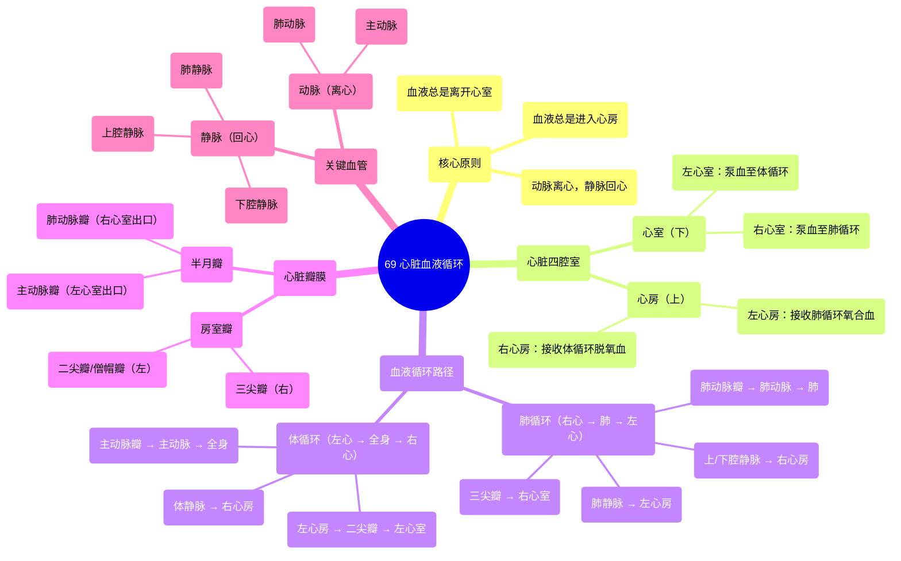

# 69 Heart Circulation Cardiology

  <video controls preload="metadata" playsinline>
    <source src="https://helly.s3.bitiful.net/心血管学科/%E4%B8%93%E8%BE%91%2020%EF%BC%9A%E5%BF%83%E5%86%85%E7%A7%91%E7%BB%88%E6%9E%81%E8%BE%9E%E5%85%B8%E7%96%BE%E7%97%85%E6%9C%BA%E5%88%B6%E7%AF%87%20%28PathologyMechanisms%29/69%20Heart%20Circulation%20Cardiology.mp4" type="video/mp4">
    
您的浏览器不支持播放，请升级。

  </video>

::: tip ⚡️ 核心考点 (30s速读)
*   **核心考点**：心脏是一个双泵系统，分为左右两侧，分别负责肺循环和体循环。血液流动遵循“心房进，心室出”的原则，并通过瓣膜防止倒流。
*   **临床意义**：理解此循环是诊断和治疗心血管疾病（如心力衰竭、瓣膜病、先天性心脏病）的基础。例如，左心衰竭主要影响全身供血，而右心衰竭则导致肺部淤血。
:::

## 🧠 深度精讲

*   **心脏的基本结构与分区**：心脏分为四个腔室：上方的两个是**心房**，下方的两个是**心室**。这是一个关键的记忆点：**血液总是先进入心房，再离开心室**。心房是接收腔，心室是泵血腔。
*   **血液循环的双环路模型**：
    1.  **肺循环（右心系统）**：负责气体交换。路径为：全身的脱氧血 → **上、下腔静脉** → **右心房** → **三尖瓣** → **右心室** → **肺动脉瓣** → **肺动脉** → 肺部（进行氧合）→ **肺静脉**。
    2.  **体循环（左心系统）**：负责向全身输送氧气和养分。路径为：来自肺部的氧合血 → **肺静脉** → **左心房** → **二尖瓣（僧帽瓣）** → **左心室** → **主动脉瓣** → **主动脉** → 全身组织 → 脱氧血经静脉系统返回右心房。
*   **瓣膜的功能与命名**：心脏瓣膜确保血液单向流动。
    *   **房室瓣**：位于心房与心室之间。右侧为**三尖瓣**（三个瓣叶），左侧为**二尖瓣**（两个瓣叶，形似主教冠，故也称僧帽瓣）。
    *   **半月瓣**：位于心室与动脉之间，呈新月形。**肺动脉瓣**位于右心室与肺动脉之间；**主动脉瓣**位于左心室与主动脉之间。
*   **血管命名规则**：一个简单但重要的记忆法则是：**离开心脏的血管是动脉，返回心脏的血管是静脉**。但这与血液是否含氧无关。例如，肺动脉内流动的是脱氧血，但它是动脉；肺静脉内流动的是氧合血，但它是静脉。

## 📚 双语术语表 (Terminology)
| 英文术语 | 中文翻译 | 定义/解释 |
| :--- | :--- | :--- |
| Atrium | 心房 | 心脏上部的腔室，负责接收回心血液。 |
| Ventricle | 心室 | 心脏下部的腔室，肌肉发达，负责将血液泵出心脏。 |
| Tricuspid Valve | 三尖瓣 | 位于右心房和右心室之间的房室瓣，有三个瓣叶。 |
| Bicuspid / Mitral Valve | 二尖瓣 / 僧帽瓣 | 位于左心房和左心室之间的房室瓣，有两个瓣叶。 |
| Pulmonary Semilunar Valve | 肺动脉半月瓣 | 位于右心室和肺动脉之间的半月瓣，防止血液从肺动脉倒流回心室。 |
| Aortic Semilunar Valve | 主动脉半月瓣 | 位于左心室和主动脉之间的半月瓣，防止血液从主动脉倒流回心室。 |
| Pulmonary Circulation | 肺循环 | 血液从右心到肺部再回到左心的循环路径，完成气体交换。 |
| Systemic Circulation | 体循环 | 血液从左心到全身组织再回到右心的循环路径，为组织输送氧气和养分。 |
| Superior/Inferior Vena Cava | 上腔静脉 / 下腔静脉 | 将身体上半身和下半身的脱氧血输送回右心房的大静脉。 |
| Pulmonary Artery | 肺动脉 | 将右心室的脱氧血输送至肺部的动脉。 |
| Pulmonary Vein | 肺静脉 | 将肺部氧合后的血液输送回左心房的静脉。 |
| Aorta | 主动脉 | 将左心室的氧合血输送至全身的最大动脉。 |
| Deoxygenated Blood | 脱氧血 | 含氧量低、二氧化碳含量高的血液，通常呈暗红色。 |
| Oxygenated Blood | 氧合血 | 含氧量高、二氧化碳含量低的血液，通常呈鲜红色。 |

## 🗺️ 知识图谱

