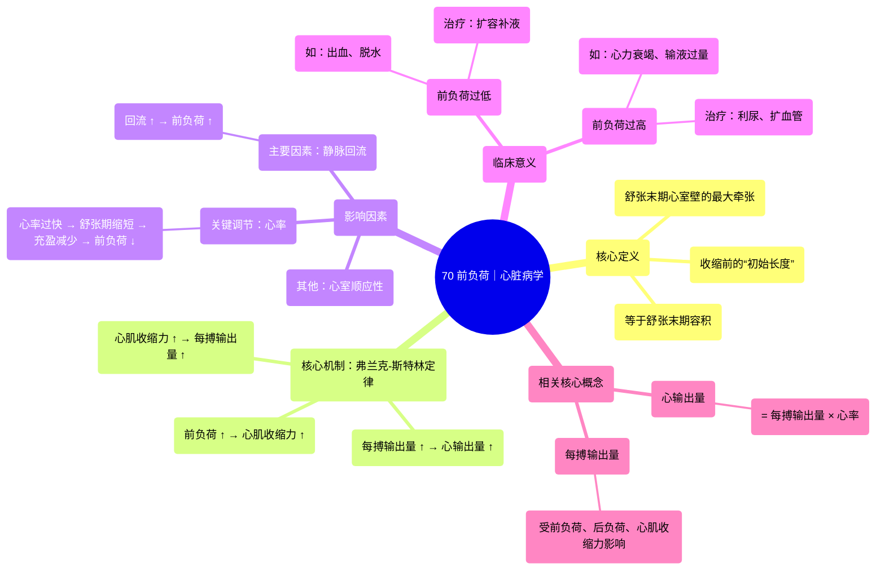

# 70 Preload ｜ Cardiology

  <video controls preload="metadata" playsinline>
    <source src="https://helly.s3.bitiful.net/心血管学科/%E4%B8%93%E8%BE%91%2020%EF%BC%9A%E5%BF%83%E5%86%85%E7%A7%91%E7%BB%88%E6%9E%81%E8%BE%9E%E5%85%B8%E7%96%BE%E7%97%85%E6%9C%BA%E5%88%B6%E7%AF%87%20%28PathologyMechanisms%29/70%20Preload%20%EF%BD%9C%20Cardiology.mp4" type="video/mp4">
    
您的浏览器不支持播放，请升级。

  </video>

::: tip ⚡️ 核心考点 (30s速读)
*   **核心考点**：前负荷是心室在舒张末期（收缩前一刻）的最大充盈量，它决定了心室壁的牵张程度。根据“弗兰克-斯特林机制”，前负荷越大，心肌收缩力越强，每搏输出量越大，从而心输出量也越大。
*   **临床意义**：理解前负荷是管理心力衰竭、休克等血流动力学状态的关键。例如，通过补液增加静脉回流（增加前负荷）可以提升心输出量；而心率过快会缩短舒张期充盈时间，降低前负荷，反而可能减少心输出量。
:::

## 🧠 深度精讲

*   **概念1：前负荷的定义与生理位置**
    前负荷不是指整个舒张期的充盈过程，而是特指**舒张末期**，即心室充盈刚刚结束、心室收缩即将开始的那一瞬间，心室内的血容量。此时，心室壁被拉伸到最大程度。这个“最大牵张”的状态就是前负荷。它本质上是心室收缩前的“初始长度”。

*   **概念2：前负荷如何影响心输出量——弗兰克-斯特林机制**
    这是前负荷与心功能关系的核心定律。该机制表明：在生理范围内，心室肌纤维在收缩前的初长度（即前负荷）越大，其收缩时产生的力量就越强。简单来说，**心脏被血液充盈得越满，下一次收缩就会越有力，射出的血液（每搏输出量）就越多**。因此，前负荷直接决定了每搏输出量，进而通过公式（心输出量 = 每搏输出量 × 心率）影响心输出量。

*   **概念3：影响前负荷的关键因素**
    1.  **静脉回流**：这是最主要的影响因素。从身体各处返回心脏的静脉血量增加（如运动时肌肉泵作用、输血补液），会使心室充盈更多，前负荷增加。
    2.  **心率**：心率增快时，心脏舒张期缩短，心室充盈时间减少，可能导致舒张末期容积减少，从而**降低前负荷**。这是心率过快时心输出量可能不增反降的重要原因。
    3.  **心室顺应性**：心室壁的僵硬程度。心室顺应性差（如心肌肥厚、纤维化）时，即使静脉回流正常，心室也难以充分充盈，会导致前负荷降低。

*   **概念4：前负荷与临床的关联**
    在临床上，医生常常通过调整前负荷来改善心功能。
    *   **前负荷过低**（如大出血、脱水）：会导致每搏输出量和心输出量下降，引起低血压、休克。治疗原则是**扩容**（输液、输血），增加静脉回流和前负荷。
    *   **前负荷过高**（如急性左心衰、输液过量）：会导致心室过度扩张，长期会加重心衰，甚至引发肺水肿。治疗原则是**利尿、扩血管**，减少回心血量，降低前负荷。

## 📚 双语术语表 (Terminology)
| 英文术语 | 中文翻译 | 定义/解释 |
| :--- | :--- | :--- |
| Preload | 前负荷 | 心室在舒张末期（收缩前）的容积，反映了此时心室壁的牵张程度。 |
| Cardiac Output (CO) | 心输出量 | 心脏每分钟泵出的血液总量，计算公式：CO = 每搏输出量 × 心率。 |
| Stroke Volume (SV) | 每搏输出量 | 心脏每次收缩（一个心动周期）泵出的血液量。 |
| Frank-Starling Mechanism | 弗兰克-斯特林机制 | 描述心肌收缩力与前负荷（初长度）关系的定律：在一定范围内，前负荷越大，心肌收缩力越强，每搏输出量越多。 |
| End Diastolic Volume (EDV) | 舒张末期容积 | 心室在舒张期结束、收缩开始前的容积，在数值上等于前负荷。 |
| Systole | 收缩期 | 心脏（心室）收缩，将血液射入动脉的时期。 |
| Diastole | 舒张期 | 心脏（心室）舒张，接受静脉回流的血液进行充盈的时期。 |
| Venous Return | 静脉回流 | 血液从全身静脉系统返回右心房的血流量。 |

## 🗺️ 知识图谱

