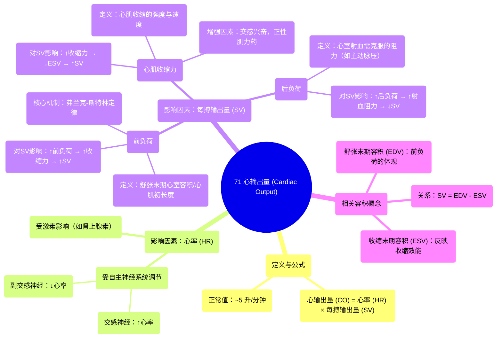

# 71 Cardiac Output Cardiology

  <video controls preload="metadata" playsinline>
    <source src="https://helly.s3.bitiful.net/心血管学科/%E4%B8%93%E8%BE%91%2020%EF%BC%9A%E5%BF%83%E5%86%85%E7%A7%91%E7%BB%88%E6%9E%81%E8%BE%9E%E5%85%B8%E7%96%BE%E7%97%85%E6%9C%BA%E5%88%B6%E7%AF%87%20%28PathologyMechanisms%29/71%20Cardiac%20Output%20Cardiology.mp4" type="video/mp4">
    
您的浏览器不支持播放，请升级。

  </video>

::: tip ⚡️ 核心考点 (30s速读)
*   **核心考点**：心输出量 (CO) = 心率 (HR) × 每搏输出量 (SV)。它是评估心脏泵血功能的核心指标，正常值约5 L/min。
*   **临床意义**：理解影响心输出量的因素（心率、心肌收缩力、前负荷、后负荷）是诊断和治疗心力衰竭、休克等循环系统疾病的基础。
:::

## 🧠 深度精讲

*   **心输出量 (Cardiac Output, CO)**：指心脏每分钟泵出的血液总量。计算公式为：**心输出量 (CO) = 心率 (HR) × 每搏输出量 (SV)**。这是衡量心脏整体泵血效能的关键生理指标。
*   **心率 (Heart Rate, HR)**：心脏每分钟搏动的次数，主要受自主神经系统（交感神经兴奋增快心率，副交感神经兴奋减慢心率）和体液激素（如肾上腺素）的调节。
*   **每搏输出量 (Stroke Volume, SV)**：心脏每次收缩（每搏）从左心室射入主动脉的血量。它由三个核心因素决定：
    1.  **心肌收缩力 (Contractility)**：指心肌纤维收缩的强度和速度。收缩力越强（如在交感神经兴奋或使用正性肌力药物时），射血越多，SV增加。
    2.  **前负荷 (Preload)**：指心脏在舒张末期（收缩开始前）心室内的血容量，它决定了心肌纤维被拉伸的初长度。根据**弗兰克-斯特林 (Frank-Starling) 定律**，在一定范围内，前负荷越大（心室充盈越多），心肌收缩力越强，SV越大。
    3.  **后负荷 (Afterload)**：指心室开始收缩射血时所需要克服的阻力，主要来自主动脉血压和外周血管阻力。后负荷增加（如高血压、动脉狭窄）时，心脏射血阻力增大，SV会减少。

*   **容积概念解析**：
    *   **舒张末期容积 (End Diastolic Volume, EDV)**：心室在舒张末期充盈完成时的容积，即前负荷的容积体现，是心室的最大充盈量。
    *   **收缩末期容积 (End Systolic Volume, ESV)**：心室在收缩末期射血完毕后的剩余容积。它反映了心脏的射血效能。
    *   **三者关系**：**每搏输出量 (SV) = 舒张末期容积 (EDV) - 收缩末期容积 (ESV)**。心肌收缩力主要影响ESV（收缩力强则ESV减小），前负荷主要影响EDV。

## 📚 双语术语表 (Terminology)
| 英文术语 | 中文翻译 | 定义/解释 |
| :--- | :--- | :--- |
| Cardiac Output (CO) | 心输出量 | 心脏每分钟泵出的血液总量，CO = HR × SV。 |
| Heart Rate (HR) | 心率 | 心脏每分钟搏动的次数。 |
| Stroke Volume (SV) | 每搏输出量 | 心脏每次收缩射出的血量。 |
| Contractility | 心肌收缩力 | 心肌自身收缩的强度和速度。 |
| Preload | 前负荷 | 心脏收缩前（舒张末期）心室肌承受的负荷，通常指心室充盈量或心肌初长度。 |
| Afterload | 后负荷 | 心室开始收缩射血时需要克服的阻力，主要来自主动脉压。 |
| End Diastolic Volume (EDV) | 舒张末期容积 | 心室在舒张末期充盈完成时的血容量。 |
| End Systolic Volume (ESV) | 收缩末期容积 | 心室在收缩末期射血完毕后的剩余血容量。 |
| Frank-Starling Mechanism | 弗兰克-斯特林机制 | 描述心肌收缩力随心肌纤维初长度（前负荷）增加而增强的生理规律。 |
| Autonomic Nervous System | 自主神经系统 | 调节内脏功能的神经系统，包括增快心率的交感神经和减慢心率的副交感神经。 |

## 🗺️ 知识图谱

