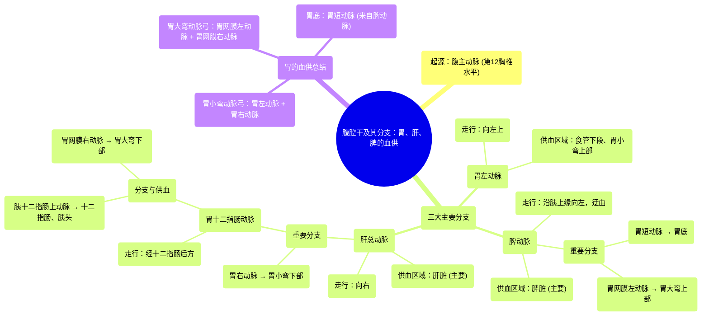

# 72 Coeliac Trunk _ Blood Supply to Stomach, Liver, and Spleen

  <video controls preload="metadata" playsinline>
    <source src="https://helly.s3.bitiful.net/心血管学科/%E4%B8%93%E8%BE%91%2020%EF%BC%9A%E5%BF%83%E5%86%85%E7%A7%91%E7%BB%88%E6%9E%81%E8%BE%9E%E5%85%B8%E7%96%BE%E7%97%85%E6%9C%BA%E5%88%B6%E7%AF%87%20%28PathologyMechanisms%29/72%20Coeliac%20Trunk%20_%20Blood%20Supply%20to%20Stomach%2C%20Liver%2C%20and%20Spleen.mp4" type="video/mp4">
    
您的浏览器不支持播放，请升级。

  </video>

::: tip ⚡️ 核心考点 (30s速读)
*   **核心考点**：腹腔干是腹主动脉的第一个主要分支，负责为胃、肝、脾及十二指肠起始部供血。其三大分支（胃左动脉、脾动脉、肝总动脉）及其次级分支的走行与分布区域是解剖学重点。
*   **临床意义**：理解腹腔干及其分支的解剖对于腹部外科手术（如胃切除术、肝部分切除术）、介入放射学（如选择性动脉栓塞）以及诊断相关血管疾病（如腹腔干压迫综合征）至关重要。
:::

## 🧠 深度精讲

*   **概念1：腹腔干及其起源**
    腹腔干，也称为腹腔动脉干，是腹主动脉在穿过膈肌进入腹腔后发出的第一个主要分支。它起源于腹主动脉的前壁，约在第12胸椎水平。作为腹部重要的“血管主干”，它负责将富含氧气和营养物质的血液输送到上腹部多个关键消化器官。

*   **概念2：腹腔干的三大分支及其分布**
    腹腔干在发出后非常短的距离内即分为三条主要动脉，形成一个经典的“三叉戟”或“海鸥翅”样结构：
    1.  **胃左动脉**：最靠左侧的分支。它向上走行，供应**食管下段**和**胃小弯的上部**。它是胃小弯动脉弓的重要组成部分。
    2.  **脾动脉**：沿胰腺上缘向左走行，是三条分支中最迂曲的一支。其主要功能是为**脾脏**供血。此外，它还发出数条**胃短动脉**和**胃网膜左动脉**，分别供应**胃底**和**胃大弯的上部**。
    3.  **肝总动脉**：向右走行，主要供应肝脏。它在行进过程中发出两个重要分支：
        *   **胃右动脉**：通常较小，供应**胃小弯的下部**，与胃左动脉吻合形成胃小弯动脉弓。
        *   **胃十二指肠动脉**：向下走行，在十二指肠后方经过。它进一步分为**胰十二指肠上动脉**（供应十二指肠和胰头）和**胃网膜右动脉**（供应**胃大弯的下部**和**十二指肠起始部**）。

*   **概念3：胃的动脉供应总结**
    通过腹腔干的分支，胃的各个部分都得到了双重或丰富的血液供应：
    *   **胃小弯**：由**胃左动脉**（上部）和**胃右动脉**（下部）形成的动脉弓供应。
    *   **胃大弯**：由**胃网膜左动脉**（脾动脉分支，供应上部）和**胃网膜右动脉**（胃十二指肠动脉分支，供应下部）形成的动脉弓供应。
    *   **胃底**：主要由脾动脉发出的**胃短动脉**供应。

## 📚 双语术语表 (Terminology)
| 英文术语 | 中文翻译 | 定义/解释 |
| :--- | :--- | :--- |
| Celiac Trunk | 腹腔干 | 腹主动脉的第一个主要分支，供应胃、肝、脾和十二指肠。 |
| Abdominal Aorta | 腹主动脉 | 主动脉在腹腔内的部分，发出供应腹部脏器的分支。 |
| Left Gastric Artery | 胃左动脉 | 腹腔干的分支，供应食管下段和胃小弯上部。 |
| Splenic Artery | 脾动脉 | 腹腔干的分支，走行迂曲，主要供应脾脏，并发出分支至胃底和胃大弯上部。 |
| Common Hepatic Artery | 肝总动脉 | 腹腔干的分支，走向肝脏，并发出胃右动脉和胃十二指肠动脉。 |
| Right Gastric Artery | 胃右动脉 | 肝总动脉的分支，供应胃小弯下部。 |
| Gastroduodenal Artery | 胃十二指肠动脉 | 肝总动脉的分支，走行于十二指肠后方，供应十二指肠、胰头和胃大弯下部。 |
| Duodenum | 十二指肠 | 小肠的起始部分，连接胃和空肠。 |
| Lesser Curvature | 胃小弯 | 胃内侧（右上方）的凹缘。 |
| Greater Curvature | 胃大弯 | 胃外侧（左下方）的凸缘。 |
| Fundus | 胃底 | 胃的最高部分，位于贲门水平以上。 |

## 🗺️ 知识图谱

