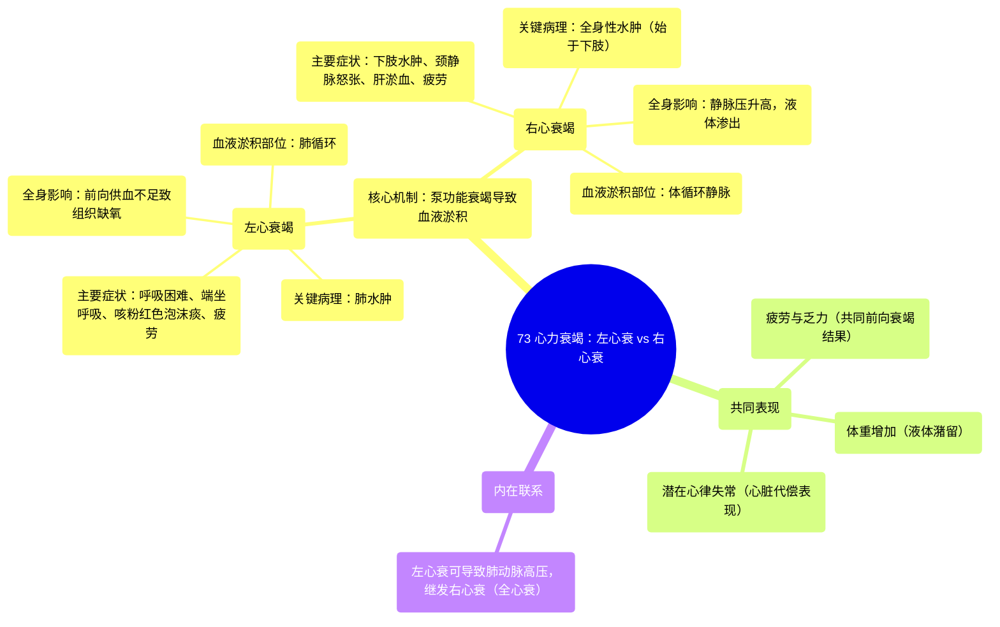

# 73 Heart failure Left versus Right Side Heart Failure

  <video controls preload="metadata" playsinline>
    <source src="https://helly.s3.bitiful.net/心血管学科/%E4%B8%93%E8%BE%91%2020%EF%BC%9A%E5%BF%83%E5%86%85%E7%A7%91%E7%BB%88%E6%9E%81%E8%BE%9E%E5%85%B8%E7%96%BE%E7%97%85%E6%9C%BA%E5%88%B6%E7%AF%87%20%28PathologyMechanisms%29/73%20Heart%20failure%20Left%20versus%20Right%20Side%20Heart%20Failure.mp4" type="video/mp4">
    
您的浏览器不支持播放，请升级。

  </video>

::: tip ⚡️ 核心考点 (30s速读)
*   **核心考点**：左心衰竭与右心衰竭的核心区别在于**血液淤积的部位不同**。左心衰竭导致血液淤积在**肺部**，引起肺水肿和呼吸困难；右心衰竭导致血液淤积在**全身静脉系统**，引起下肢水肿和脏器淤血。
*   **临床意义**：区分两者对诊断和治疗至关重要。左心衰的典型表现是“喘”（肺淤血），右心衰的典型表现是“肿”（体循环淤血）。两者最终都会导致全身供氧不足，引起疲劳乏力。
:::

## 🧠 深度精讲

*   **概念1：心力衰竭的基本定义与循环路径**
    心力衰竭是指心脏的泵血功能下降，无法满足机体代谢需要。理解左右心功能差异，需先回顾正常血液循环路径：**左心**（左心房、左心室）接收来自肺部的**含氧血**，并将其泵出至全身（体循环）；**右心**（右心房、右心室）接收来自全身的**缺氧血**，并将其泵至肺部进行气体交换（肺循环）。

*   **概念2：左心衰竭 (Left-Sided Heart Failure) 的病理生理与表现**
    当左心泵血功能衰竭时，会出现两个主要问题：
    1.  **前向衰竭 (Forward Failure)**：泵入体循环的含氧血量减少，导致全身组织**缺氧**。临床表现为**疲劳、乏力、活动耐力下降**。身体为代偿缺氧，会通过神经体液调节（如激活肾素-血管紧张素-醛固酮系统）来**升高血压、减少排尿、增加血容量**，但这会加重心脏负担。
    2.  **后向淤血 (Backward Congestion)**：血液无法被有效泵出，于是淤积在左心后方，即**肺循环**。这导致肺静脉压力增高，液体渗入肺泡间隙，形成**肺水肿 (Pulmonary Edema)**。临床典型表现为**呼吸困难（尤其在平卧时，即端坐呼吸）、咳嗽、咳粉红色泡沫痰**。心脏本身也可能出现代偿性心跳加快、不规则（心律失常）。

*   **概念3：右心衰竭 (Right-Sided Heart Failure) 的病理生理与表现**
    当右心泵血功能衰竭时，同样遵循前向与后向的病理过程：
    1.  **前向衰竭**：泵入肺循环的血量减少，间接影响左心回血，最终导致全身供氧不足，同样引起**疲劳、乏力**。
    2.  **后向淤血**：血液淤积在右心后方，即**体循环静脉系统**。这导致全身静脉压力升高，液体从毛细血管渗入组织间隙，形成**水肿 (Edema)**。由于重力作用，水肿最早出现在身体最低垂部位，如**脚踝、胫前**，严重时可蔓延至全身，并伴有**体重增加**。此外，静脉高压还可导致**颈静脉怒张、肝淤血肿大、胃肠道淤血引起食欲不振**等表现。

*   **概念4：左右心衰竭的关联性**
    临床上，左右心衰竭常相互影响。长期左心衰竭导致肺循环压力持续增高，最终会增加右心泵血阻力，从而引发**右心衰竭**，此时称为**全心衰竭**。因此，患者可能同时出现呼吸困难（左心衰）和下肢水肿（右心衰）的症状。

## 📚 双语术语表 (Terminology)
| 英文术语 | 中文翻译 | 定义/解释 |
| :--- | :--- | :--- |
| Heart Failure | 心力衰竭 | 心脏泵血功能下降，无法满足身体需求的临床综合征。 |
| Left-Sided Heart Failure | 左心衰竭 | 左心室泵血功能受损，导致肺循环淤血和体循环灌注不足。 |
| Right-Sided Heart Failure | 右心衰竭 | 右心室泵血功能受损，导致体循环静脉系统淤血。 |
| Pulmonary Edema | 肺水肿 | 由于肺静脉压力增高，液体渗入肺间质和肺泡，影响气体交换。 |
| Edema | 水肿 | 组织间隙内异常液体积聚，在右心衰中典型表现为下肢凹陷性水肿。 |
| Fatigue | 疲劳 / 乏力 | 因心脏输出量减少，组织器官供氧不足所致的主要症状之一。 |
| Arrhythmia | 心律失常 | 心脏跳动的节律或频率异常，心力衰竭时常见的一种代偿或并发症。 |
| Venous System | 静脉系统 | 将全身血液输送回心脏的血管网络，右心衰时压力升高。 |

## 🗺️ 知识图谱

