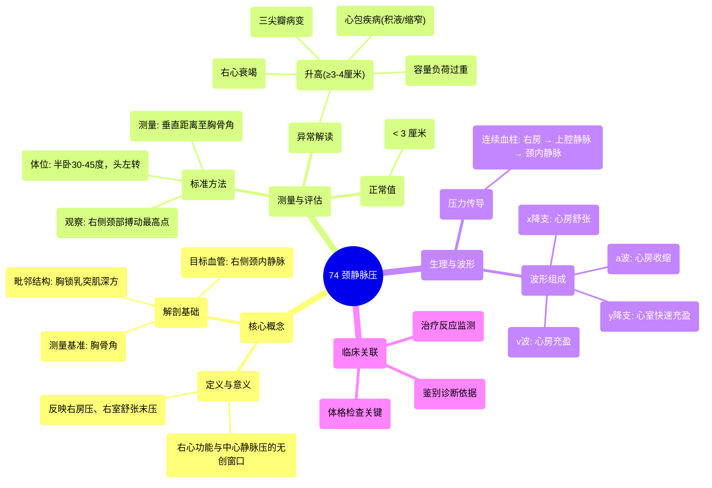

# 74 Jugular venous pressure

  <video controls preload="metadata" playsinline>
    <source src="https://helly.s3.bitiful.net/心血管学科/%E4%B8%93%E8%BE%91%2020%EF%BC%9A%E5%BF%83%E5%86%85%E7%A7%91%E7%BB%88%E6%9E%81%E8%BE%9E%E5%85%B8%E7%96%BE%E7%97%85%E6%9C%BA%E5%88%B6%E7%AF%87%20%28PathologyMechanisms%29/74%20Jugular%20venous%20pressure.mp4" type="video/mp4">
    
您的浏览器不支持播放，请升级。

  </video>

::: tip ⚡️ 核心考点 (30s速读)
*   **核心考点**：颈静脉压是评估右心功能和中心静脉压的无创指标。正常值应小于3厘米（从胸骨角测量）。升高提示右心压力增高，常见于心力衰竭、心包疾病等。
*   **临床意义**：通过观察右侧颈内静脉的搏动高度，可以间接判断右心房压力、右心室舒张末压及中心静脉压，是心血管系统体格检查的关键环节。
:::

## 🧠 深度精讲

*   **概念1：解剖基础与测量方法**
    *   **目标静脉**：主要观察**右侧颈内静脉**。因其与上腔静脉、右心房几乎成一直线，能更准确地反映中心静脉压力。左侧颈内静脉因解剖走行原因，代表性较差。
    *   **解剖位置**：颈内静脉位于胸锁乳突肌深面，因此肉眼不可见，但可观察到其表面的搏动。
    *   **测量基准点**：**胸骨角**。此点位于胸骨柄与胸骨体交界处，约在右心房上方5厘米处。
    *   **测量方法**：
        1.  患者取半卧位（30-45度），头转向左侧（放松右侧胸锁乳突肌）。
        2.  观察右侧颈部，找到颈内静脉搏动的最高点。
        3.  用直尺垂直测量从搏动最高点到胸骨角的垂直距离。
        4.  正常值：**< 3厘米**。≥ 3-4厘米即为颈静脉压升高。

*   **概念2：生理与波形解读**
    *   **生理意义**：颈静脉压波形是一个连续的“压力柱”，直接反映右心房压力的变化。由于三尖瓣在心室舒张期开放，因此它也能反映**右心室舒张末压**。
    *   **波形组成**（需通过中心静脉压描记清晰观察）：
        *   **a波**：对应心房收缩（心电图P波之后）。是波形中的第一个正向波。
        *   **c波**：三尖瓣关闭向上膨出所致（部分教材提及）。
        *   **v波**：对应心房充盈（心室收缩期，血液从腔静脉回流至心房）。
        *   **x降支**：心房舒张。
        *   **y降支**：三尖瓣开放，血液快速流入心室。

*   **概念3：病理意义（颈静脉压升高）**
    *   **右心容量负荷过重**：如三尖瓣反流、肺动脉高压导致右心衰竭。
    *   **右心功能不全**：右心室心肌梗死、心肌病。
    *   **心脏充盈受限**：**心包积液**、**心包缩窄**（此时颈静脉压常显著升高且随吸气更明显，称为Kussmaul征）。
    *   **循环容量过多**：如肾功能衰竭导致的液体潴留。
    *   **上腔静脉梗阻**：但此时搏动可能消失。

## 📚 双语术语表 (Terminology)
| 英文术语 | 中文翻译 | 定义/解释 |
| :--- | :--- | :--- |
| Jugular Venous Pressure (JVP) | 颈静脉压 | 颈内静脉内的血压，反映右心房压力。 |
| Internal Jugular Vein (IJV) | 颈内静脉 | 颈部深层的静脉，引流大脑血液，是观察JVP的主要部位。 |
| External Jugular Vein (EJV) | 颈外静脉 | 颈部浅表静脉，临床价值不如颈内静脉。 |
| Sternal Angle / Angle of Louis | 胸骨角 / 路易氏角 | 胸骨柄与胸骨体连接处的骨性标志，是测量JVP高度的基准点。 |
| Central Venous Pressure (CVP) | 中心静脉压 | 上、下腔静脉或右心房内的压力，JVP是其无创评估指标。 |
| a wave | a波 | JVP波形中的第一个正向波，代表右心房收缩。 |
| v wave | v波 | JVP波形中的另一个正向波，代表右心房充盈。 |
| Elevated JVP | 颈静脉压升高 | 测量值≥3-4厘米，提示右心系统压力增高。 |

## 🗺️ 知识图谱

