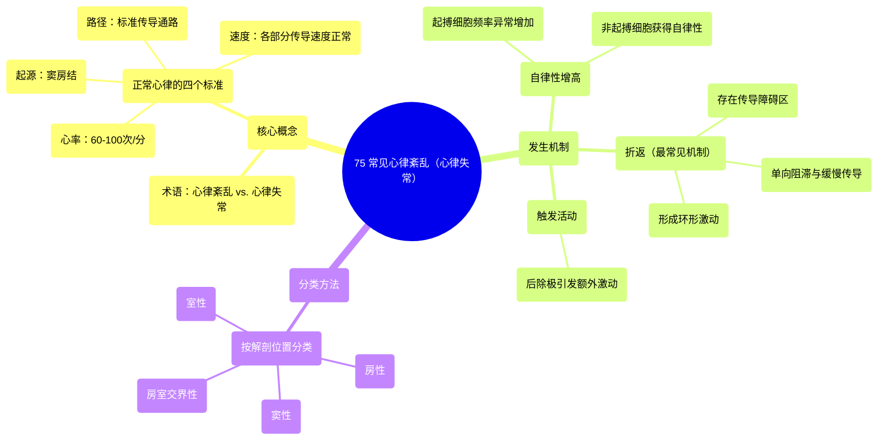

# 75 Cardiac dysrhythmias (arrhythmias) (common)

  <video controls preload="metadata" playsinline>
    <source src="https://helly.s3.bitiful.net/心血管学科/%E4%B8%93%E8%BE%91%2020%EF%BC%9A%E5%BF%83%E5%86%85%E7%A7%91%E7%BB%88%E6%9E%81%E8%BE%9E%E5%85%B8%E7%96%BE%E7%97%85%E6%9C%BA%E5%88%B6%E7%AF%87%20%28PathologyMechanisms%29/75%20Cardiac%20dysrhythmias%20%28arrhythmias%29%20%28common%29.mp4" type="video/mp4">
    
您的浏览器不支持播放，请升级。

  </video>

::: tip ⚡️ 核心考点 (30s速读)
*   **核心考点**：理解正常心律的四个判定标准（心率、起搏点、传导路径、传导速度）是识别心律失常的基础。心律失常的主要发生机制包括：自律性增高、折返和触发活动，其中折返机制最常见。
*   **临床意义**：心律失常是心脏电活动紊乱的表现，可影响心脏泵血功能，导致心悸、头晕、晕厥甚至猝死。掌握其机制和分类是诊断和治疗的关键第一步。
:::

## 🧠 深度精讲

*   **概念1：术语辨析与正常心律标准**
    视频首先澄清了术语：“心律失常”通常指所有异常心律，但严格来说，“arrhythmia”意为“无节律”，而“dysrhythmia”（心律紊乱）更准确地描述了“功能失调的节律”。本讲座使用后者。
    判断是否为正常心律（正常窦性心律）必须满足四个条件：
    1.  **心率**：每分钟60-100次。
    2.  **起搏点**：电冲动必须起源于**窦房结**。
    3.  **传导路径**：电冲动必须沿标准路径传导：窦房结 → 心房 → 房室结 → 希氏束 → 浦肯野纤维 → 心室心肌。
    4.  **传导速度**：电冲动在传导系统各部分的传导速度需正常（如心房约1000米/秒，房室结仅约200米/秒）。任何一项不满足，即可导致心律紊乱。

*   **概念2：心律失常的发生机制**
    心律紊乱主要源于三种电生理机制：
    1.  **自律性增高**：心脏起搏细胞（正常为窦房结）或普通心肌细胞的自发性去极化频率异常增加，或本无自律性的细胞获得了自律性，从而“抢夺”了心脏的主导节律。
    2.  **折返**：这是最常见的机制。由于心脏局部存在解剖或功能上的传导障碍（如瘢痕），电冲动在此处单向阻滞，并沿另一条通路缓慢传导，当它绕回阻滞区的近端时，该处已脱离不应期，从而允许冲动再次激动，形成一个自我维持的环形激动。这个“短路循环”会导致心动过速。
    3.  **触发活动**：在一次正常的去极化后，心肌细胞膜电位发生震荡，达到阈值后引发一次额外的、非正常的去极化，导致额外收缩。

*   **概念3：心律失常的分类方法**
    视频提到，将按照**解剖位置**（如窦房结、心房、房室结、心室）来系统性地讲解最常见的心律紊乱类型。这种分类有助于定位病变起源，指导临床思维。

## 📚 双语术语表 (Terminology)
| 英文术语 | 中文翻译 | 定义/解释 |
| :--- | :--- | :--- |
| Cardiac dysrhythmia / Arrhythmia | 心律紊乱 / 心律失常 | 心脏电活动的频率、节律、起源部位、传导速度或激动次序的异常。 |
| Sinoatrial (SA) node | 窦房结 | 位于右心房上部，是正常心脏的初级起搏点，自发产生节律性电冲动。 |
| Atrioventricular (AV) node | 房室结 | 位于房间隔下部，是心房和心室之间电传导的关键“闸门”，能延迟冲动传导。 |
| Bundle of His | 希氏束 | 房室结的延续，负责将电冲动从房室结传导至心室。 |
| Purkinje fibers | 浦肯野纤维 | 希氏束的细小分支，遍布心室心内膜下，以极快速度将电冲动传导至整个心室肌。 |
| Automaticity | 自律性 | 心肌细胞在没有外界刺激的情况下，能够自发地、有节律地产生去极化的能力。 |
| Re-entry | 折返 | 一种心律失常机制，电冲动在心脏内沿着环形通路持续循环传导。 |
| Triggered activity | 触发活动 | 一种心律失常机制，在一次正常的去极化后，由后除极（早期或延迟后除极）触发一次额外的异常激动。 |
| Depolarization | 去极化 | 心肌细胞膜电位由静息状态（内负外正）变为兴奋状态（内正外负）的过程，是电冲动传导的基础。 |
| Action potential | 动作电位 | 心肌细胞在受到刺激时，膜电位发生的一系列快速、可逆的波动，是电兴奋的标志。 |

## 🗺️ 知识图谱

