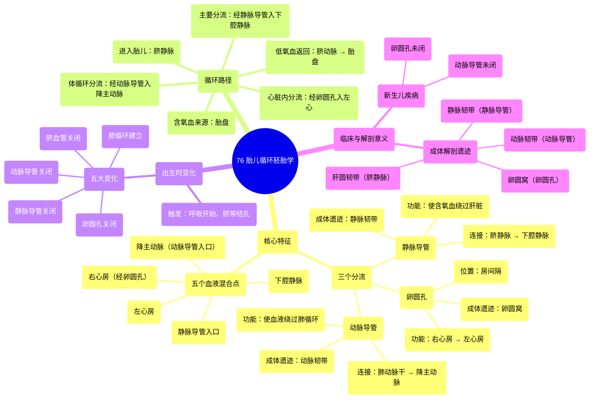

# 76 Fetal circulation Embryology

  <video controls preload="metadata" playsinline>
    <source src="https://helly.s3.bitiful.net/心血管学科/%E4%B8%93%E8%BE%91%2020%EF%BC%9A%E5%BF%83%E5%86%85%E7%A7%91%E7%BB%88%E6%9E%81%E8%BE%9E%E5%85%B8%E7%96%BE%E7%97%85%E6%9C%BA%E5%88%B6%E7%AF%87%20%28PathologyMechanisms%29/76%20Fetal%20circulation%20Embryology.mp4" type="video/mp4">
    
您的浏览器不支持播放，请升级。

  </video>

::: tip ⚡️ 核心考点 (30s速读)
*   **核心考点**：胎儿循环的核心在于通过三个**分流**（静脉导管、卵圆孔、动脉导管）和五个**血液混合点**，实现含氧血的高效分配。出生后，这些分流关闭，循环系统转变为成人模式。
*   **临床意义**：理解胎儿循环是诊断和治疗新生儿先天性心脏病（如动脉导管未闭、卵圆孔未闭）及某些成人血管结构异常（如肝圆韧带、动脉韧带）的基础。
:::

## 🧠 深度精讲

本讲座系统阐述了胎儿循环的独特路径、出生时的关键转变以及这些转变在成体解剖结构中的遗留痕迹。

*   **胎儿循环的独特路径**：胎儿通过胎盘进行气体和营养交换。富含氧气和营养的血液（氧饱和度约80%）经**脐静脉**进入胎儿体内。大部分血液绕过肝脏，通过第一个分流——**静脉导管**，直接汇入下腔静脉，从而优先供应心脏和大脑等重要器官。
*   **三个关键分流**：
    1.  **静脉导管**：连接脐静脉与下腔静脉，使含氧血绕过肝脏。
    2.  **卵圆孔**：位于左右心房之间的开口，使来自下腔静脉的混合血（含氧血为主）从右心房直接流入左心房，进而供应头部和上肢。
    3.  **动脉导管**：连接肺动脉干与降主动脉，使右心室泵出的血液（大部分为静脉血）绕过尚未工作的肺循环，直接进入体循环。
*   **五个血液混合点**：在胎儿循环中，动脉血和静脉血并非完全隔离，会在五个部位发生混合，包括静脉导管入口、下腔静脉、右心房（通过卵圆孔）、左心房（接收来自右心房的血液）以及动脉导管入口处的降主动脉。
*   **出生时的五大变化**：
    1.  **脐血管关闭**：脐带结扎后，脐动、静脉血流停止，血管功能性闭合，随后纤维化。
    2.  **静脉导管关闭**：脐静脉血流中断，静脉导管失去功能，闭锁成为**静脉韧带**。
    3.  **卵圆孔关闭**：肺循环建立，左心房压力升高，压迫卵圆孔瓣（原发隔）贴附于继发隔上，形成功能性关闭，最终融合形成**卵圆窝**。
    4.  **动脉导管关闭**：血氧分压升高和前列腺素水平下降导致动脉导管平滑肌收缩，功能上关闭，最终形成**动脉韧带**。
    5.  **肺循环建立**：随着呼吸开始，肺血管阻力下降，大量血液流入肺进行气体交换。
*   **成体解剖遗迹**：胎儿时期的血管结构在成体中留下永久性痕迹：脐静脉变为**肝圆韧带**，静脉导管变为**静脉韧带**，卵圆孔变为**卵圆窝**，动脉导管变为**动脉韧带**。这些是理解胎儿循环演变的解剖学证据。

## 📚 双语术语表 (Terminology)
| 英文术语 | 中文翻译 | 定义/解释 |
| :--- | :--- | :--- |
| Foetal circulation | 胎儿循环 | 胎儿时期独特的血液循环路径，依赖胎盘进行气体交换，并通过分流绕过肺和肝脏。 |
| Shunt | 分流 | 胎儿循环中连接两个血管结构的通道，使血液绕过某些器官（如肺、肝）。 |
| Ductus venosus | 静脉导管 | 胎儿分流之一，连接脐静脉与下腔静脉，使含氧血绕过肝脏。 |
| Foramen ovale | 卵圆孔 | 胎儿心脏房间隔上的开口，允许血液从右心房直接流入左心房。 |
| Ductus arteriosus | 动脉导管 | 胎儿分流之一，连接肺动脉干与降主动脉，使血液绕过肺循环。 |
| Umbilical vein | 脐静脉 | 将来自胎盘的含氧血输送至胎儿的血管。 |
| Umbilical arteries | 脐动脉 | （通常为两条）将胎儿低氧血输送回胎盘的血管。 |
| Placenta | 胎盘 | 母体与胎儿之间进行物质交换的器官。 |
| Sinus venosus | 静脉窦 | 胚胎早期心脏的一部分，接收全身静脉血，后并入右心房。 |
| Ligamentum teres hepatis | 肝圆韧带 | 出生后闭锁的脐静脉在成体肝脏中形成的纤维索。 |
| Ligamentum venosum | 静脉韧带 | 出生后闭锁的静脉导管形成的纤维索。 |
| Fossa ovalis | 卵圆窝 | 房间隔上的凹陷，是胎儿时期卵圆孔闭合后的遗迹。 |
| Ligamentum arteriosum | 动脉韧带 | 出生后闭锁的动脉导管形成的纤维索。 |

## 🗺️ 知识图谱

