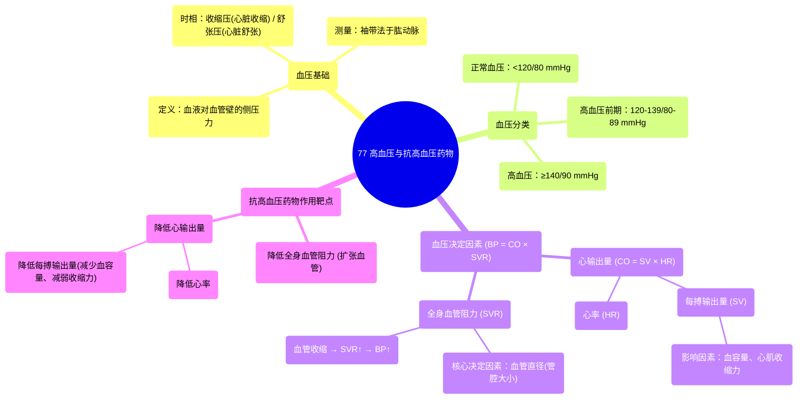

# 77 Hypertension & Anti-hypertensive drugs

  <video controls preload="metadata" playsinline>
    <source src="https://helly.s3.bitiful.net/心血管学科/%E4%B8%93%E8%BE%91%2020%EF%BC%9A%E5%BF%83%E5%86%85%E7%A7%91%E7%BB%88%E6%9E%81%E8%BE%9E%E5%85%B8%E7%96%BE%E7%97%85%E6%9C%BA%E5%88%B6%E7%AF%87%20%28PathologyMechanisms%29/77%20Hypertension%20%26%20Anti-hypertensive%20drugs.mp4" type="video/mp4">
    
您的浏览器不支持播放，请升级。

  </video>

::: tip ⚡️ 核心考点 (30s速读)
*   **核心考点**：血压由心输出量（CO）和全身血管阻力（SVR）决定。高血压定义为静息状态下持续测量值 ≥ 140/90 mmHg。治疗核心是降低CO或SVR。
*   **临床意义**：抗高血压药物通过作用于血压调节的关键环节（如血容量、心率、心肌收缩力、血管张力）来降低血压，需根据患者具体情况选择。
:::

## 🧠 深度精讲
*   **血压的定义与测量**：血压是血液对血管壁产生的侧压力。临床上通常使用袖带在肱动脉（主动脉分支）处测量。测量值包含两个时相：**收缩压**（心脏收缩射血时的最高压力）和**舒张压**（心脏舒张时，主动脉弹性回缩维持的压力）。
*   **血压的分类**：根据测量值，血压可分为：**正常血压**（<120/80 mmHg）、**高血压前期**（收缩压120-139 mmHg 或 舒张压80-89 mmHg）和**高血压**（持续测量值 ≥ 140/90 mmHg）。
*   **血压的决定因素**：血压（BP）由**心输出量（CO）** 和**全身血管阻力（SVR）** 的乘积决定（BP = CO × SVR）。
    *   **心输出量（CO）**：指心脏每分钟泵出的血量，等于**每搏输出量（SV）** 乘以**心率（HR）**。每搏输出量受**血容量**和**心肌收缩力**影响。
    *   **全身血管阻力（SVR）**：指血液流经外周血管时遇到的阻力，主要受**血管直径**（管腔大小）影响。血管收缩时，SVR升高，血压随之升高。
*   **高血压的病理生理与治疗靶点**：高血压的发生源于上述一个或多个决定因素的异常升高。因此，抗高血压药物的作用靶点也围绕这些环节展开：
    1.  **降低全身血管阻力（SVR）**：通过**扩张血管**来实现。
    2.  **降低心输出量（CO）**：通过**降低心率**（如阻断交感神经）、**降低每搏输出量**（如减少血容量、减弱心肌收缩力）来实现。

## 📚 双语术语表 (Terminology)
| 英文术语 | 中文翻译 | 定义/解释 |
| :--- | :--- | :--- |
| Hypertension | 高血压 | 在静息状态下，血压持续高于正常范围（通常指≥140/90 mmHg）的病理状态。 |
| Systolic Blood Pressure | 收缩压 | 心脏收缩时，血液对动脉血管壁产生的最高压力。 |
| Diastolic Blood Pressure | 舒张压 | 心脏舒张时，动脉血管壁仍受到的压力，主要由大动脉弹性回缩维持。 |
| Cardiac Output (CO) | 心输出量 | 一侧心室每分钟射出的血液总量，等于每搏输出量乘以心率。 |
| Systemic Vascular Resistance (SVR) | 全身血管阻力 | 血液流经体循环动脉系统时所遇到的外周总阻力，主要受小动脉口径影响。 |
| Stroke Volume (SV) | 每搏输出量 | 一侧心室每次收缩所射出的血液量。 |
| Pre-hypertension | 高血压前期 | 血压水平介于正常和高血压之间（收缩压120-139 mmHg 或 舒张压80-89 mmHg），是发展为高血压的高风险状态。 |

## 🗺️ 知识图谱

