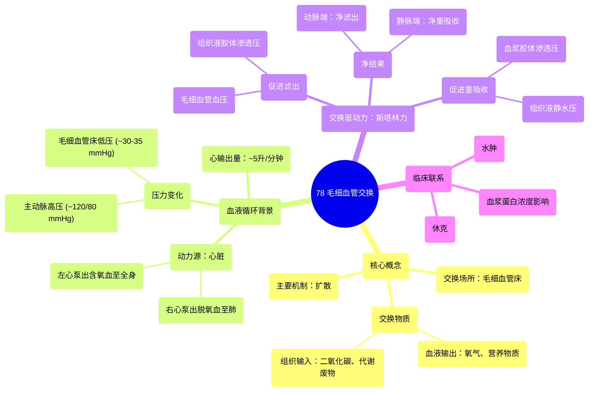

# 78 Capillary exchange

  <video controls preload="metadata" playsinline>
    <source src="https://helly.s3.bitiful.net/心血管学科/%E4%B8%93%E8%BE%91%2020%EF%BC%9A%E5%BF%83%E5%86%85%E7%A7%91%E7%BB%88%E6%9E%81%E8%BE%9E%E5%85%B8%E7%96%BE%E7%97%85%E6%9C%BA%E5%88%B6%E7%AF%87%20%28PathologyMechanisms%29/78%20Capillary%20exchange.mp4" type="video/mp4">
    
您的浏览器不支持播放，请升级。

  </video>

::: tip ⚡️ 核心考点 (30s速读)
*   **核心考点**：毛细血管交换是血液与组织液在毛细血管床进行物质交换的过程，主要依靠**扩散**和**滤过/重吸收**。驱动液体进出的关键力量是**毛细血管血压**和**血浆胶体渗透压**。
*   **临床意义**：理解毛细血管交换是掌握**水肿**（组织液生成大于回流）和**休克**（有效循环血量不足）等病理生理的基础。血压和血浆蛋白浓度的变化会直接影响组织液平衡。
:::

## 🧠 深度精讲

*   **概念1：毛细血管交换的场所与过程**
    毛细血管交换发生在全身各处的**毛细血管床**。当富含氧气和营养物质的动脉血流经毛细血管时，液体（血浆）会从毛细血管的**动脉端**滤出，进入组织间隙，形成**组织液**。组织液与细胞进行物质交换：通过**扩散**，氧气和营养物质从血液进入细胞，而二氧化碳和代谢废物（如尿素）则从细胞进入组织液。随后，大部分组织液在毛细血管的**静脉端**被重吸收回血液，少部分则进入淋巴系统。完成交换后的血液变为脱氧血，经静脉返回心脏右心，再被泵往肺部进行气体交换。

*   **概念2：全身血液循环与毛细血管交换的关联**
    心脏是循环的动力源。**左心室**收缩将含氧血泵入主动脉，经动脉、小动脉分支，最终到达毛细血管床进行交换。**心输出量**（每搏输出量×心率，约5升/分钟）决定了单位时间内流经毛细血管床的血流量。血液从主动脉流出时压力最高（收缩压约120 mmHg），在流经各级血管时因阻力而不断下降，到达毛细血管床时压力约为**30-35 mmHg**。这个压力是驱动液体滤出毛细血管的主要力量。

*   **概念3：驱动液体交换的力量——斯塔林力**
    毛细血管壁是多孔的，液体是流出还是流入，取决于毛细血管内外两侧的四组压力：
    1.  **毛细血管血压 (Pc)**：推动液体**流出**血管的力量（动脉端高，静脉端低）。
    2.  **组织液静水压 (Pi)**：组织间隙的压力，通常较低，促进液体**流入**血管。
    3.  **血浆胶体渗透压 (πp)**：主要由血浆蛋白（尤其是白蛋白）产生，吸引液体**流入**血管。
    4.  **组织液胶体渗透压 (πi)**：由组织间隙中的蛋白质产生，吸引液体**流出**血管。
    净滤过压 = (Pc + πi) - (Pi + πp)。在动脉端，净滤过压为正值，液体**滤出**；在静脉端，净滤过压为负值，液体**重吸收**。

## 📚 双语术语表 (Terminology)
| 英文术语 | 中文翻译 | 定义/解释 |
| :--- | :--- | :--- |
| Capillary exchange | 毛细血管交换 | 血液与组织液在毛细血管处进行气体、营养物质和废物交换的过程。 |
| Capillary bed | 毛细血管床 | 由大量毛细血管组成的微循环网络，是物质交换的主要场所。 |
| Stroke volume | 每搏输出量 | 心脏每次收缩（每搏）从左心室泵出的血液量，约70毫升。 |
| Cardiac output | 心输出量 | 每分钟由一侧心室泵出的血液总量，等于每搏输出量×心率，约5升/分钟。 |
| Systolic pressure | 收缩压 | 心脏收缩时，血液对动脉壁产生的最高压力，正常值约120 mmHg。 |
| Diastolic pressure | 舒张压 | 心脏舒张时，血液对动脉壁产生的最低压力，正常值约80 mmHg。 |
| Mean arterial pressure (MAP) | 平均动脉压 | 一个心动周期中动脉血压的平均值，约93 mmHg，是推动血液向前流动的平均压力。 |
| Arterial end | 动脉端 | 毛细血管中靠近小动脉的一端，血压较高，是液体滤出的主要部位。 |
| Venous end | 静脉端 | 毛细血管中靠近小静脉的一端，血压较低，是液体重吸收的主要部位。 |
| Diffusion | 扩散 | 物质顺浓度梯度从高浓度区域向低浓度区域的净移动，是气体和小分子交换的主要方式。 |
| Hydrostatic pressure | 静水压 | 液体本身因重力或压力产生的压强。在毛细血管中指血管内的血压。 |
| Colloid osmotic pressure | 胶体渗透压 | 由溶液中大分子物质（主要是蛋白质）产生的渗透压，能吸引水分。 |
| Starling forces | 斯塔林力 | 决定毛细血管处液体滤过和重吸收的四组压力（毛细血管血压、组织液静水压、血浆胶体渗透压、组织液胶体渗透压）。 |

## 🗺️ 知识图谱

