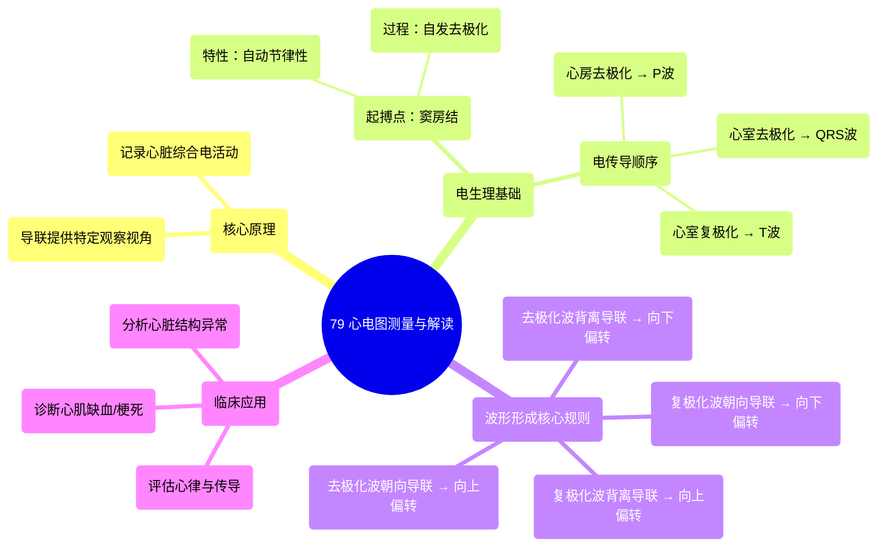

# 79 ECG measurement and interpretation

  <video controls preload="metadata" playsinline>
    <source src="https://helly.s3.bitiful.net/心血管学科/%E4%B8%93%E8%BE%91%2020%EF%BC%9A%E5%BF%83%E5%86%85%E7%A7%91%E7%BB%88%E6%9E%81%E8%BE%9E%E5%85%B8%E7%96%BE%E7%97%85%E6%9C%BA%E5%88%B6%E7%AF%87%20%28PathologyMechanisms%29/79%20ECG%20measurement%20and%20interpretation.mp4" type="video/mp4">
    
您的浏览器不支持播放，请升级。

  </video>

::: tip ⚡️ 核心考点 (30s速读)
*   **核心考点**：心电图（ECG）通过记录心脏电活动来评估心脏功能。其波形方向取决于电活动（去极化/复极化）相对于导联探查方向的关系。
*   **临床意义**：理解“正向波朝向导联产生向上偏转”这一核心规则，是解读P波、QRS波群、T波形态及诊断心律失常、心肌缺血等疾病的基础。
:::

## 🧠 深度精讲

*   **心电图的基本原理**：心电图记录的是整个心脏在心动周期中产生的综合电向量变化。它通过体表放置的电极（如12导联心电图的10个电极）从不同角度“观察”心脏。
*   **心脏电活动的起源与传导**：
    *   正常心律起源于**窦房结**。窦房结细胞具有**自动节律性**，其细胞膜上的钠通道可自发、缓慢地开放，使钠离子内流，导致膜电位从静息状态（约-90mV）逐渐升高至阈电位（约-70mV），从而触发**自发性去极化**。
    *   去极化（钠离子内流，细胞变正）一旦在窦房结开始，便会像波浪一样通过细胞间的连接（闰盘）顺序传导，先引起**心房肌去极化**（对应ECG上的P波），再经房室结、希氏束、左右束支传导至**心室肌去极化**（对应ECG上的QRS波群）。
*   **心电图波形的形成规则（核心规则）**：
    *   **去极化波**：当去极化（正电荷移动）的传播方向**朝向**某个导联的探查电极时，该导联记录到一个**向上的偏转**（正波）。反之，若背离导联，则记录到**向下的偏转**（负波）。
    *   **复极化波**：复极化是钾离子外流（负电荷移动）的过程。根据上述逻辑，复极化波**朝向**导联时，产生**向下的偏转**；**背离**导联时，产生**向上的偏转**。需要注意的是，心室复极化（T波）通常与心室去极化（QRS波群）的主波方向一致，这是一个重要的生理现象。
*   **导联与视图**：每个心电图导联都提供了一个特定方向的“视角”。12导联心电图提供了12个这样的视角，从而在二维平面上构建出心脏电活动的立体图像，帮助定位病变。

## 📚 双语术语表 (Terminology)
| 英文术语 | 中文翻译 | 定义/解释 |
| :--- | :--- | :--- |
| ECG (Electrocardiogram) | 心电图 | 记录心脏电活动随时间变化的图形。 |
| Depolarization | 去极化 | 心肌细胞膜电位由负变正的过程，主要由钠离子快速内流引起，标志着心肌兴奋的开始。 |
| Repolarization | 复极化 | 心肌细胞膜电位恢复为静息负电位的过程，主要由钾离子外流引起，为下一次兴奋做准备。 |
| Sinoatrial (SA) Node | 窦房结 | 位于右心房上部，是正常心脏节律的起搏点，具有最高的自动节律性。 |
| Automaticity | 自动节律性 | 心肌细胞（尤其是自律细胞）在没有外界刺激条件下，能自动发生节律性兴奋的特性。 |
| Lead | 导联 | 记录心电图时，放置在体表特定位置的电极组合，代表一个特定的电活动探查方向。 |
| 12-lead ECG | 12导联心电图 | 一种标准心电图记录方式，使用10个电极提供12个不同方向的心脏电活动视图。 |
| Deflection | 偏转 | 心电图记录纸上波形相对于基线的向上或向下的变化。 |
| Threshold Potential | 阈电位 | 触发动作电位（去极化）所需的临界膜电位值。 |

## 🗺️ 知识图谱

