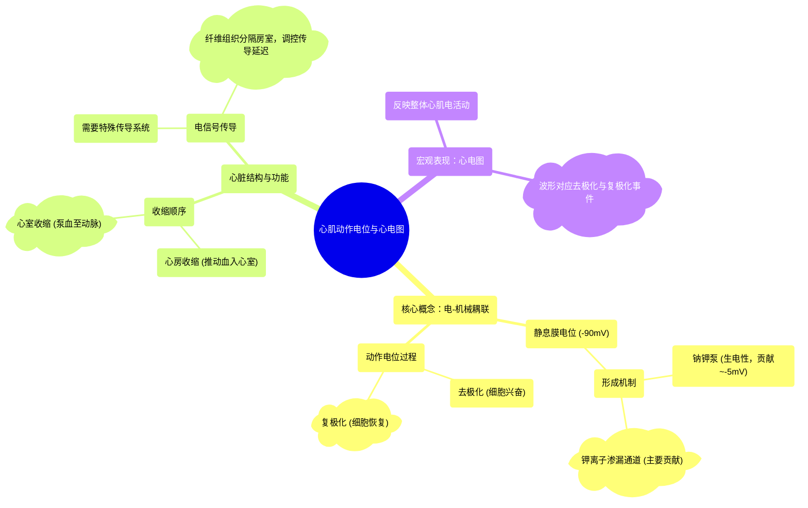

# 80 Heart Muscle (myocardium) Action Potential Cardiology

  <video controls preload="metadata" playsinline>
    <source src="https://helly.s3.bitiful.net/心血管学科/%E4%B8%93%E8%BE%91%2020%EF%BC%9A%E5%BF%83%E5%86%85%E7%A7%91%E7%BB%88%E6%9E%81%E8%BE%9E%E5%85%B8%E7%96%BE%E7%97%85%E6%9C%BA%E5%88%B6%E7%AF%87%20%28PathologyMechanisms%29/80%20Heart%20Muscle%20%28myocardium%29%20Action%20Potential%20Cardiology.mp4" type="video/mp4">
    
您的浏览器不支持播放，请升级。

  </video>

::: tip ⚡️ 核心考点 (30s速读)
*   **核心考点**：心肌细胞通过钠钾泵和钾离子渗漏通道建立并维持约-90mV的静息膜电位。其去极化与复极化过程是心脏有序收缩（心房先于心室）的电生理基础，并直接对应于心电图（ECG）上的波形。
*   **临床意义**：理解心肌动作电位是解读心电图、诊断心律失常及理解相关药物（如抗心律失常药）作用机制的根本。
:::

## 🧠 深度精讲

*   **心肌细胞的静息膜电位**：心肌细胞在静息状态下，细胞膜内侧电位比外侧低约90毫伏（-90mV）。这主要由两个机制维持：1) **钠钾泵**：主动将3个钠离子泵出细胞，同时将2个钾离子泵入细胞，造成膜外净增正电荷，贡献约-5mV。2) **钾离子渗漏通道**：部分钾通道在静息时轻微开放，允许带正电的钾离子顺浓度梯度外流，进一步使膜内变负，共同形成-90mV的电位差。这是细胞能够产生兴奋和收缩的电压基础。

*   **心脏收缩的顺序与电信号**：心脏的泵血活动依赖于电信号的精确传导。收缩顺序为：**心房先收缩**，将血液推入心室；随后**心室收缩**，将血液泵入动脉。这个机械收缩顺序是由电兴奋（动作电位）的传导顺序决定的，电信号需要通过特殊的传导系统（视频中提到的纤维组织是房室传导的关键屏障的一部分）来协调。

*   **动作电位与心电图的关系**：心肌细胞群同步发生的去极化与复极化电活动，可以通过体表电极记录为心电图。视频旨在阐明心肌细胞水平的电变化（动作电位）如何宏观地表现为ECG上的P波、QRS波群和T波等。

## 📚 双语术语表 (Terminology)
| 英文术语 | 中文翻译 | 定义/解释 |
| :--- | :--- | :--- |
| Depolarization | 去极化 | 细胞膜电位由负值向正值变化的过程，是动作电位的上升支，对应心肌细胞的兴奋。 |
| Repolarization | 复极化 | 细胞膜电位由正值恢复至静息负值的过程，是动作电位的下降支，对应心肌细胞的恢复期。 |
| Cardiomyocyte | 心肌细胞 | 构成心脏肌肉（心肌）的基本功能单位，具有自动节律性、传导性和收缩性。 |
| ECG (Electrocardiogram) | 心电图 | 记录心脏整体电活动随时间变化的图形，是临床评估心脏节律和功能的重要工具。 |
| Resting Membrane Potential | 静息膜电位 | 细胞在静息状态下，膜内外存在的稳定电位差。心肌细胞约为-90mV。 |
| Sodium-Potassium ATPase Pump | 钠钾ATP酶泵 | 一种跨膜蛋白，利用ATP水解供能，主动将3个Na⁺泵出细胞，2个K⁺泵入细胞，对建立静息电位有贡献。 |
| Ion Channel | 离子通道 | 细胞膜上的蛋白质孔道，允许特定离子被动或主动跨膜转运，如钠通道、钾通道。 |
| Myocardium | 心肌 | 心脏的肌肉层，负责通过收缩泵送血液。 |

## 🗺️ 知识图谱

