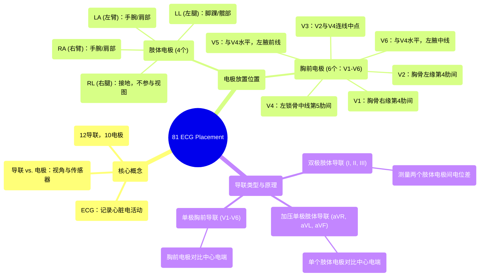

# 81 ECG Placement

  <video controls preload="metadata" playsinline>
    <source src="https://helly.s3.bitiful.net/心血管学科/%E4%B8%93%E8%BE%91%2020%EF%BC%9A%E5%BF%83%E5%86%85%E7%A7%91%E7%BB%88%E6%9E%81%E8%BE%9E%E5%85%B8%E7%96%BE%E7%97%85%E6%9C%BA%E5%88%B6%E7%AF%87%20%28PathologyMechanisms%29/81%20ECG%20Placement.mp4" type="video/mp4">
    
您的浏览器不支持播放，请升级。

  </video>

::: tip ⚡️ 核心考点 (30s速读)
*   **核心考点**：掌握12导联心电图10个电极的精确放置位置，理解“导联”与“电极”的区别，以及肢体导联与胸前导联的不同工作原理。
*   **临床意义**：正确的电极放置是获得准确心电图波形、诊断心律失常、心肌缺血等心脏疾病的基础。位置错误会导致波形失真，引发误诊。
:::

## 🧠 深度精讲

*   **概念1：ECG与导联系统**
    *   **ECG**：代表心电图或心电图机，是一种记录心脏电活动的无创检查方法。心脏的机械收缩由电信号触发，ECG通过体表电极捕捉这些电信号的变化。
    *   **导联 vs. 电极**：这是关键区别。**电极**是贴在皮肤上的导电贴片（粘性圆点）。**导联**是心电图机记录心脏电活动的特定“视角”或“通道”。一个12导联心电图提供了12个不同的心脏电活动视图，但仅使用了10个电极来实现。

*   **概念2：10个电极的放置位置**
    *   **肢体电极 (4个)**：
        *   **RA (右臂)**：置于右腕或右肩三角肌下方。
        *   **LA (左臂)**：置于左腕或左肩三角肌下方。
        *   **LL (左腿)**：置于左踝或左髂前上棘下方。
        *   **RL (右腿)**：置于右踝或右髂前上棘下方。**注意**：右腿电极是**接地电极**，用于减少干扰，不提供心脏视图。
    *   **胸前电极 (6个，V1-V6)**：
        *   **V1**：胸骨右缘，**第4肋间**。
        *   **V2**：胸骨左缘，**第4肋间**。
        *   **V4**：**左锁骨中线**与**第5肋间**的交点（此处常可触及心尖搏动）。
        *   **V3**：放置在V2与V4连线的**中点**。
        *   **V5**：与V4同一水平（第5肋间），**左腋前线**。
        *   **V6**：与V4同一水平（第5肋间），**左腋中线**。
    *   **记忆要点**：放置顺序通常为V1→V2→V4→V3→V5→V6。定位依赖于准确的骨骼标志（胸骨、锁骨、肋骨）。

*   **概念3：导联的类型与工作原理**
    *   **双极肢体导联 (I, II, III)**：通过测量两个肢体电极之间的电位差形成。
        *   **导联 I** = LA - RA (左臂与右臂“对话”)
        *   **导联 II** = LL - RA (左腿与右臂“对话”)
        *   **导联 III** = LL - LA (左腿与左臂“对话”)
    *   **加压单极肢体导联 (aVR, aVL, aVF)**：通过将单个肢体电极与另外两个肢体电极形成的中心电端比较，进行“加压”放大后获得。
    *   **单极胸前导联 (V1-V6)**：每个胸前电极（探查电极）与中心电端（由三个肢体电极构成）比较，反映电极正下方局部心肌的电活动。

## 📚 双语术语表 (Terminology)
| 英文术语 | 中文翻译 | 定义/解释 |
| :--- | :--- | :--- |
| ECG / Electrocardiogram | 心电图 | 记录心脏电活动的图形。 |
| Lead | 导联 | 心电图机记录心脏电活动的特定电路或视角。 |
| Electrode | 电极 | 贴在皮肤上用于采集电信号的导电贴片。 |
| 12-lead ECG | 12导联心电图 | 使用10个电极从12个不同角度记录心脏电活动的标准心电图。 |
| Limb Leads | 肢体导联 | 包括双极导联(I, II, III)和加压单极导联(aVR, aVL, aVF)，共6个。 |
| Precordial / Chest Leads | 胸前导联 | 置于胸前的6个单极导联(V1-V6)。 |
| Bipolar Leads | 双极导联 | 测量两个体表点之间电位差的导联（如I, II, III）。 |
| Unipolar Leads | 单极导联 | 测量单个探查电极与中心电端之间电位差的导联（如aVR, aVL, aVF, V1-V6）。 |
| Sternum | 胸骨 | 胸部正中的扁骨，是定位V1、V2的重要标志。 |
| Intercostal Space | 肋间隙 | 两根肋骨之间的空间，是定位胸前电极的关键。 |
| Mid-clavicular Line | 锁骨中线 | 通过锁骨中点的垂直线，用于定位V4。 |
| Apex of the heart | 心尖 | 心脏的左下尖端，通常在左锁骨中线第5肋间可触及搏动。 |
| Ground Electrode | 接地电极 | （通常为右腿电极）用于为心电图机提供参考电位，减少干扰。 |

## 🗺️ 知识图谱

