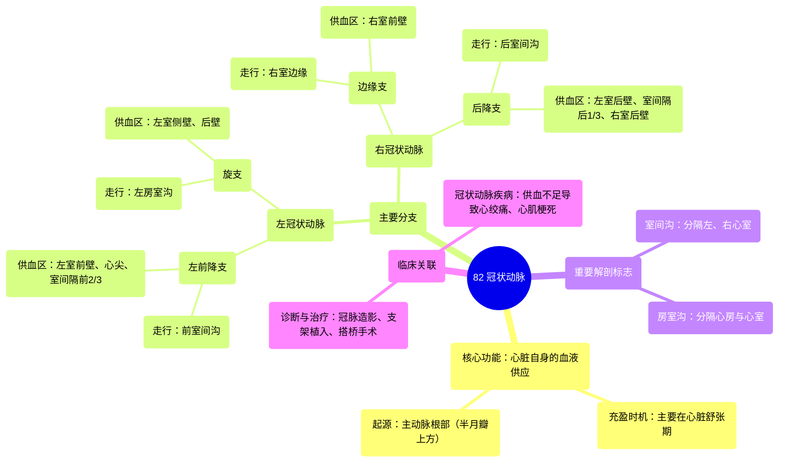

# 82 Coronary arteries

  <video controls preload="metadata" playsinline>
    <source src="https://helly.s3.bitiful.net/心血管学科/%E4%B8%93%E8%BE%91%2020%EF%BC%9A%E5%BF%83%E5%86%85%E7%A7%91%E7%BB%88%E6%9E%81%E8%BE%9E%E5%85%B8%E7%96%BE%E7%97%85%E6%9C%BA%E5%88%B6%E7%AF%87%20%28PathologyMechanisms%29/82%20Coronary%20arteries.mp4" type="video/mp4">
    
您的浏览器不支持播放，请升级。

  </video>

::: tip ⚡️ 核心考点 (30s速读)
*   **核心考点**：冠状动脉是心脏自身的血液供应系统，起源于主动脉根部，在心脏舒张期充盈。主要分为左冠状动脉和右冠状动脉，其关键分支包括左前降支、旋支、边缘支和后降支。
*   **临床意义**：冠状动脉疾病（如堵塞）是心肌缺血和心肌梗死的主要原因。理解其解剖走行和供血区域，对于诊断冠心病、进行血管介入治疗（如支架植入）或冠脉搭桥手术至关重要。
:::

## 🧠 深度精讲

*   **心脏的血液需求**：心脏（心肌）作为持续工作的“泵”，自身需要消耗大量氧气和养分，因此需要一个**独立的血液供应系统**，即冠状动脉系统。它并非直接利用心腔内的血液。
*   **冠状动脉的起源与充盈时机**：冠状动脉起源于**主动脉根部**，位于**主动脉半月瓣**上方。其充盈主要发生在**心脏舒张期**：当心室收缩将血液泵入主动脉后，心脏放松，主动脉瓣关闭，血液在主动脉根部产生反流压力，从而流入冠状动脉开口。
*   **主要冠状动脉及其分支**：
    1.  **左冠状动脉**：从左主动脉窦发出，主要供应心脏左半部分。
        *   **左前降支**：沿心脏前表面的室间沟下行，供应左心室前壁、心尖部及室间隔前2/3。因其供血范围广，是冠心病最常累及的血管，常被称为“寡妇制造者”。
        *   **旋支**：沿左房室沟向左后环绕，供应左心室侧壁和后壁的一部分。
    2.  **右冠状动脉**：从右主动脉窦发出，主要供应心脏右半部分及左心室后壁的一部分。
        *   **边缘支**：沿右心室边缘走行，供应右心室前壁。
        *   **后降支**：沿心脏后下部的室间沟下行，供应左心室后壁、室间隔后1/3及右心室后壁。其起源存在变异（可由右冠状动脉或左旋支延续而来）。
*   **解剖标志与走行**：冠状动脉的走行与心脏表面的沟（**房室沟**分隔心房与心室，**室间沟**分隔左右心室）密切相关，旋支走行于房室沟，前降支和后降支则分别走行于前、后室间沟。

## 📚 双语术语表 (Terminology)
| 英文术语 | 中文翻译 | 定义/解释 |
| :--- | :--- | :--- |
| Coronary arteries | 冠状动脉 | 供应心脏自身血液的动脉系统。 |
| Myocardium | 心肌 | 构成心脏壁的肌肉组织。 |
| Aorta | 主动脉 | 体循环的起始大动脉，冠状动脉由此发出。 |
| Semilunar valves | 半月瓣 | 位于主动脉和肺动脉根部的瓣膜，防止血液倒流。 |
| Diastole | 舒张期 | 心脏放松、充盈血液的阶段，是冠状动脉主要充盈期。 |
| Left Coronary Artery | 左冠状动脉 | 起源于左主动脉窦，供应左心。 |
| Right Coronary Artery | 右冠状动脉 | 起源于右主动脉窦，供应右心及部分左心后壁。 |
| Left Anterior Descending | 左前降支 | 左冠状动脉的主要分支，沿前室间沟下行。 |
| Circumflex artery | 旋支动脉 | 左冠状动脉的分支，沿左房室沟向左后环绕。 |
| Marginal artery | 边缘支动脉 | 右冠状动脉的分支，沿右心室边缘走行。 |
| Posterior Descending artery | 后降支动脉 | 通常为右冠状动脉的终末分支，沿后室间沟下行。 |
| Atrioventricular sulcus | 房室沟 | 心脏表面分隔心房和心室的环形沟。 |
| Interventricular sulcus | 室间沟 | 心脏表面分隔左、右心室的纵行沟。 |
| Anastomosis | 吻合 | 血管之间的连接，可在一定程度上建立侧支循环。 |

## 🗺️ 知识图谱

